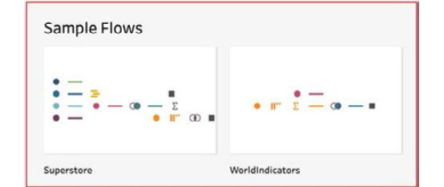

# Lab 1: Getting Started with Tableau Prep

In this lab, you will come to understand how we think about data
preparation from the perspective of Tableau Prep Builder. You will learn
about the different use cases you may employ Tableau Prep for, be it ad
hoc data analysis, creating a dataset for a BI tool, or specifically for
**Tableau Desktop**.

In this lab, we will cover the following exercises:

-   Checking out the user interface
-   Using Tableau Prep for ad hoc data analysis
-   Preparing data for generic BI tools
-   Preparing data for Tableau Desktop ad hoc analysis

# Technical requirements

To follow along with the exercises in this lab, you need to have
**Tableau Prep Builder** installed, and **Tableau Desktop**. In the
first exercise, we\'ll walk through the details of installing Tableau Prep
Builder.

# Open Tableau Prep Builder

In this exercise, you\'ll open **Tableau Prep Builder**. Double click Tableau Prep icon to launch and click `Start a Trial` to start using the software.

Enter information click and `Start trial now`. You can enter test information to start the trial.

# Open Tableau Desktop

In this exercise, you\'ll open **Tableau Desktop**. Double click Tableau Desktop icon to launch and start trial to use the software.

You will following screen after opening tableau desktop.

**Note:** You can close the Tableau Desktop now.

# Checking out the user interface

Tableau has taken great care in creating an
interface that is intuitive and easy to understand. Perhaps best of all,
it has quite a few similarities to the manner in which things are laid
out in Tableau Desktop. So, if you are familiar with Tableau Desktop,
you should feel right at home.

In this exercise, we will take a brief tour of the Tableau Prep user
interface.

## Getting ready

**Tableau Prep** provides what we need right out
of the box. That includes data connectors, sample flows, training
resources, and community updates. We\'ll walk through these step by
step. This knowledge is foundational to all exercises.

## How to do it...

Open Tableau Prep:

1.  When you open **Tableau Prep Builder**, you\'re presented with the
    home screen. From here, you can take a number of actions, which
    we\'ll cover briefly:

In Tableau Prep, a **flow** is what we call a
    data pipeline. If you\'ve used other software in the past, you may
    have referred to a pipeline as an **Extract,
    Transform, and Load** (**ETL**) process, **workflow**, or **data pipeline**. 

It\'s easy to start a new flow, simply by creating a data
    connection. To get started, click the blue **Connect to Data**
    button to expand the data connection options:

    

From here, select your connection type, and that will complete the creation of a new flow:

    

In *Lab 2*, *Extract and Load Processes*, we\'ll cover the configuration of various data connections in detail.

2.  At the bottom of the home page, you\'ll notice two example flows
    provided by Tableau:

    

Both these flows use the sample **Superstore**
    and **WorldIndicators** data that is delivered with the Tableau
    Desktop application as well, so you may be familiar with this data
    already.

These example flows can be opened with one click and run locally.
    They\'re excellent for testing out quick actions and exercises learned
    in this course, without the need for you to create a new flow from
    scratch. Personally, I\'ve become so accustomed to this, I typically
    try something out in an example workflow quickly, and then move on
    to my own flow and implement the action there when I\'m confident
    it\'ll work.

3.  To the right side of the home screen, you\'ll find the **Discover**
    pane:

    

The **Discover** pane has two sections that are always visible, **Training** and **Resources**.

4.  There are two ways to open flows. Firstly, you can use the **Open a
    Flow** button at the top of the home screen.

    The second, one-click approach is to select a flow from the **Recent Flows** section. This section will automatically update based on
    your activity, with the latest flow accessed
    being the first one listed:

    

5.  Click the **Superstore** flow in the **Recent
    Flows** section to view a flow in the flow builder interface, which
    shows you the data input, transformations, and output steps in a
    single overview:

    

6.  A key feature of the flow interface is pausing
    data updates, which you can enable and disable with a single click
    in the top action bar:

    

7.  When data updates are paused, Tableau Prep Builder does not validate
    all the changes you are making instantly. As a result, you get
    increased performance. However, some features that require a data
    preview will be disabled until you resume data
    updates:

    

8.  Next to the **Pause Data Updates** icon, you\'ll find the **Data
    Refresh** button. This comes in handy when you are actively working
    on a flow and you are expecting changes to your data inputs at the
    same time. For example, a column may have been added to a data input
    since you opened the flow. In that case, you\'ll need to refresh the
    input to ensure the column becomes visible to Tableau Prep:

    

9.  You can click the button itself to simultaneously update all inputs.
    Alternatively, open the dropdown to select a
    single input to update:

    

10. The play button in the action bar will run your workflow and produce
    all outputs with a single click:

    

11. However, you may also select the dropdown and select a specific
    output to be generated only. This could significantly improve the
    flow runtime, a great benefit during
    development and testing:

You\'re now familiar with the foundational elements that make up the
**Tableau Prep Builder** user interface and can start building flows
using your data.

## How it works...

Simply put, Tableau Prep Builder works by
ingesting data from a source to your local machine and processes it
there whenever you make updates to a flow, in real time. To stay
performant, Tableau Prep Builder automatically takes a sample of your
data inputs only during this process. When you execute an entire flow,
only then will the full data input be processed, and so this may take
longer than previewing data in real time. In *Lab 2*,
*Extract and Load Processes*, there is a exercise to
manage the sampling size and method used by Tableau Prep.

# Using Tableau Prep for ad hoc data analysis

In this exercise, you\'ll learn how to leverage
Tableau Prep Builder to perform ad hoc data
analysis. In most scenarios, getting insights from your data would
involve the creation of a data pipeline and then connecting a data
visualization tool to the output of that pipeline to perform your
analysis. However, with Tableau Prep Builder, you can perform basic ad
hoc analysis on your data from within the tool itself.

## Getting ready

Open the Tableau Prep **Superstore** flow to follow along with the steps
outlined.

## How to do it...

Ad hoc analysis typically starts with a business question to be answered
with the use of your data. Let\'s assume the question posed for the
**Superstore** data is: *Which is the top category of products that
consumers order with same-day delivery?*

Following these steps, you\'ll be able to use Tableau Prep to answer
this question without the need for additional reporting tools:

1.  In Tableau Prep Builder, select the **All orders** step:

    

2.  Whenever we select a step
    in Tableau Prep, the bottom pane will become
    visible. The pane will leverage data as it is at the time of the
    step being selected. In our case, this will be the state of the data
    after having passed through the **All orders** step:

    

3.  First, let\'s reduce the dataset
    to consumers only. To do this, scroll
    horizontally through the columns in the results pane until you find
    the **Segment** column. From the three available values,
    **Consumer**, **Corporate**, and **Home Office**, right-click
    **Consumer**. From the context menu, select **Keep Only**:

    

Tableau Prep will instantly
    apply the filter and show you the data preview
    excluding any segments that are not **Consumer**.

4.  Next, locate the **Ship Mode** field. We could perform the
    method of filtering as in the previous step. However, an alternate
    method ideally suited to quick exploratory analysis is using
    **highlights**. Highlights instantly mark data related to the
    selected value in the results pane, in a shade of blue. Go ahead and
    left-click **Same Day** ship mode.

5.  Next, locate the **Category** column and sort its values by
    descending order:

    

6.  Now, we can clearly see the top category
    for consumers\' orders with same-day shipping
    is **Office Supplies**, which is the answer to the business question
    posed. We can get additional information by hovering over the item
    and see that number of rows, or % of consumer orders, fall into this
    category:

    

With these steps, you\'ve quickly performed ad hoc analysis on the
**Superstore** data and identified the top product category for
consumers who placed orders with the same-day shipping ship mode.

## How it works...

Using Tableau Prep Builder, we\'ve quickly performed exploratory data
analysis without the need to run our flow or create new outputs. Doing
so provides great value not only in terms of a fast turnaround but also
in keeping your data landscape clean by avoiding the
creation of new data sources
(outputs) for simple analysis.

When you perform analysis in this fashion, Tableau Prep instantly runs
the required actions in the background to give you the results. In the
**Superstore** example flow, this is fairly quick. However, on large
datasets, this may take more time. Tableau Prep will show a progress
indicator in the top-right corner when performing such background
actions:

In this exercise, you\'ve learned how to quickly perform ad hoc data
analysis in Tableau Prep without the need to export your data for
analysis in a downstream application.

# Preparing data for generic BI tools

In this exercise, you\'ll learn how to use Tableau
Prep to generate outputs for consumption by a
variety of **Business Intelligence** (**BI**)
tools. Specifically, we\'ll write a single output, from a flow with
multiple outputs, to a CSV file.

## Getting ready

Open the Tableau Prep **Superstore** flow to follow along with the steps
outlined.

## How to do it...

In the steps that follow, we\'ll create an output that is suitable for
consumption by data visualization and BI tools other than Tableau
Desktop:

1.  Examine the output steps in the **Superstore** flow by clicking
    either output. In the bottom pane, notice how **Output type** is set
    to **Tableau Data Extract (.hyper)**. This is the default output
    format for any output step added to a flow:

    

2.  Since the **.hyper** extract is a
    proprietary format, it cannot be opened by
    other applications for further analysis. However, we can change the
    output type to CSV. CSV outputs are compatible with most leading BI
    tools and spreadsheet applications:

    

3.  Once you have an output configured, run just the output that you
    need to open in the BI tool. If you\'re using the **Superstore**
    sample flow, select the Create \'**Superstore Sales.csv**\' output
    step and click on the play button within the step. This will ensure
    the flow only generates this one output,
    rather than all outputs
    in the flow:

4.  Finally, open the CSV file in the tool of your choice for further
    analysis. You can keep both Tableau Prep and the analysis
    application open and, if needed, tweak your flow
    and run the output again to
    update the saved CSV file:

You\'ve now successfully completed this exercise and are able to export
data to CSV so that you may utilize the transformed dataset in a BI
application.

## How it works...

Using the preceding steps, Tableau Prep Builder generates a generic CSV
file that can be opened by most popular BI and spreadsheet applications.
The benefit of this is that you are free to
leverage any tool of your choice and are
not locked into any particular ecosystem.

Using Tableau Prep to run distinct outputs separately is a great feature
for ad hoc analysis, as you do not need to refresh your entire output
every time.

# Preparing data for Tableau Desktop ad hoc analysis

In this exercise, you\'ll learn how
to use Tableau Prep to generate a Tableau Desktop
workbook at any point in your flow, to perform further analysis on that
data.

Similar to the third exercise, *Using Tableau Prep for ad hoc data
analysis*, we\'ll find the answer to the question posed for the
**Superstore** data: *Which is the top category of products that
consumers order with same-day delivery?* However, this time, we\'ll get
the answer in Tableau Desktop instead.

## Getting ready

Open the Tableau Prep **Superstore** flow to follow along with the steps
outlined. Ensure that Tableau Desktop is installed.

## How to do it...

In the steps that follow, we\'ll produce a
temporary **hyper extract** that will allow us to perform quick ad hoc
analysis in Tableau Desktop:

1.  To perform quick ad hoc analysis with a dataset in Tableau Desktop,
    you can click any step (excluding input and output steps) and select
    **Preview in Tableau Desktop**. Go ahead and select the **UNION**
    step, then select **Preview in Tableau Desktop**:

    

2.  **Note:** It might take couple of minutes and Tableau
    Desktop will start automatically and open a
    new workbook connected to the data from the step we selected in the
    flow:
    

3.  From here, you can perform the typical analysis you\'d perform in
    Tableau Desktop. Add a **Segment** filter for **Consumer**, a
    **Ship Mode** filter for **Same Day**.

**Note:** You can drag these fields in Filters menu from the left menu.

4.  Create a bar chart
    using the **Category** dimension and the **CNT(Migrated Data)**
    measure, as shown in the following screenshot:

**Note:** You can drag the fields in Columns/Rows section as shown in the screenshot.

And with this, we\'ve found the
    answer to our question. **Office Supplies** is the
    product category for which consumers most often leverage same-day
    shipping.

## How it works...

When leveraging the **Preview in Tableau Desktop** functionality,
Tableau Prep automatically creates a temporary **.hyper** extract and
connects that to a new Tableau workbook. This is ideal for quickly
visualizing your data at any point in the data flow, whether that is for
exploratory analysis or simply verifying that your flow works as
expected up to the selected step.

