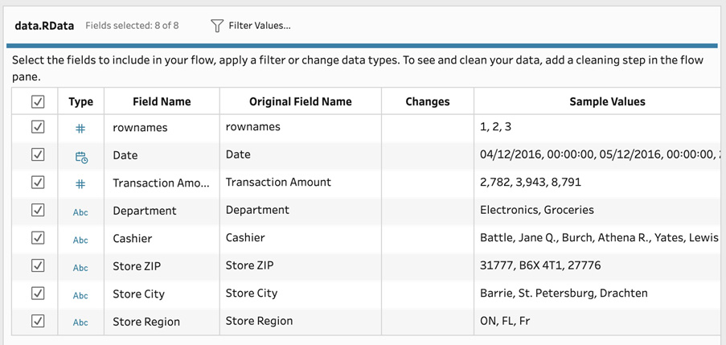

# Lab 2: Extract and Load Processes

In this lab, you will find exercises to ingest
and output the data you require from and to a wide variety of data
types:

-   Connecting to text and Excel files
-   Connecting to PDF files
-   Connecting to SAS, SPSS, and R files
-   Connecting to Tableau extracts
-   Writing data to CSV and Hyper files
-   Setting up an incremental refresh

# Technical requirements

To follow along with the exercises in this lab, you will require
Tableau Prep Builder version 2020.2.3 or later.

The exercises in this lab use sample data files, which you can
download from the course GitHub repository:
[https://github.com/fenago/tableau-data-prep](https://github.com/fenago/tableau-data-prep).

# Connecting to text and Excel files

In this exercise, we\'ll connect to a
**Comma-Separated Values** (**CSV**) file
containing sales transactions
and create a second connection to multiple
**Excel** files. These connection types are very similar and so we\'ll
cover them in one exercise. However, there are key features to both, which
we\'ll highlight.

## Getting ready

To follow along with the exercise, download the **Sample Files 2.1**
folder from this course\'s GitHub repository.

## How to do it...

To get started, ensure you have the sample CSV and/or Excel file(s)
ready on your computer and open up Tableau Prep Builder:

1.  From the Tableau Prep Builder home screen, click the **Connect to
    Data** button and subsequently select **Text file** from the
    **Connect** pane:

    

2.  Tableau Prep will bring
    up the file selection window next. From here, navigate to our sample
    file, **December 2016 Sales.csv**, and open it:

    

Once selected, Tableau
    Prep will automatically create a new flow with
    the data connection in it:

    

Since the data
    connection is automatically selected, all
    options onscreen now relate to that particular connection. On the
    left-hand side, you can see the **Tables** pane. Note that there is
    only one table, equal to the filename. Since text files do not
    contain tables, this is by design. Tableau Prep Builder will always
    provide a generic user interface for data connections whenever
    possible. Once you\'re comfortable with one connection type, others
    should be easier to master:

    

In the bottom pane, you
    can find a summary of all data fields identified in your text file,
    along with the automatically determined data type. In *Lab 3*,
    *Cleaning Transformations*, we\'ll dive into the cleaning options
    you can perform here:

    

3.  In the same bottom pane,
    you can configure the data connection settings. For text files,
    you\'ll always want to verify the **Text Options** section. Tableau
    Prep will automatically set these values as best as possible, but I
    recommend you verify them before you continue. The word **header**
    refers to the first row in your dataset. If you do not have headers
    in your dataset, you can select **Generate field names automatically**, which will create headers named F1, F2, F3, and so
    on. You can rename those fields later on. **Field Separator** tells
    Tableau how columns are defined in a CSV file, which is usually a
    comma or pipe symbol. **Text Qualifier** tells Tableau Prep which
    characters indicate the start and end of a value or string.

    Finally, **Character Set** and **Locale** are typically identified
    appropriately but you can alter them here as needed:

    

4.  Now that we have connected a CSV file, let\'s create a second
    connection to an Excel file, in the same flow.
    To start, click the **+** icon in the **Connections** pane
    and select **Microsoft Excel**:

    

5.  Identical to the selection of a text file, browse to and select our
    sample file named **December 2016 Sales.xlsx**.

    Once we\'ve selected the file, Tableau Prep Builder does *not*
    automatically show another data connection in the flow, as it did
    for our CSV file. This is the default behavior for any data
    connection that has multiple tables. In the case of Microsoft Excel,
    each Excel sheet is considered a table:

    

6.  In order to continue, we
    must drag a table, or sheet, onto the flow canvas to finalize the
    data connection. Proceed by dragging in the **Sales_Data** table.
    Once added, you\'ll notice the color of this connection is different
    from the text file connection we made earlier. Tableau Prep Builder
    randomly assigns a color to the various data flows for easy
    recognition.

    The colors do not denote any kind of functionality:

    

7.  Once connected, you\'ll
    notice the options specific to text file
    connections no longer appear. However, the layout remains the same.
    A function common to both text and Excel files is the ability to
    ingest multiple files simultaneously. Select the **Multiple Files**
    tab for this function:

    

8.  From here, select **Wildcard union** to reveal
    the options:

    

9.  Here, we can opt to include files in subfolders from the selected
    folder, which defaults to the folder where our Excel file is
    located. Select the **Include subfolders** option to enable this.
    Let\'s assume we want to include all sheets named **Sales_Data**, in
    all files ending in **2016 Sales.xlsx**. To do
    so, we can use the asterisk symbol as a
    wildcard and set the file **Matching Pattern**
    property to **\*2016 Sales.xlx** and the sheet **Matching Pattern**
    property to **Sales_Data**:

As a result, this step will
now ingest all files in our subfolder named **Archive** and combine the
data:

By completing these steps, you have learned how to connect Tableau Prep
to text and Excel files.

## How it works...

Tableau Prep text files and Microsoft Excel
connections automatically detect most settings
very well, so, in most cases, a couple of clicks will get you up and
running. The most powerful feature is undoubtedly the ability to ingest
multiple files at the same time. You can ingest
hundreds of files at the same time using this
method, using a single data connection.

# Connecting to PDF files

In this exercise, we\'ll connect to a **PDF** file
containing text and a table with data. Tableau Prep has an exciting
feature that can automatically detect the presence of tables in PDF
files and extract the data for you.

## Getting ready

To follow along with the exercise, download the **Sample Files 2.2**
folder from the course GitHub repository.

## How to do it...

To get started, ensure you have the sample PDF file ready on your
computer, and open Tableau Prep Builder:

1.  Tableau Prep Builder will not show us the entire PDF document, so
    it\'s best to open it in a PDF viewer and review what data we want
    to extract from our PDF. In our example document here, we have a
    single table and so we expect a table in Tableau Prep with the
    headers **Department** and **Amount**:

    

2.  In Tableau Prep Builder, select the **Connect
    to Data** button, followed by **PDF file** to open the file browse
    dialog and select our sample PDF file, **Sales Summary.pdf**:

    

3.  Once connected, Tableau Prep Builder will
    automatically detect the tables within the PDF file. In our sample,
    we can see the **Department** and **Amount** fields coming through
    as expected:

    

4.  Each table is listed separately in the **Tables** part of the
    **Connections** pane to the left. This allows you to digest PDF
    files with multiple tables within them just as easily. The name of
    the table is automatically generated and
    refers to the page number in the PDF file and
    its position on the page:

In this exercise, you have learned how to connect to PDF files and extract
data for processing in Tableau Prep.

## How it works...

Tableau Prep converts each table in a PDF document into a data table
when ingesting the file into a new flow. As such,
Tableau Prep removes the complexity of parsing PDF documents and allows
you to treat this like any other data connection.

# Connecting to SAS, SPSS, and R files

In this exercise, we\'ll
connect to a **statistical file**. Tableau Prep
offers fantastic integration with popular statistical files from **SAS**
(**.sas7bdat**), **SPSS** (**.sav**), and **R** (**.rdata**, **.rda**).

I advocate the use of open file formats such as CSV or commonly used
standards such as Excel. However, if you are unable to obtain your data
in such a format from your data science partner, this connector may
offer a solution.

## Getting ready

In this exercise, we\'ll connect to an R file using the statistical file
connector. In order to follow along, download the **Sample Files 2.3**
folder from the course GitHub repository.

## How to do it...

To get started, ensure you have the sample RData file available on your
computer. From the Tableau Prep home screen follow these steps:

1.  Click the **Connect to Data** button and select **Statistical
    file**.

2.  From the browse file window, locate and open our statistical file
    named **December 2016 Sales.Rdata**.

    And with just these few steps, Tableau Prep Builder has added the
    statistical file source to a new flow:

Most options in
the bottom pane are identical to those when
processing Excel files. However, there is a small but important feature
absent. You cannot alter the data type of the fields in the statistical
file connection step. In order to do this, you have to use a **cleaning step**, which we\'ll discuss in *Lab 3*, *Cleaning Transformations*:

In this exercise, you have learned how to add
Tableau Prep to a data science workflow by
connecting to data produced by popular statistics
applications.

## How it works...

Tableau Prep unpacks statistical files when you connect to them and,
from that moment on, allows you to leverage them like any other
connection.

# Connecting to Tableau extracts

Tableau has two popular proprietary data types,
**Tableau Data Extract** (**.tde**) and **Tableau Hyper Extract**
(**.hyper**). Neither format can
easily be read, if at all, by most data pipeline
and ETL tools. With Tableau Prep Builder, however, you can easily use a
Tableau data extract as an input into your flow. In this exercise, we\'ll
connect to a hyper extract. The steps are identical when connecting to a
TDE extract.

## Getting ready

To follow along with this exercise, download **Sample Folder 2.6** from
the course GitHub repository.

## How to do it...

To get started, ensure you have Tableau Prep Builder open, then follow
these steps:

1.  From the home screen, click the **Connect to Data** button. From the
    **Connect** pane, select **Tableau extract**. This connection type
    is suited to both TDE and hyper extracts.
2.  From the file browse dialog, select and open our Hyper file named
    **Superstore Sales.hyper**.
3.  When the hyper extract has a single table, Tableau Prep will
    automatically add that table to our flow. If the extract has
    multiple tables, all we need to do is drag the desired table onto
    our flow canvas to complete the connection. In this example, the
    extract contains a single table and is added to the flow by Tableau,
    completing our input configuration:

By following the steps in this exercise, you have
learned how to connect to a Tableau extract.

## How it works...

As you\'ve seen in this exercise, connecting to Tableau extracts is very
straightforward, as you might expect from the company\'s own data source
type. If you\'re fully into the Tableau ecosystem and using products
such as Prep, Desktop, and Server, extracts are a great way to manage
data and performance.

# Writing data to CSV and Hyper files

In this exercise, we\'ll
create an output to a file. There are
two file outputs supported by Tableau Prep,
Comma-Separated Values (**.csv**) files and Tableau extracts
(**.hyper**).

## Getting ready

Follow along with the steps in this exercise by downloading the **Sample
Files 2.8** folder from the course GitHub repository.

## How to do it...

To follow along with the exercise, open up a new flow in Tableau Prep
Builder and configure a data input connection, using the **Superstore Sales.hyper** sample file.

Then, follow along with these steps:

1.  Hover your mouse over the data input step in your flow and click the
    **+** icon. The context menu allows you to select a step to be added
    to your flow in order to build your pipeline.
    In this exercise, we\'re
    focusing solely on the output, so select the
    **Output** option:

    

2.  Tableau Prep will instantly add the **Output** step and select it,
    which brings up the bottom pane where the output configuration is
    visible, as well as a data preview.

3.  In the output settings, the default configuration is always **File**
    and the type is **Tableau Data Extract (.hyper)**. We can change the
    output **Name**, which is the filename,
    **Location**, and **Output type** properties here. The only other
    available type is **Comma-Separated Values**
    (**.csv**). Let\'s change the location to the
    same folder as our input
    file:

    

4.  The only difference in settings between these two output types is
    the ability to **append** an existing file. This option is only
    available for Tableau data extracts and will
    write the data as new
    rows to an
    existing hyper file:

    

5.  We can adjust our output settings as desired. In this example,
    let\'s leave all the default settings as they are. When ready, click
    **Run Flow** to execute your flow and generate the output. When
    done, Tableau Prep will show a success message.

6.  Let\'s browse our filesystem and verify that
    the output has been produced:

    

7.  Anytime you\'ve created a hyper extract, you
    can easily validate the extract by connecting
    to it in Tableau Desktop, using it as a data source:

Using the steps in this
exercise, you have learned how to write data
from Tableau Prep to CSV and hyper files.

## How it works...

Using the **Output** tool, you can easily write data to CSV and hyper
files for use in other analytics applications.

# Setting up an incremental refresh

In this exercise, we\'ll configure a flow to achieve incremental refresh.

In the example described, an incremental
refresh would only process orders that have not previously been
processed by Tableau Prep. To achieve this, Tableau Prep compares the
data in the flow output to the flow input.

## Getting ready

To follow along, open up Tableau Prep Builder and, from the home screen,
select the **Superstore** sample flow.

## How to do it...

To get started, select the **Orders(West)** input step, and then follow
these steps:

1.  From the bottom pane, select the **Settings** tab, then scroll to
    the bottom to reveal the **Incremental Refresh** setting and check
    the **Enable incremental refresh** box. This will result in an error
    message, which will disappear as we configure the incremental
    refresh in the next steps:

    

    Tableau Prep needs to know three bits of
    information in the input step to configure a incremental refresh.

2.  Firstly, which field indicates whether or not a row in the data is
    new. In this example, we want to identify new **Superstore** rows by
    **Order Date**. Select this from the **Input field** dropdown to
    reveal the additional settings:

Next, we need to tell Tableau Prep in which output
it can find a field to compare the selected input field with, to
determine whether a row is new or not. In this case, the fields are
named identically, and so Tableau Prep has automatically selected
**Order Date** as the output field in the **Superstore Sales** output,
which is exactly what we want. No further changes are needed; your
incremental refresh for this input is now configured. If you have
multiple inputs, an incremental refresh must be configured for each
input separately.

Important note

Replacing **Output** with **Incremental Data Only**: When you select the
**Create \'Superstore Sales.hyper\'**, output step notice
the **Incremental Refresh** dropdown in the
settings area. There are two options here. By default, Tableau Prep will
append data, meaning only the newly processed rows are added. However,
you can change this to **Create Table** to replace any existing output
with new output containing only those newly
processed rows.

## How it works...

Tableau has achieved a marvelously easy method to process data
incrementally by comparing the existing output to the input for a
particular field only. This method can save you hours of unnecessarily
processing data that\'s already been processed previously.

