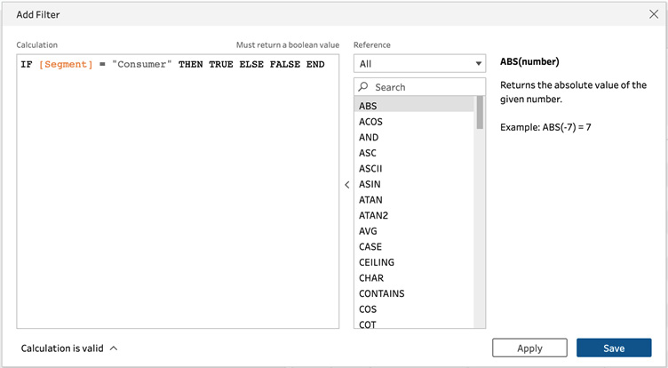

# Lab 3: Cleaning Transformations

All of **Tableau Prep Builder**\'s functionality is designed around the
purpose of combining, shaping, and cleaning your data for downstream
analysis. In this lab, we\'ll look at the various transformations
available to you to shape and clean your data.

In this lab, you\'ll find the following exercises, which will help you
transform your data:

-   Renaming columns
-   Filtering your dataset
-   Changing data types
-   Auto-validating data
-   Validating data with a custom reference list
-   Splitting fields with multiple values

# Technical requirements

To follow along with the exercises in this lab, you will require
Tableau Prep Builder. We\'ll use sample **Excel** files supplied in the
course **GitHub** repository.

The exercises in this lab use sample data files that you can download
from the course GitHub repository:
[https://github.com/fenago/tableau-data-prep](https://github.com/fenago/tableau-data-prep).

# Renaming columns

When it comes to cleaning data, one of the
simplest yet most powerful actions might be simply renaming your fields
to a more user-friendly format.

Tableau Prep steps can be categorized into three items: **inputs**,
**transformations**, and **outputs**. During the first two, the input
and transformation steps, we\'ll always have the ability to change any
field name as desired.

## Getting ready

To follow along with this exercise, download the **Sample Files 3.1**
folder from this course\'s GitHub repository.

## How to do it...

Open up Tableau Prep Builder and connect to the **December 2016
Sales.xlsx** file:

1.  Drag the **Sales_Data** sheet onto the flow canvas:

    
    

    When you select the **Sales_Data** input step,
    the bottom pane will show a preview of all the fields in the source
    data, along with their data type and some sample values:

    
    

2.  In order to change any of the field names, we
    can simply double-click the current name, in the **Field Name**
    column, and edit it to our desired name. We\'ll always be able to
    see what the original field name was in our data source in the
    **Original Field Name** column. Go ahead and update the field names
    to match the following screenshot:

    
    

    It\'s easy to remember the changes we\'ve made
    just now, but as your flow grows in complexity, it can become
    challenging to recall all the changes we\'ve made. Tableau Prep
    supports us here by showing an edit icon next to the step in the
    flow that we\'ve altered. In this case, this is the input
    **Sales_Data** step. We can hover our mouse over the edit icon to
    see a summary of the edits we made:

    
    

    Of course, you may wish to get more detailed
    insights into the exact change. There\'s a great overview of that as
    well! We can click the step with the changes and, from the bottom
    pane, select the **Changes** tab. This tab provides detailed insight
    into the changes made, and we can edit or remove any of the changes
    as needed from here:

    
    

3.  You may have noticed a typo in *Figure 3.4*.
    We renamed the **STORE_CITY** field to **Store Zity**. We\'ll rename
    this to the right name using a slightly different way to the
    previous method, using a clean step. To add a clean step, select the
    **+** icon on the input tool and select **Clean Step**:

    
    

4.  With **Clean Step** selected, locate the **Store Zity** field from
    the bottom pane, open the menu by clicking the
    three dots next to the name, and select **Rename Field**. Rename the
    field to **Store City** and press *Enter*.

You\'ve now successfully prepared this dataset for use by providing
user-friendly, descriptive names to all fields.

## How it works...

As we\'ve seen in the steps in the *How to do it...* section, changing a
field name in Tableau Prep is very easy. However, I recommend you take
caution when renaming fields in your workflow at random steps. Doing so
makes it more difficult for someone else to quickly understand your
flow.

To avoid this confusion as best as possible, always rename fields as far
upstream as possible, preferably in the input step
itself. That way, your flow will stay organized and is easier to
understand for others.

# Filtering your dataset

In Tableau Prep, there are three methods you can use to filter your
data. In this exercise, we\'ll perform filter actions using all three
methods: calculation filters, selected values filters, and regular
filters.

## Getting ready

To follow along with this exercise, download the **Sample Files 3.2**
folder from this course\'s GitHub repository.

## How to do it...

Open up Tableau Prep Builder and connect to the **Superstore
Sales.hyper** extract file, then follow the steps:

1.  With an input step, the only method to filter our data is by using a
    **calculation filter**. To open up the calculation dialog window,
    click **Filter Values...** in the bottom pane:

    
    

2.  The sample data contains information for three
    *segments*: **Consumer**, **Corporate**, and **Home Office**.
    Suppose we want to create a filter to only include **Consumer**
    information. To do so, enter the following calculation and click
    **Save** to apply the filter:

    IF \[Segment\] = \"Consumer\" THEN TRUE ELSE FALSE END

    Important note

    Calculations are a powerful feature in Tableau Prep. You can find
    more information on calculations in *Lab 7*,
    *Creating Powerful Calculations*.

As seen in the following screenshot, you can type in your code entirely,
or use the reference section to look up functions and use the examples
to get started:

1.  Next, add a clean step to your flow by
    clicking the **+** icon on the input step and selecting **Clean
    Step**.

2.  With **Clean Step** selected, expand the bottom pane by dragging its
    top border up. Doing so will reveal a preview of your data.
    Depending on your monitor size and resolution, this pane may be
    visible already:

    
    

3.  From the bottom pane, you can select any value
    in the profile pane, which will instantly update the data preview
    grid below it to show only rows with the selected value. Similarly,
    we can select multiple values by holding the *Ctrl* or *Command* key
    on the keyboard. Let\'s select **Office Supplies** from the
    **Category** field and **Binders** and **Envelopes** from the
    **Sub-Category** field. The data in the grid now only shows rows
    that have the selected values:

    
    

4.  We can turn this selection into a filter with
    a single click. At the top of the pane, you\'ll find that two
    buttons have appeared after we made our selection, **Keep Only** and
    **Exclude**. If we click **Keep Only**, Tableau Prep will create a
    filter to include rows with the selected values. Conversely, if we
    select **Exclude**, it will exclude those rows. Let\'s select
    **Exclude** to create the filter. You can see that the filter has
    been applied from the **Changes** section:

    
    

5.  Behind the scenes, Tableau Prep has created a calculation filter for
    our last action. To see the filter, select
    **Edit Filter** from the **Changes** pane. Here, we can view or edit
    the calculation as needed:

    
    

6.  Close the **Edit Filter** pane and add another clean step to your
    flow. In this step, locate the **Ship Mode** field in the
    profile pane and click the more options menu,
    followed by **Filter** and **Selected
    Values**:

    
    

7.  The **Selected Values** dialog will allow you to choose from a list
    of distinct values in the selected field, to include or exclude.
    Let\'s select **First Class** and **Same Day** to filter the data to
    those values only and click **Done** to complete the filter setup:

    
    

8.  Next, locate the **Order Date** field and open
    up the filter menu once more. Notice how the options here are
    different than those we saw previously for **Ship Mode**.
    That\'s because the options shown will always be relative to the
    data type of the field in question. In this case, **Order Date** is
    a *date* data type, and so we only see filter options applicable to
    dates:

    
    

9.  Select **Range of Dates** and set the filter
    to include data from *January 1st, 2016* through to *December 31st,
    2016*. Click **Done** to complete the filter addition.

10. Next, open the filter menu for the **Product ID** field and select
    **Wildcard Match**. Suppose we only want to include values where the
    product ID starts with the characters **FUR**. To do this, enter
    **FUR** into the value match field and set the matching option to
    **Starts with**. This will exclude any rows that have a value in
    this field that does not start with **FUR**. Click **Done** to save
    the filter.

## How it works...

In this exercise, we learned how to leverage data filters in Tableau Prep.
Filters are the primary method for cleaning your dataset to remove
redundant data. Besides benefiting the output for analysis purposes, a
leaner dataset can also speed up the execution time of your flow. For
that reason, exclude unnecessary data as early as
possible in your flow.

# Changing data types

With Tableau Prep\'s ability to connect to an
incredible number of different data sources comes the challenge of *data
type* management. Every data source technology handles data types
slightly differently, or stores values differently. The wrong data type
may limit the number of functions you can perform with that field. For
example, you cannot aggregate a number if its data type is text, nor can
you filter for a date range if the data type is not a date.

Tableau Prep does a phenomenal job of automatically detecting the
appropriate data type. Tableau Prep data types are
listed as follows:

-   **Number (decimal)**
-   **Number (whole)**
-   **Date & Time**
-   **Date**
-   **String**

There are times when Tableau is unable to determine the correct data
type, and times when it is unable to set it to your desired type because
the values in the data are not compatible. We\'ll look at both cases in
this exercise and how to address them.

## Getting ready

To follow along with this exercise, download the **Sample Files 3.3**
folder from this course\'s **GitHub** repository.

## How to do it...

Open up Tableau Prep and connect to the **December Sales 2016.xlsx**
file from the **Sample Files 3.3** folder and follow the steps:

1.  When you add an input step, Tableau Prep will show you a list of
    fields in the source, along with the data type it has automatically
    detected. The data type is indicated by an icon in the **Type**
    column. You can select any of the options here to change the data
    type instantly. In this particular dataset, we have two fields with
    a data type issue, **Date** and **Return Date**. **Date** has been
    detected as a number, whereas **Return Date** has been set to
    **String**. To correct this, click the icon type
    and set both fields to **Date**:

    
    

2.  Once set, you should see both fields list a single sample value of
    **null**. In this case, the input tool was not able to automatically
    change the data type to our preference. From the **Changes** pane,
    undo the changes:

    
    

3.  Let\'s add a cleaning step to the flow and
    from the profile pane, select the **Abc** data type icon above the
    **Return Date** field name and set it to **Date**:

    
    

    The change is successful this time and the pane shows proper date
    formats for the values now:

    
    

    Tip

    Always use the data cleaning tool to change data types. Not only
    does the result sometimes differ compared to using the input tool
    but you also have the added benefit of seeing more rows in the data
    grid, so you can instantly view the result of your changes.

4.  The **Date** column in our dataset is a little more problematic and
    cannot be solved by the cleaning tool itself. The values in this
    sample set are in *Unix timestamp* format, which Tableau Prep does
    not automatically recognize. We can however create a calculated
    field in order to return the date. To start a new calculation, click
    the **Create Calculated Field** button from the bottom pane. In the
    **Add Field** dialog, set **Field Name** to **Date Fix** and the
    calculation to **DATE(DATEADD(\'second\',
    INT(str(\[Date\])), DATE(\"1970-01-01\")))**, and then click
    **Save**:

We can see that our new field, **Date Fix**, has been added and Tableau
Prep has automatically set the data type to **Date**:

## How it works...

In this exercise, we learned how to improve the quality of our data by
correcting data types. Tableau auto-detects a variety of data types for
your inputs. As we\'ve seen in this exercise, it also auto-detects the
type for newly added fields that are the result of a calculation. If you
ever run into issues with the automatic detections, your first port of
call is simply selecting the desired type from the data type dropdown.
However, advanced calculations are always available for more complex
scenarios.

# Auto-validating data

Data validation can be a time-consuming task where
we have to determine whether a value is accurate or not. One of the most
typical data validation issues relates to misspelling and labeling the
same thing differently. For example, the city of New York might be
present in your data more than once, with different labels:

-   New York
-   NY
-   NYC
-   New York, NY
-   New York, New York
-   New York, US
-   And so on...

To make the process of validating data easier, Tableau Prep uses **data roles**. A data role compares your data against a list of known values
or specific patterns. This allows us to quickly identify problematic
values in our data and take action to resolve them.

## Getting ready

To follow along with this exercise, download the **Sample Files 3.4**
folder from this course\'s GitHub repository.

## How to do it...

Open up Tableau Prep and connect to the **User List.csv** file from the
**Sample Files 3.4** folder and follow the steps:

1.  To assign a data role to any field, we must utilize a clean step.
    Let\'s click the **+** icon on the input step and select **Clean
    Step**.

2.  In the bottom pane, from the profile section, we can see that our
    data contains three fields: **Email**, **Profile URL**, and
    **City**. We can use Tableau Prep\'s built-in data roles to validate
    the values of these fields. To enable validation, click the data
    type icon on the **Email** field and select **Email** under **Data
    Role** from the menu:

    
    

    With the role selected, Tableau Prep will
    validate the data in our sample file and flag any mismatch to the
    role with an exclamation symbol:

    
    

    We have several options to resolve these
    issues, which you can reveal by right-clicking an item. Let\'s
    select **Replace with Null** for **gator**:

    
    

    Once you edit a value, you\'ll notice a little
    paperclip icon in the list of values and a change in the **Changes**
    section listed as **Group Values**. This is because Tableau has
    created a new group with the **null** value and added **gator** as a
    member of that group.

3.  Next, select the **URL** data role for the **Profile URL** field.
    Then, right-click the **Example** value and select **Exclude**.
    Notice how the value disappears from the list and the **Changes**
    pane now lists a filter to exclude this value:

    
    

4.  We can also create **groups** to resolve
    validation issues. Apply the **City** data role to the **City**
    field, then use the search function on the **City** field and search
    for **York**. This should result in two values, one of which has a
    leading space, resulting in a validation error:

    
    

    Important note

    More details about the grouping functionality are provided in *Lab 4*,
    *Data Aggregation*.

5.  We can safely assume that these values both mean **New York**. To
    group them together, select both (hold *Ctrl*
    or *Command*), right-click, and select **Group Values**:

With the group created, we can now only see the **New York** value, and
the warning has disappeared. Note that the **Changes** pane now displays
another grouping action, specific to the **City** field:

You\'ve now successfully applied auto-validation
methods to your data.

## How it works...

In this exercise, we learned how to apply auto-validation to ensure the
right information is present in our dataset. Tableau Prep relies on data
roles to validate your data. The built-in rules allow quick validation
of common fields. For more powerful custom validation data roles, refer
to the next exercise in this lab.

# Splitting fields with multiple values

It\'s not uncommon for a single field to contain
multiple values. For example, a name field may
contain both a user\'s first and last name. Separating these can be done
with Tableau Prep\'s **Split Values** function. **Split Values**
facilitates the automatic creation of calculated fields with the
necessary logic to split up a field based on your requirements.

## Getting ready

To follow along with this exercise, download the **Sample Files 3.6**
folder from this course\'s GitHub repository.

## How to do it...

Open up Tableau Prep and connect to the **December 2016 Sales.xlsx**
file from the **Sample Files 3.6** folder and follow the steps:

1.  Click the **+** icon on the input step and select **Clean Step** to
    add a cleaning step to your flow.

    In the profile pane, we can see that the field named **Cashier**
    contains an employee\'s name. We want to split that value into two
    separate fields, first name and last
    name:

    
    

2.  Expand the more options menu on the **Cashier** field, and from the
    **Split Values** section, select **Automatic Split**:

    
    

    When selecting **Automatic Split**, Tableau
    Prep will attempt to identify the delimiter in
    the field automatically and subsequently create new fields as a
    result. If Tableau is unable to determine the delimiter, **Automatic
    Split** will display the **Custom Split** dialog instead.

    The result of the action we just took can be seen in the **Changes**
    pane, where we can see that two new calculated fields have been
    created. We can also see two new fields in the profile pane:
    **Cashier -- Split 1** and **Cashier -- Split 2**.

    Note that the splitting of a field does not amend or remove the
    original field. In this instance, we still have the original
    **Cashier** field present in our data:

    
    

3.  Change the field names
    of **Cashier -- Split 1** to **Cashier First Name** and **Cashier --
    Split 2** to **Cashier Last Name**, then remove the original
    **Cashier** field:

    
    

4.  We have another field in our dataset labeled
    **Store**. This field contains the store\'s
    city and region information split by a pipe, **\|**, symbol. Let\'s
    split this field using the **Custom Split** functionality. Similar
    to *Step 2*, expand the options menu on the **Store** field, and
    from the **Split Values** section, select **Custom Split**. This
    will present the **Custom Split** dialog box, where we can specify
    the delimiter symbol and the number of fields we want to extract.
    Enter the pipe, **\|**, symbol as the delimiter and split off the
    first two fields, one for **City** and one for **Region**. Then,
    click **Split**:

    
    

5.  Rename the fields from
    **Store -- Split 1** to **City** and **Store -- Split 2** to
    **Region**. Then, remove the **Store** field.

    You\'ve now successfully cleaned up this dataset and your
    **Changes** pane should look like the following:

## How it works...

In this exercise, we learned how to split values
contained in a single field into multiple fields.
Whenever you create a split in Tableau Prep, whether you are using the
**Automatic Split** or **Custom Split** option, Tableau Prep will create
a **calculated field** to determine the values in
the new field. You can always edit these calculations just like any
other calculated field by selecting the **Edit** icon in the **Changes**
pane.

The following screenshot shows the split function
in the calculated fields dialog:

With this knowledge, you can now manage complex datasets that store
multiple values in a single field and transform them into an organized,
easy-to-understand dataset.

