# Lab 4: Data Aggregation

In this lab, we\'ll cover the following exercises:

-   Determining granularity
-   Aggregating values
-   Using fixed LOD calculations for grouping data
-   Grouping data

# Technical requirements

To follow along with the exercises in this lab, you will require
**Tableau Prep Builder** and **Tableau Desktop**. We\'ll use the sample
data supplied in the course GitHub repository.

# Determining granularity

One key consideration that is often overlooked is
determining the granularity of the data that\'s needed. For example,
when working with geographic data, you may have values for continent,
region, country, state, city, ZIP code, street, and so on. But if
you\'re only going to report on country data, you may not need all those
other dimensions. Or perhaps you are processing order data; you may want
to consider whether you need the details for each individual line item
in each individual order -- maybe your analysis will be fine with just
the total order amount per day. In this exercise, we\'ll look at a quick
method to help reveal the data actually in use in a **Tableau Desktop**
visualization.

## Getting ready

To follow along with this exercise, download the **Sample Files 4.1**
folder from this course\'s GitHub repository.

## How to do it...

Start by opening the **Superstore.tflx** flow from the **Sample Files
4.1** folder in Tableau Prep, then follow these steps:

1.  Click the **Create \'Superstore Sales.hyper\'** output step in the
    flow and observe the number of fields shown in the profile pane at
    the bottom of the screen. These are all the fields that will be
    included in the hyper file when the flow runs:

    
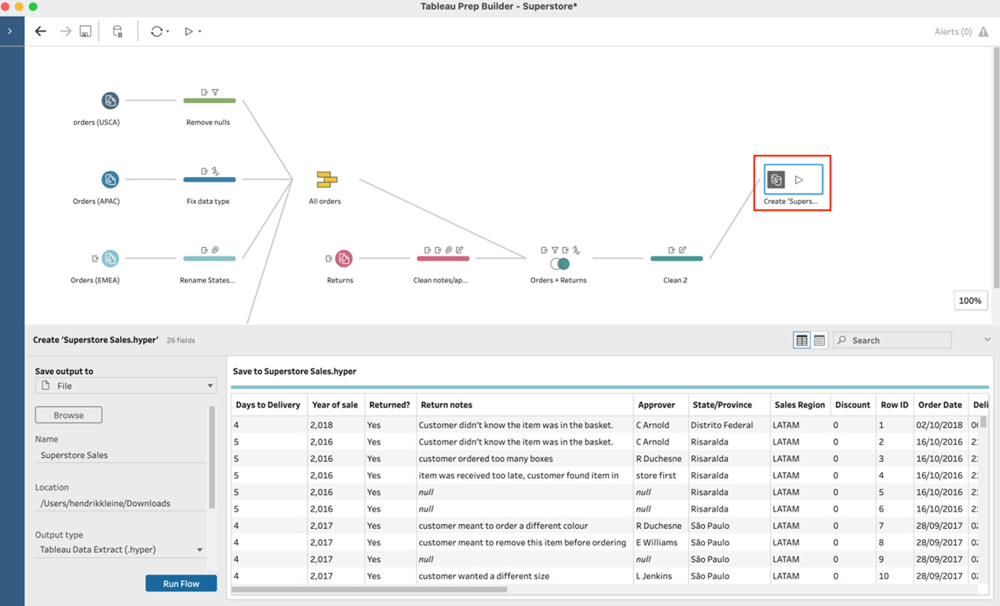

2.  Click the play icon at the top of the screen
    to run your flow. If you\'ve not altered the output settings, this
    will create the **Superstore Sales.hyper** file in your **My Tableau
    Prep Repository\\Datasources** folder in your lab environment:
 

3.  Leave Tableau Prep open and start up **Tableau Desktop**. In Tableau
    Desktop, connect to the **Superstore Sales.hyper** file you just created:

       
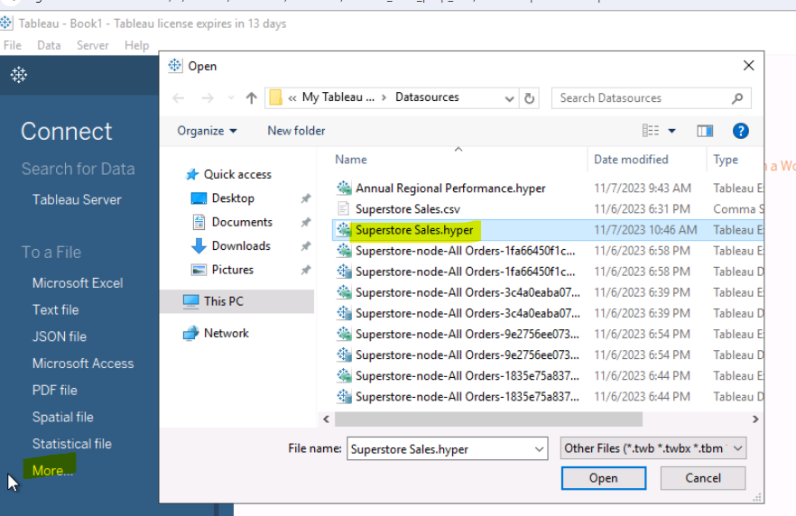

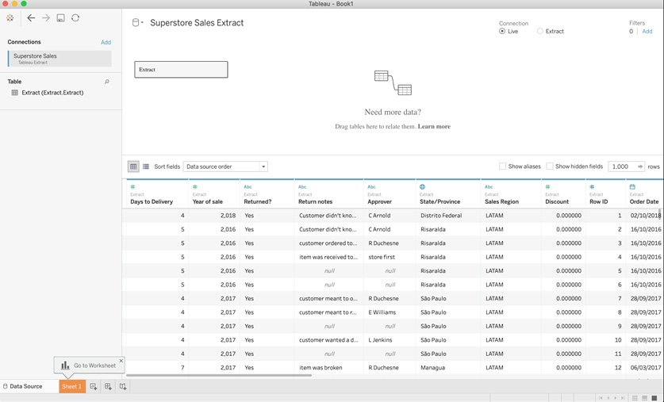

4.  Click **Sheet 1** at the bottom of the screen to start a new
    visualization. To create the visualization from the list of
    available fields, drag **Segment** onto **Columns** and **Sales**
    onto **Rows**:

    
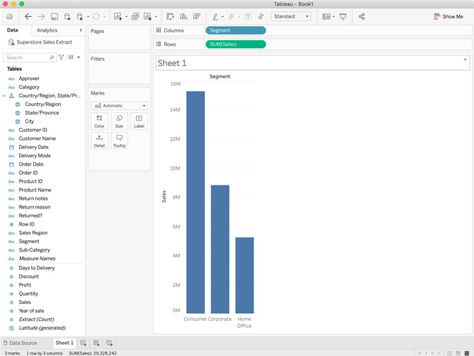

5.  From the menu bar, select **Analytics**, then
    **View Data**. Tableau will then display a dialog with the data
    that\'s present in the visualization. It should come as no surprise
    that the data contains the three segments and their sales amounts,
    as we saw in the bar chart. In the bottom right, you\'ll see that
    the row count is *3*. In a more complex visualization, you\'ll see
    all the data that was presented in this dialog:

    
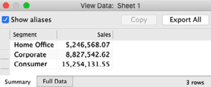

6.  In the **View Data** dialog, select the **Full
    Data** tab at the bottom, then uncheck the **Show all fields**
    option at the top. Finally, change the default preview value of
    **10,000 rows** in the top left to *50,000*. The value in the row
    box will automatically adjust the total number of rows, **40,889**
    in this case. The data that is displayed now is the data that
    Tableau Desktop processed in order to render the bar chart:

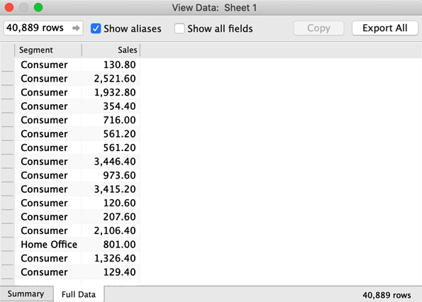

In this example, we\'ve determined that our data
output from Tableau Prep contained many more fields than required to
create the visualization. Furthermore, the fields that were required
were more granular than required to render the visualization.

## How it works...

In this exercise, we learned how to aggregate data in order to achieve a
desired output with the minimum necessary data. Instead of an output
with 26 fields and 40,889 rows, the visualization we created in *Step 4*
could have been created with an output of 2 fields and 3 rows.

In the following exercises in this lab, we\'ll see methods for
grouping and aggregating data in Tableau Prep.

# Aggregating values

In this exercise, we\'ll look at the preferred methods for most users when
aggregating data in Tableau Prep, using the aptly named **Aggregate**
step.

## Getting ready

To follow along with this exercise, download the **Sample Files 4.2**
folder from this course\'s GitHub repository. In this flow, you\'ll find a
slimmed-down version of the sample **Superstore** flow provided by
Tableau.

The last step in this flow contains more than 20 fields and outputs more
than 40,000 rows. However, let\'s assume we are interested only in the
total **Sales** amount by **Segment**. In this exercise, we\'ll achieve
that output using the Aggregate step.

## How to do it...

Start by opening the **Superstore.tflx** flow from the **Sample Files 4.2** folder in Tableau Prep, then follow these steps:

1.  At the end of the flow, click the **+** icon to open the context
    menu and select **Aggregate** to add the
    Aggregate step to your flow:

    
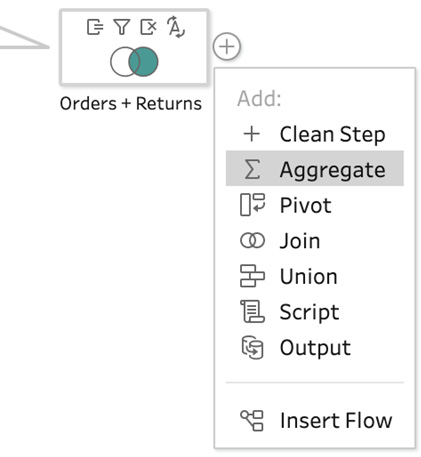

2.  Adding the Aggregate step will bring up its configuration pane at
    the bottom. Here we can select the fields that we want to aggregate
    by dragging them into the **Aggregated Fields** section. Drag the
    **Sales** field into the **Aggregated Fields** section. Notice how
    we instantly see the aggregated value of 29 million:

    
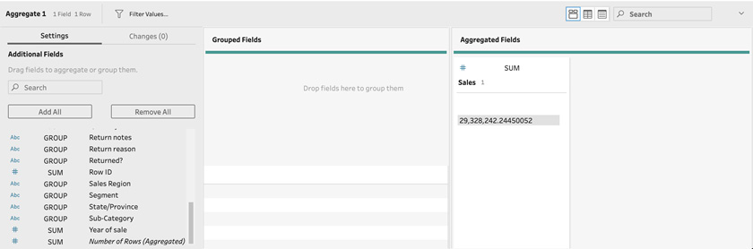

By default, aggregating a numeric value will
    be done by **summarizing** its value across all rows. However, you
    can select from a range of basic mathematic functions, as well as
    several statistical functions, to use for aggregation. To do so,
    click the **SUM** function on top of the field in the **Aggregated
    Fields** section, and select the desired function:

    
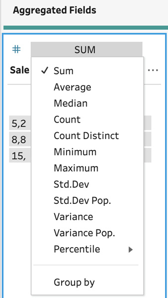

3.  The preview we\'re seeing in *Figure 4.8* is
    our current dataset that will be output, and so we must add
    **Segment** back in if we wish to view the sales amount by segment.
    We do so by creating a group. You can create a group by dragging the
    desired fields into the **Grouped Fields** section. Try it out and
    drag **Segment** into the **Grouped Fields** section:

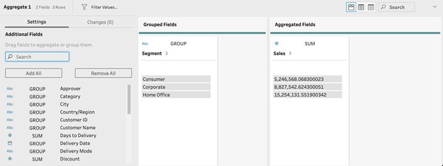

And with that, we\'ve aggregated and grouped our data in just a few
clicks. You can add other fields to the Aggregate
step by simply dragging them into their respective sections. When doing
so, you can always select a different aggregation function for each
field. For example, you can summarize **Sales** but add the average
**Discount** amount.

## How it works...

Aggregating data in Tableau Prep performs the calculations in the data
preparation flow rather than outputting all data just for it to be
aggregated later in a data visualization tool. It\'s a process that
requires careful thought as you\'ll want to provide the optimal dataset
for the intended downstream analysis: not too broad and not too narrow.
In this exercise, you\'ve successfully performed data aggregation. In the
process of aggregation, you\'ve created groups. Furthermore, the data
preview in Tableau Prep itself might have given you the answer you
needed without having to perform additional aggregation steps in a data
analysis tool!

# Using fixed LOD calculations for grouping data

**Level of Detail** or **LOD** calculations are
calculation expressions that
have been available in **Tableau Desktop** for some time. An LOD
calculation allows you to aggregate your data at different levels of
granularity within a single dataset.

For example, you might have a dataset with customer orders, where each
row represents a single line item in an order. You might want to
aggregate revenue by order, or by customer, without losing the
granularity of your data. This is where LOD calculations come into play.
In this exercise, you\'ll create an LOD calculation. In doing so, you\'ll
group your data into distinct buckets and aggregate values in a single
step.

## Getting ready

To follow along with this exercise,
download the **Sample Files 4.3** folder from this
course GitHub repository. You must have **Tableau Prep** version 2020.1
or greater to leverage the LOD functionality.

## How to do it...

Start by opening Tableau Prep and connect to the **December 2016
Sales.csv** file from the **Sample Files 4.3** folder in Tableau Prep,
then follow these steps:

1.  Click the **+** icon on the input tool and add a clean step to your
    flow:

    
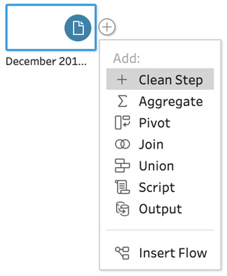

2.  Suppose we want to see
    the total **Transaction Amount** value for
    each department. As seen in the *Aggregating values* exercise earlier
    in this lab, we can achieve that output with the **Aggregate**
    step. However, in doing so, we\'d lose the LOD available. In order
    to prevent this, we\'ll create an **LOD** calculation. Expand the
    menu of the **Department** card, then, from the **Create Calculated
    Field** section, select **Fixed LOD**:

    
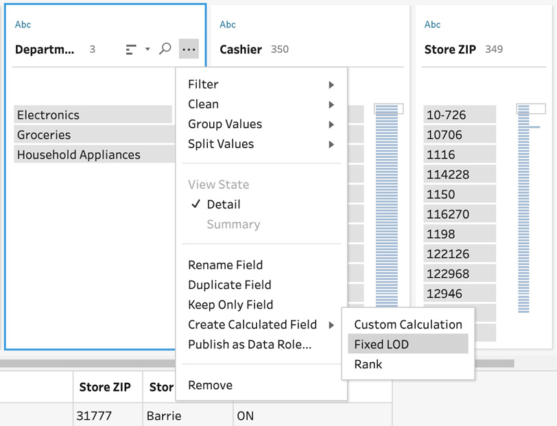

This step will cause an immediate
    error in your flow. That\'s expected, as we
    need to take another step to configure the LOD calculation:

    

3.  Now that we\'re presented with the **Fixed LOD** dialog, we need to
    populate the **Compute using** section in order to complete the
    calculation. In our case, we want to aggregate **Transaction
    Amount**. To do this, select **Transaction Amount**
    from the list of values and
    select **SUM** as the aggregation method, then
    click **Done**:

    
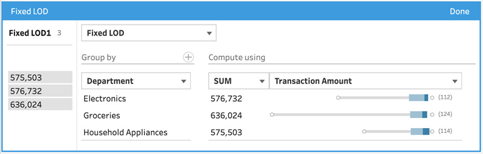

4.  Tableau Prep will instantly add a new field at the beginning of your
    dataset, named **Fixed LOD 1**. You can quickly rename this field to
    something friendlier by double-clicking the name and typing in
    **Total Transaction Amount by Department**. From the profile pane,
    we can quickly see the result of our action; the new fixed LOD field
    has only three values, one for each department. However, the
    original **Transaction Amount** field still exists with all its
    original values:

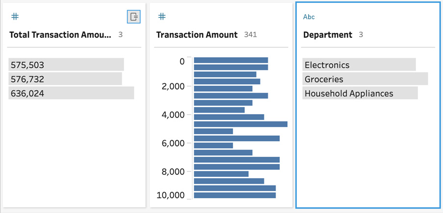

Tip

Ensure that whoever is using your output
understands the various levels of detail in your
output. There are certain calculations that need to be avoided with the
LOD field. For example, a graph plotting the **Department** and **Total
Transaction Amount by Department** fields will have inflated results as
it will summarize values that have already been aggregated.

## How it works...

Tableau Prep uses the same calculation expressions as Tableau Desktop.
In this exercise, you\'ve created an LOD calculation that resulted in the
creation of a group and value aggregation in one powerful move.

In this exercise, Tableau Prep has done the hard work behind the scenes
and created the appropriate LOD calculation based
on our selections. You can view the calculation by opening
the **Changes** pane:

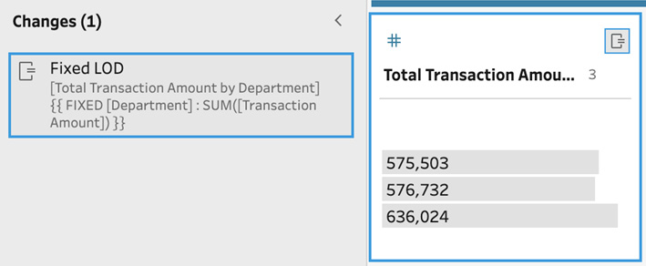

You\'re now able to leverage LOD calculations to perform quick data
preparation, and even data analysis, in Tableau Prep!

# Grouping data

Grouping data in **Tableau Prep** can be done as
part of the **Aggregate** step, as we\'ve seen in the *Aggregating
values* exercise earlier in this lab. The function we\'ll review in
this exercise is different, in that it can group values from a single
field based on certain criteria.

As an example, values in a Name field might include John Smith and
Smith, John. These might refer to the same person, and so we can group
them together as John Smith. Performing this type of grouping is key to
your data preparation efforts and ensures the downstream analysis does
not run into issues with seemingly duplicate names.

## Getting ready

To follow along with this exercise, download the **Sample Files 4.4**
folder from this course\'s GitHub repository.

## How to do it...

Start by opening Tableau Prep and connect to the **2016 Sales.csv** file
from the **Sample Files 4.4** folder in Tableau Prep, then follow these
steps:

1.  Add a clean step to your flow and observe the values in the
    **Department** field in the profile pane. We can see some of the
    data here has been entered inconsistently. Specifically, we have
    **Groceries** and **Grocery** and **Electronics**, **Electrics**,
    and **Electrics Dept**:

    
    

2.  Let\'s resolve the issue by using grouping.
    Select both the **Electrics** and **Electronics** (hold the *Ctrl*
    key on your keyboard) fields. Do not include the **Electrics Dept**
    value. Then, right-click and select **Group Values**:

    
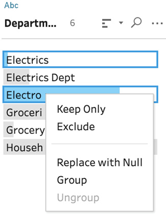

3.  After the grouping action has been completed,
    a little paperclip icon will show up next to **Electronics**,
    indicating that multiple values are grouped together. Your data map
    changes over time and as a result, new values may be introduced.
    Let\'s assume the **Electrics Dept** value was added later. To edit
    the current group, right-click **Electronics** (the item with the
    paperclip) and select **Edit Group Members**:

    
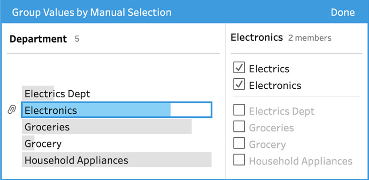

4.  In the group members edit dialog, select
    **Electrics Dept** followed by **Done** to update your group to
    include all three variations of **Electronics**.

5.  Thus far, we\'ve been grouping data manually, that is, selecting
    values and grouping them. Tableau Prep has a number of built-in
    algorithms that can perform grouping for you automatically. Let\'s
    try this out on the **Department** field by opening the context
    menu, selecting **Group Values**, and then selecting
    **Pronunciation**:

    
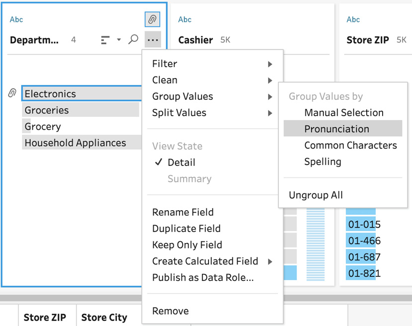

6.  The edit group member dialog opens up
    automatically so we can instantly view the results of this
    algorithm, and we can see here that it has grouped **Grocery** and
    **Groceries** together, as we wanted. Take note of how this edit
    group dialog is different from the manual grouping one we saw
    earlier. There\'s a slider at the top that influences the results of
    the algorithm. In this case, we see how similar the pronunciation
    should be in order to allow grouping. You can move it to the left
    and right to instantly see the effects it has:

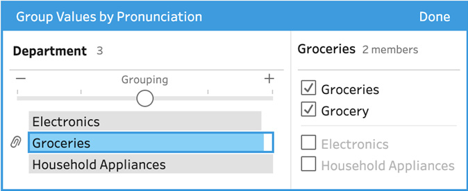

## How it works...

In this exercise, you\'ve manually grouped data.
You\'ve also reviewed the different options available to you, including
manual grouping, pronunciation, common characters, and spelling grouping
options. When you run your flow, Tableau Prep will replace any value in
your group with the name of the group itself. Grouping is a great thing
to do to improve the quality of your data and make the resulting
analysis more robust.

With the knowledge gained in this exercise, you\'re now able to leverage
the different types of data grouping options available to you in Tableau
Prep.

