# Lab 5: Combining Data

In this lab, you\'ll find the following exercises to help you combine
your data for analytics:

-   Combining data with Union
-   Combining data ingest and Union actions
-   Combining datasets using an inner join
-   Combining datasets using a left or right join
-   Expanding datasets using a full outer join
-   Expanding datasets using a not inner join

# Technical requirements

To follow along with the exercises in this lab, you will require
**Tableau Prep Builder**. The exercises in this lab use sample data
files that you can download from the course GitHub repository at
[https://github.com/fenago/tableau-data-prep](https://github.com/fenago/tableau-data-prep).

# Combining data with Union

Data is typically produced by multiple systems and
certain systems may produce similar data that
needs to be combined vertically. That is, the rows need to be stacked on
top of one another. A use case we\'ll use in this exercise is combining
sales data from two different sales systems, in order to get the total
sales dataset prepared. This is a typical scenario you may encounter
when your organization is operating multiple systems, is migrating from
one system to another, is maintaining legacy systems, or is integrating
systems from a partner or acquired company. In this exercise, we\'ll
combine multiple datasets using Union.

## Getting ready

To follow along with this exercise, download the **Sample Files 5.1**
folder from this course\'s GitHub repository.

## How to do it...

Start by opening **Tableau Prep** and perform the following steps:

1.  Connect to the **DataExport_NOV_Sales.csv** text file in order to
    create a brand-new flow with a data connection. Let\'s assume that
    this is data from a legacy sale system, where each row represents a
    sale made.

2.  Create a second data connection to the
    **DataExport_NOV_SalesData.csv** text file. This data is from the
    same legacy system, but it may reside on a separate server,
    resulting in the need for a separate connection here:

    
    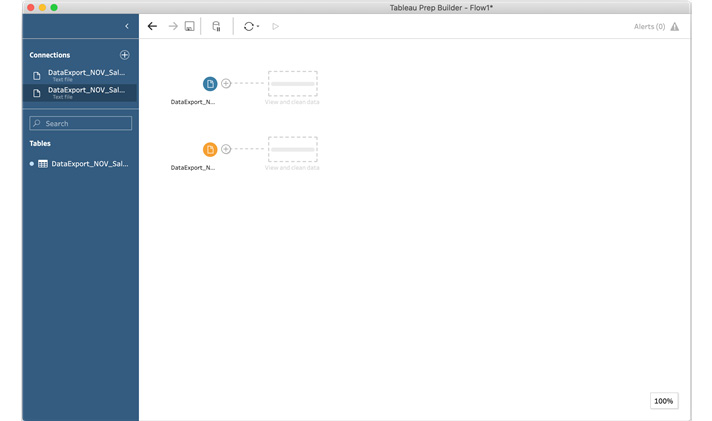

3.  We\'ll now need to combine data from both
    connections in order to get a complete picture
    of all sales made. To do so, we\'re going to union these two data
    inputs. To do so, click and hold the second data input and then drag
    it on top of the first data input. When you do so, you will see two
    options appear, **Union** and **Join**:

    
    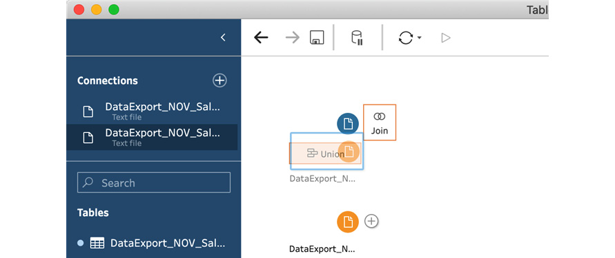

    Drag the connection so that **Union** is
    highlighted, and then release. Tableau Prep
    will instantly add a step named **Union 1**:

    
    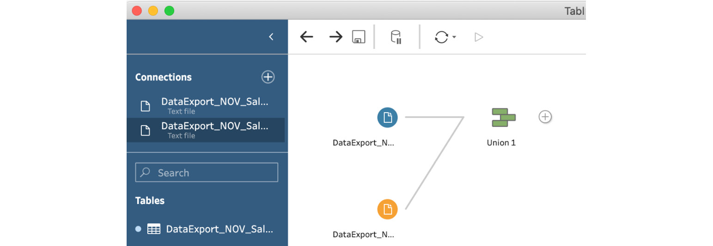

4.  Select the **Union 1** step to view the data
    pane at the bottom of the screen. Expand the
    bottom pane so that the data preview becomes
    visible. Notice how a new field has been added automatically, named
    **Table Names**. This field indicates the original source of each
    row in the combined dataset. You can scroll through the preview to
    see both values, **DataExport_NOV_Sales.csv** and
    **DataExport_NOV_SalesData.csv**:

    
    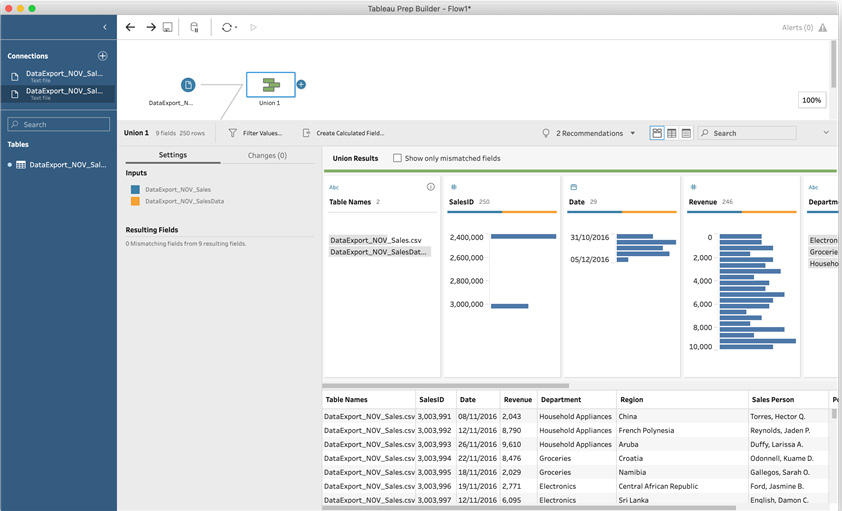

    Important note

    In the bottom pane, take
    note of the two colors Tableau Prep has
    assigned to each data connection; blue for
    **DataExport_NOV_Sales.csv** and amber for
    **DataExport_NOV_SalesData.csv**. Observe the column headers and
    notice the multi-colored bar beneath all the field names, with the
    exception of the **Table Names** field. This multi-colored bar
    indicates from which data connection the field was sourced. In our
    case, all bars are a combination of blue and amber, meaning data was
    sourced from both data connections.

5.  Now let\'s add a third data connection to your flow. This time,
    connect to the **POS_Sales_Data_November_2016.xlsx** file,
    specifically, the **Sales_Data** sheet. This data is from a
    completely different sales system. As a result, the data in the
    file is organized differently from the two
    connections we\'ve used so far. Observe the
    input field names by selecting the input step:

    
    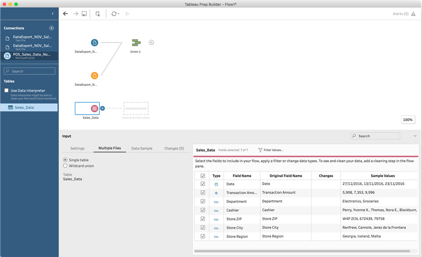

6.  Even though we\'ve observed different field names, we can still
    stack this data with the existing connections, using **Union**. Go
    ahead and drag and drop the **POS_Sales_Data_November_2016.xlsx**
    input on top of the **Union 1** step. Notice how this time, three
    options appear when hovering, instead of the two
    options we saw in *Step
    3* earlier. We have **Add**, **Union**, and **Join**:

    
    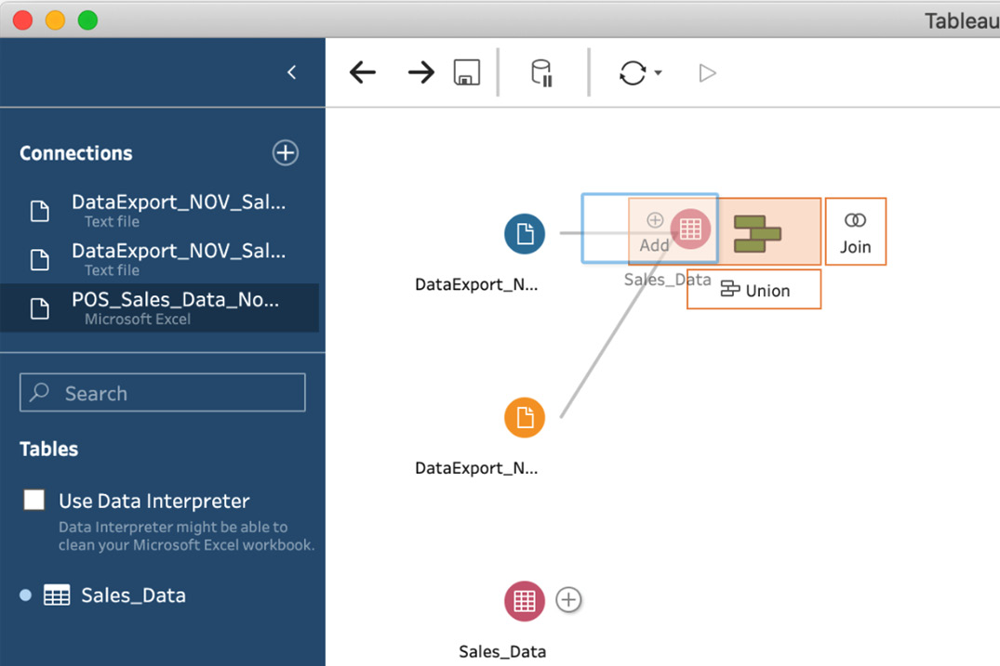

    Hover to the left to highlight the **Add** action and release the
    mouse button. This will add the third source to your existing union.
    If you have selected **Union** instead, a second union step would
    have been created, combining **Union 1** with the third data
    connection.

7.  Select the **Union 1** step to view the bottom pane. Notice how you
    can use the color coding to quickly find potential issues with the
    union. The **Inputs** section now defines three colors; blue for
    **DataExport_NOV_Sales.csv**, amber for
    **DataExport_NOV_SalesData.csv**, and red for
    our newly added
    **POS_Sales_Data_November_2016.xlsx** connection:

    
    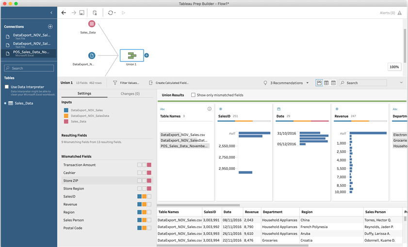

    Using the same color bars we described in *Step 4*, you can quickly
    see the origins of each field. For example, **SalesID** is blue and
    amber, meaning it contains data from those two data connections.
    That is, the **SalesID** field does not exist in the
    **POS_Sales_Data_November_2016.xlsx** data connection. Similarly,
    the **Date** field has three colors -- blue, amber, and red --
    indicating the field is present in all three inputs.

8.  The **Mismatched Fields** section uses color coding to inform us of
    the field origins, similar to the multi-colored bar under each field
    name. There are some fields that contain similar data, such as
    **Store Region** and **Region**. However, because
    the field names in the data connections are
    different, Tableau Prep was unable to align
    them in a single field. To solve this issue, we can simply rename
    the fields:

    Rename **Transaction Amount** to **Revenue**.

    Rename **Cashier** to **Sales Person**.

    Rename **Store ZIP** to **Postal Code**.

    Rename **Store Region** to **Region**.

    The following screenshot illustrates the end result, where fields
    have automatically been merged as a result of renaming field names:

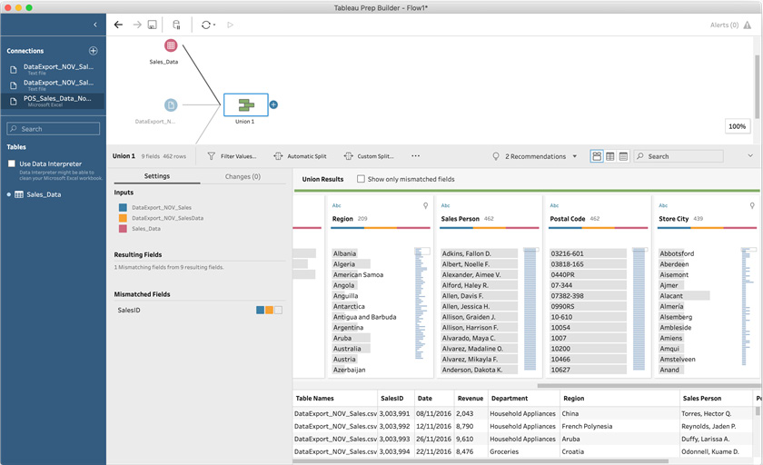

As you can see, Tableau Prep automatically and
instantly re-aligns the fields once they have
identical names. In our case, we have one field remaining that is not
present in the **POS_Sales_Data_November_2016.xlsx** data connection --
**SalesID**. This is not an issue for the union step. The field will be
retained, and any rows originating from the
**POS_Sales_Data_November_2016.xlsx** data connection will have a null
value for that field.

## How it works...

Tableau Prep stacks rows from any input to a union on top of each other
and aligns the data by field names at the same
time. In our exercise, we\'ve resolved two scenarios. First, we
combined data from two similar, but separate, data
connections. In this case, Tableau Prep combined the data without any
issues. Then we combined data that was significantly different, that is,
data with a different number of fields, and different field names.
Tableau resolves this by setting the value to null for fields that are
not present in a certain input, and we can manually rename fields in
order to trigger Tableau to align them.

# Combining data ingest and Union actions

When you have multiple data sources that need to
be vertically stacked using a union, you may opt
to perform that action during ingestion. This avoids you having to
create a separate **Union** step in Tableau Prep. Furthermore, you can
use wildcards in your input, such that the input becomes dynamic, and
new data files can be ingested as they are added. A typical scenario for
this would be an automated process that exports data on a recurring
schedule, which you then need to union with prior data exports.

In this exercise, we\'ll use a special type of union that is part of the
input step, rather than a step by itself. Using the **Union**
functionality during input allows you to ingest and union multiple input
files simultaneously.

## Getting ready

To follow along with this exercise, download the **Sample Files 5.2**
folder from this course\'s GitHub repository. This folder contains sales
data that has been exported every month, and so we have one file for
every month of the year 2016, 12 files in total, to be combined using a
union.

## How to do it...

Start by opening Tableau Prep and perform the following steps to create
a dynamic input and union step:

1.  Connect to the **January 2016 Sales.xlsx** Excel file in order to
    create a brand-new flow with a data connection.

2.  From the available tables, drag the **Sales_Data** table onto the
    flow canvas. Then, select the input step in
    order to display the bottom pane. From the
    pane, select **Multiple Files**, followed by **Wildcard union**:

    
    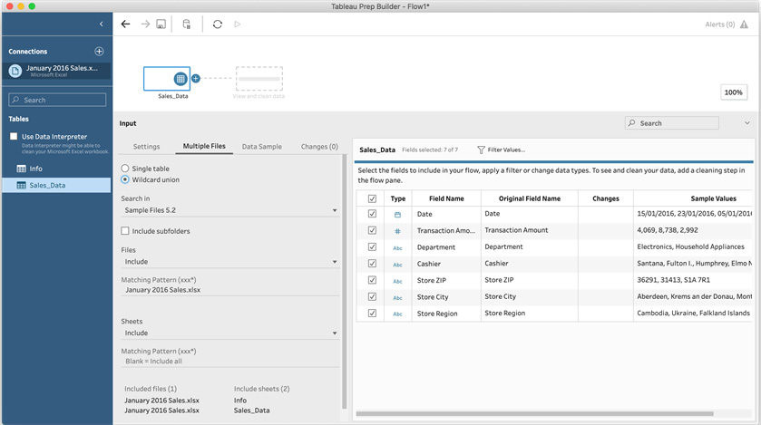

    **Wildcard union** allows you to perform a union within the input
    data connection. That is, you can union multiple files at the same
    time. Wildcards, represented by the asterisk, *\**, symbol, are
    utilized to refer to any number of files in a given directory that
    match a certain naming pattern.

    In this exercise, we will perform a union to combine all 12 Excel
    files in the sample folder.

3.  By default, **Matching Pattern** is identical to the filename of the
    current connection, in this case, **January 2016 Sales.xlsx**. To
    capture all files in the directory, we can replace any number of
    characters using a wildcard. Set **Matching Pattern** to **\*2016
    Sales.xlsx**. This will instruct Tableau Prep
    to include every file ending in **2016 Sales.xlsx**. In this
    example, we\'ve replaced the month with a
    wildcard, and hence all 12 files are now in scope.

4.  Once you\'ve set the **Matching Pattern** field, Tableau Prep will
    immediately scan the files in scope, and identify the sheet names
    per file. You will be presented with a full list of file and sheet
    names under **Sheets**. Notice how each file from our sample data
    contains two sheets, **Sales_Data** and **Info**:

    
    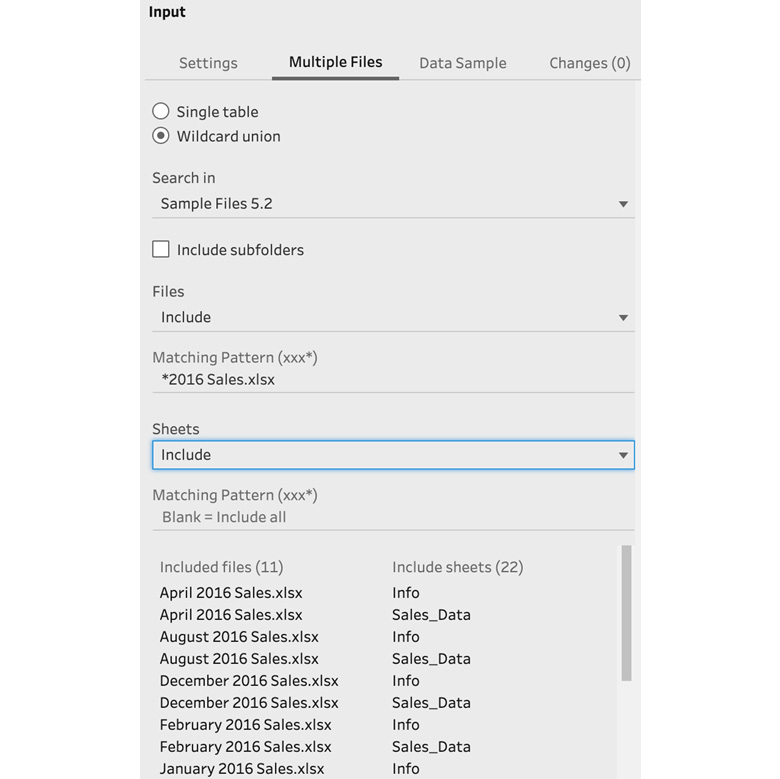

    The data we want to capture resides in the **Sales_Data** sheet. As
    such, we need to provide a matching pattern for sheets, so that only
    the sheet carrying that name will be included. Since the sheet names
    are identical, we can achieve this without a wildcard.

    Note that we can set our **Matching Pattern** behavior to
    **Include** or **Exclude**. Using the dropdown highlighted in
    *Figure 5.10*, by setting this option to **Exclude**, you can
    specify the **Matching Pattern** value as **Info**. In doing so,
    you\'re instructing Tableau Prep to exclude all sheets named
    **Info**.

5.  To confirm the settings, make sure to click the **Apply** button at
    the bottom of the pane. Depending on your
    screen size, this button may not be visible
    initially. Scroll down to the bottom to reveal the **Apply** button
    and click it.

6.  After applying your changes, Tableau Prep will provide a list of
    field names found across all the files in scope. Furthermore, it
    will provide us with a preview of values per field in the bottom
    pane:

    
    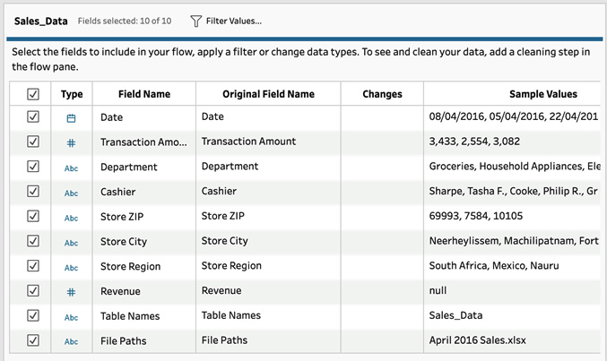

    Notice that there is a field named **Revenue** with null values.
    Throughout this course, we\'ve used these sample files multiple times
    and the **Revenue** field name is unexpected, as is the null value.
    To investigate this further, add a clean step to your flow.

7.  With **Clean 1** selected, scroll through the field list, to the
    **Revenue** field. The data profile shows a large number of null
    values, confirming our suspicion that there\'s something not
    right here. Select the
    **null** value in the profile chart. Doing so will highlight the
    origins of the **null** value in the **File Paths** field, which has
    automatically been added by Tableau Prep, as a result of the union.
    Here, we can clearly see that null values are present in all files,
    except the **November 2016 Sales.xlsx** file:

    
    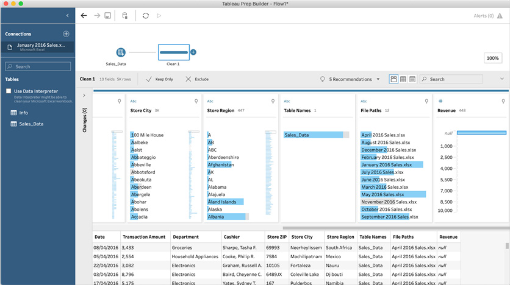

8.  The only other numeric field in the dataset is **Transaction
    Amount**, so it is worth investigating that field as well. When you
    scroll over to the **Transaction Amount** field, you\'ll once again
    see a significant number of **null** values. Repeat the process from
    the previous step, select the **null** value, and then observe the
    origins in the **File Paths** field.

    This time, you can see that the origin is the
    opposite. All **null** values originate from
    the **November 2016 Sales.xlsx** file. And so we have determined
    that **Transaction Amount** and **Revenue** are likely to represent
    the same data, but the field labels have changed in the November
    file.

9.  To resolve the problem we have identified, we need to merge the
    **Transaction Amount** and **Revenue** fields into a single field.
    To do so, select the **Transaction Amount** field, press the *Ctrl*
    key, and then select the **Revenue** field as well. With both fields
    selected, open the options menu on either field and then select
    **Merge**:

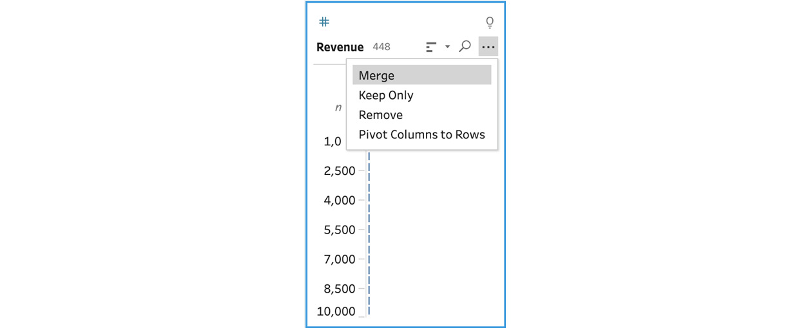

Tableau Prep will instantly merge the fields
and assign it the name of the field first
selected. An icon above that field will indicate the merge action.
Hovering over the icon provides details on the fields that were merged:

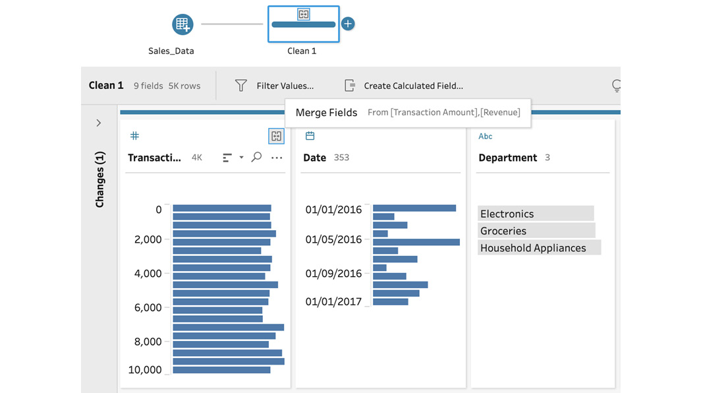

With these steps completed, you have successfully performed a union
during the input step.

## How it works...

In this exercise, we\'ve created a union as part of the input step,
leveraged a filename and sheet matching pattern, toggled
the matching style from
include to exclude, and investigated a discrepancy
as a result of a union of files with a different structure. As a result,
we\'ve learned how to ingest multiple files and perform a Union action
using a single input step.

# Combining datasets using an inner join

An inner join is the end result of joining two data sources together and
retaining only those rows that overlap. For example, let\'s assume we
have order data for a B2B seller of office supplies. Their data may be
segmented into a database containing order information, and another
database containing customer information. The overlap between these two
sources is a common identifier, such as the customer\'s name, or, more
likely, a unique customer ID.

## Getting ready

To follow along with this exercise, download the **Sample Files 5.3**
folder from this course\'s GitHub repository.

## How to do it...

Start by opening Tableau Prep and perform the following steps to combine
the two sample files using the **Inner Join** functionality:

1.  Connect to the **Orders.csv** text file in order to create a
    brand-new flow with a data connection. The **Orders** file contains
    order data from a B2B supplier. Each row
    represents a separate order. Each customer is
    denoted by a unique identifier in the
    **cust_id** field:

    
    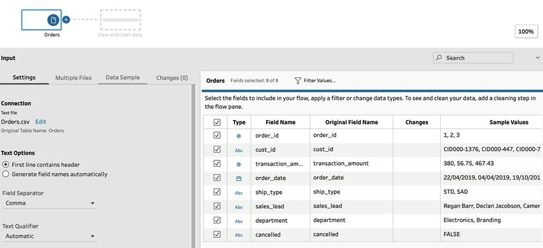

2.  In our sample data folder, there is a separate file containing
    customer details, such as a customer contact name, email, and
    geographic information. In order to perform a comprehensive analysis
    on orders, for example, identifying the total sales by **State** or
    **County**, we need to combine these datasets. To get started,
    create a second connection in your flow to the **Customers.csv**
    file.

3.  In order to start any new **join**, whether that is an inner join or
    any other type, we need to click and drag the second data connection
    step over the first step. When you hover on
    top of the first connection
    step, two options will appear, **Union** and
    **Join**. Ensure that **Join** is highlighted and then release your
    mouse hold:

    
    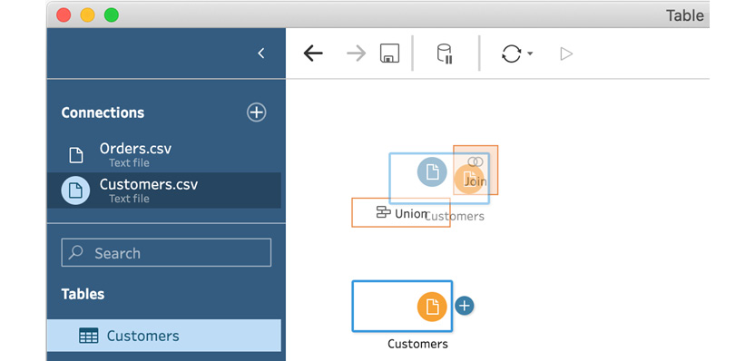

    A join will always require additional configuration before it is
    ready for use. Because Tableau Prep instantly evaluates the validity
    of your flow, creating a new join will initially result in a warning
    message. This is expected behavior and nothing to be concerned
    about:

    
    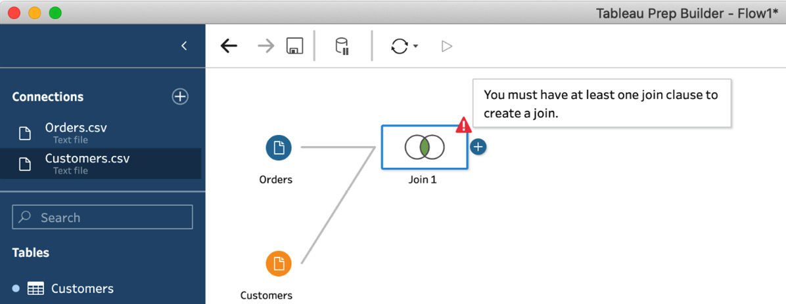

4.  Next, we need to specify how these two data
    sources can be connected, that is, which
    field, or combination of fields, they have in common. We can specify
    this in the bottom pane, in the **Applied Join Clauses** section.
    Here, click **Add** to reveal two field name lists. The field name
    lists indicate their source data connection, **Orders** and
    **Customers**, just above the search bar:

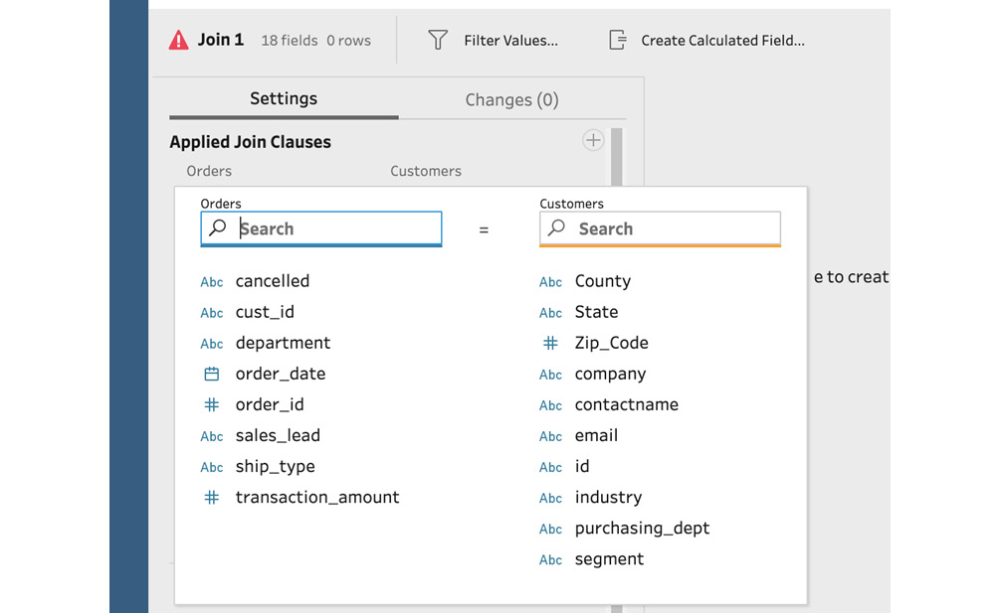

These data sources are connected by customer ID.
In the **Orders** data source, this field is
denoted by **cust_id**. In the **Customers** data source, it is denoted
by **id**. Select these two fields to create your join clause.

Once a join clause has been created, as we did in the previous step,
Tableau Prep will immediately execute the join and provide detailed
results in the bottom pane. There are two specific areas to pay careful
attention to when creating a join, **Join Type** and **Summary of Join
Results**.

**Join Type** allows us to set the type of join, that is, an inner,
left, right, full outer, or other type of join. By default, the type is
set to **inner**, which is the type we require in this exercise, and so we
do not have to alter it. An inner join will return all data that
overlaps between the two data sources; in our case, all orders that have
a customer associated with them.

In the following screenshot, we can see that
the overlapping section of the two circles is
selected, resulting in **Join Type : inner**:

**Summary of Join Results** provides valuable information regarding the
outcome of a join operation. Specifically, it will inform us how many
records are returned from each data source, after passing through the
join, and how many records did not pass through because of a mismatch.
In our example, a mismatch would occur if an order would *not* have a
customer associated with it in the **Customers.csv** file. Our sample
data has not mismatched and we\'re seeing a total of 15,821 rows from
the **Orders** file passed through the join, as well as 1,467 rows from
the **Customers** file. You can open both files in Excel to confirm that
this is indeed the correct number of rows.

The following screenshot shows the join results of the steps we have
just performed:

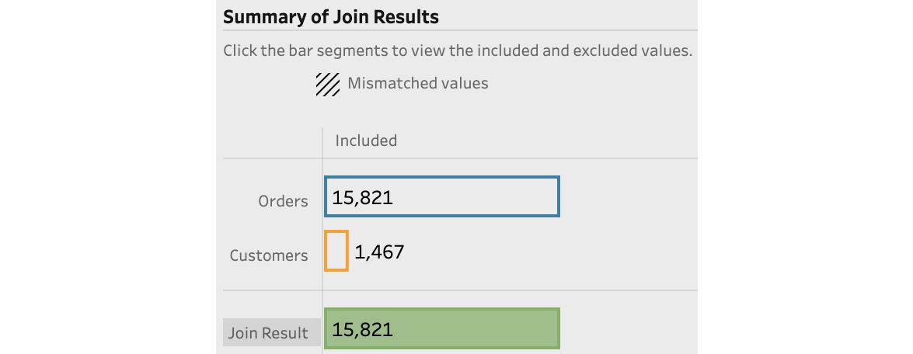

Let\'s move on to the next section!

## How it works...

In this exercise, you\'ve connected two data sources
in a Tableau Prep flow. You then joined these two
data sources using a common denominator, in this case, the customer ID.
You\'ve experienced how Tableau Prep immediately performs join
operations without the need for you to run the entire flow. This is by
design, and helps you validate your join prior to building out your flow
further and possibly running into unexpected issues later on as a result
of the output of the join step.

# Combining datasets using a left or right join

In a left join, we pass through all the data from the first dataset,
that is, the left data source, and only those records from the second,
right data source that we were able to match. This means that any sales
records that did not involve a loyalty card will still pass through, but
the additional fields from the second source will simply be empty, or
null.

## Getting ready

To follow along with this exercise, download the **Sample Files 5.4**
folder from this course\'s GitHub repository.

## How to do it...

Start by opening Tableau Prep and perform the following steps to enrich
the sample sales data with the customer loyalty card data, if available:

1.  Connect to the **Sales Data.xlsx** Excel file in order to create a
    brand-new flow with a data connection. Let\'s assume this is sales
    data from a checkout system, where a customer may or may not have
    used a loyalty card. If the transaction involved a loyalty card,
    there will be a value in the **Loyalty_ID** field, otherwise it will
    be null.

2.  Now, bring in the customer loyalty card data by creating a second
    data connection, this time to the **LoyaltyData.csv** text file.

3.  Create a join by dragging the **LoyaltyData** data source on top of
    the **Sales Data** source, ensuring that you release when the join
    is highlighted:

    
    

4.  Set the join clause to
    use the **Loyalty_ID** field
    from the **Sales Data** source
    and the **ID** field from the **LoyaltyData**
    source. Once you apply the join clause, Tableau Prep will
    immediately perform the join operation and, after a few moments,
    provide you with the results, in both summary and detail, within the
    bottom pane:

    
    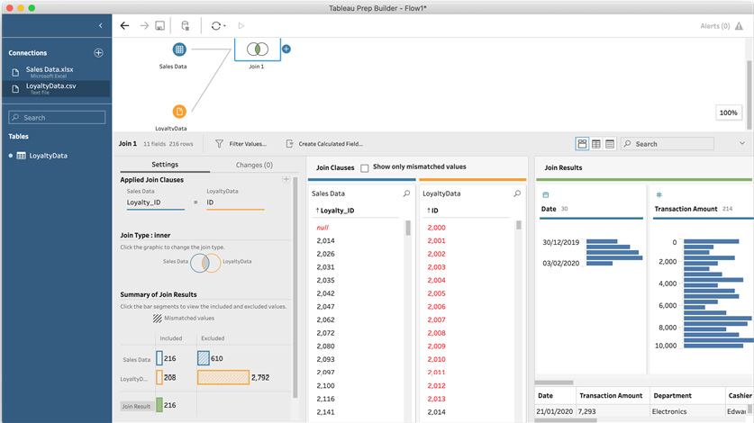

    Note that Tableau Prep indicates
    a number of mismatched
    values in the **Summary of Join Results**
    section. Because the default join type is an
    inner join, Tableau Prep will only return rows
    that have a common identifier in both sources, in this case, our
    loyalty ID. Any other rows are excluded. The join result gives the
    count of rows that actually passed through the join, 216 in this
    case, out of a total of 826 sales transactions:

    
    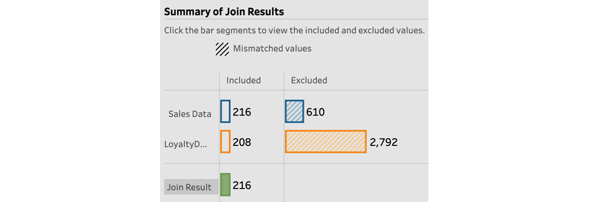

    The middle section in the
    join step settings shows
    all the IDs that could not be matched in a red
    font. For example, **null** from **Sales Data** could not be matched
    to any row in the **LoyaltyData** file and, as a result, is excluded
    from the join results. Similarly, the ID **2000** from the
    **LoyaltyData** file was not present in the sales data, and
    therefore is also excluded from the join results:

    
    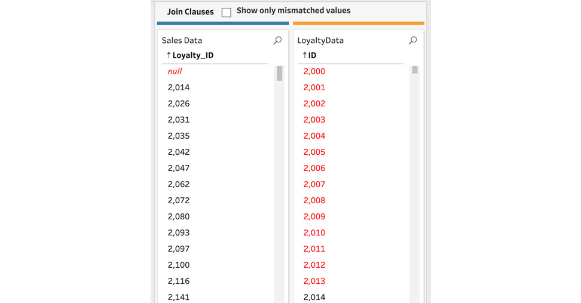

5.  In our case, we want to return all our
    sales data rows and simply augment them with
    loyalty card data, if the
    customer used a loyalty card. Therefore, we
    need to change our join type to **Left Join**, meaning that we want
    to retrieve all data from the left side, **Sales Data**, and only
    those rows from the right side, **LoyaltyData**, when there is an
    overlap, based on **Loyalty ID**. To change the join type, select
    the left circle in the **Join Type** Venn diagram:

Tableau Prep immediately
updates the join results,
and, at a glance, we can now see from the summary
that all 826 **Sales Data** rows are being passed through:

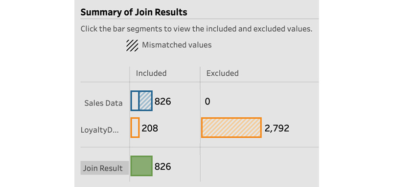

You may review the row-by-row results in a more organized pane by adding
a clean step to your flow and selecting **null** from the **Loyalty_ID**
field. This will display all rows where a transaction was made without a
loyalty card, and you can see that the values for customer information
are set to **null** as a result:

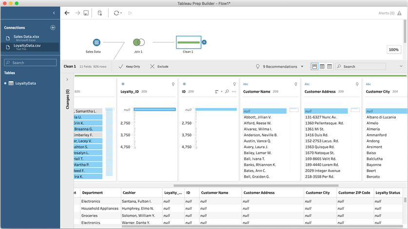

With these steps completed, you\'ve successfully utilized Tableau Prep
to perform a left join.

## How it works...

In this exercise, you\'ve created a left join, which
resulted in returning all
rows from one data source, and only those rows
from a complementary data source when there was a
common identifier. A right join would have performed the exact opposite,
that is, returned all rows from the second data source, and only
matching rows from the first data source.

There are many use cases for a left or right join, as in many scenarios
we combine data from multiple sources to a core data source, such as
transactions or customers.

# Expanding datasets using a full outer join

In the *Combining data ingest and Union actions* exercise, we created an
inner join to return rows from two data sources
that had a commonality. In the *Combining datasets
using a left or right join* exercise, we created a left join to return all
rows from a data source and enrich that data with information from a
second source, whenever there was additional information available,
without dropping any rows from the original source.

In this exercise, we\'ll look at a variation of the join, which is named
the **full outer join**. In this case, we\'ll want to retrieve all rows
from both data sources involved in the join, that is, even if there\'s
no overlap. It\'s essentially doing a left and right join at the same
time; you won\'t lose any data from either data source.

In the example that follows, we\'ll use a use case where a company is
running several projects and each project may have a number of people
assigned to it. However, some projects may not have started yet, or may
have already been completed. Those inactive projects won\'t have people
assigned to them. Similarly, people may be assigned to a project, or are
currently between projects and not assigned directly to any project. We
want the result of our join to return all projects and all people.

## Getting ready

To follow along with this exercise, download the **Sample Files 5.5**
folder from this course\'s GitHub repository.

## How to do it...

Start by opening Tableau Prep and perform the following steps to create
a full outer join to combine project and people data:

1.  Connect to the **Projects.xlsx** Excel file in order to create a
    brand-new flow with a data connection. From the available tables,
    drag the **Projects** table onto the canvas.

2.  The source we\'ve connected to contains two tables, **Projects** and
    **Project Staff**. Without creating a
    brand-new data connection, drag the **Project
    Staff** table onto the canvas to create a second input, using the
    same data connection:

    
    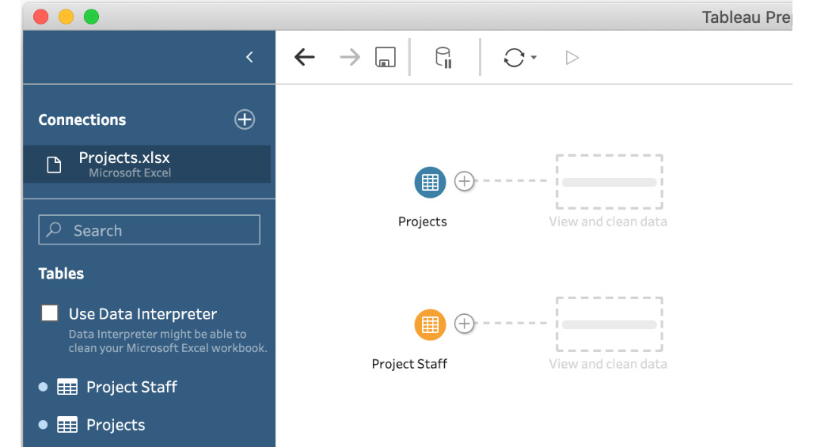

3.  To initiate the join creation process, drag the **Project Staff**
    input on top of **Projects**, releasing it when the join icon is
    highlighted.

4.  Create a join clause using the **Project Name** field for the
    **Projects** input, and the **Project** field for the **Project
    Staff** input.

5.  To complete the configuration, click the left circle in the Venn
    diagram, followed by the right circle. This will then update the
    join to become a full outer join. Notice that
    the type name is abbreviated to
    simply state **full**:

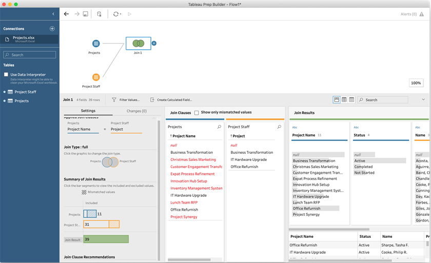

With these steps completed, you\'ve successfully performed a full outer
join with Tableau Prep.

## How it works...

In this exercise, you\'ve leveraged a full outer join to combine two data
sources, even if those sources have nothing in
common. In this case, we have included projects
that were not assigned any staff and included staff that were not
assigned to any project.

Using a full outer join can come in handy for specific scenarios.
However, there is a risk of creating a dataset that is incorrect since,
with a full outer join, you may expect many mismatched values, and a
mistake is easily made by ignoring the mismatches. It is prudent to
double-check that your join clause is correct with any join, but perhaps
even more so with a full join, for this reason.

# Expanding datasets using a not inner join

In this lab, we have assumed in all
join-related exercises that there was an overlap
between two data sources. However, for analysis purposes, you may be
interested in what data is not overlapping, so that you can take action
appropriately.

Using the same data as we\'ve used in the *Expanding datasets using a
full outer join* exercise, where we have a data source with projects, and
another data source with project staff, we may change our use case to
focus solely on data that does not overlap. That is, we are only
interested in projects without staff assigned to them, or staff members
not currently assigned to work on any project.

## Getting ready

To follow along with this exercise, download the **Sample Files 5.6**
folder from this course\'s GitHub repository.

## How to do it...

Start by opening Tableau Prep and perform the following steps to create
a **not inner join**:

1.  Connect to the **Projects.xlsx** Excel file in order to create a
    brand-new flow with a data connection. From the available tables,
    drag **Projects** onto the canvas.

2.  From the same list of tables, drag **Project Staff** onto the canvas
    to create a second input step.

3.  Drag the **Project Staff** step on top of **Projects**, releasing
    when the join icon is highlighted, in order to
    create a new join.

4.  Configure **Join Clause** to match the data on **Project Name** from
    the **Projects** source, and **Project** from the **Project Staff**
    source.

5.  To create the **not inner join**, click the Venn diagram in the
    following order. First, click the left circle, then the right
    circle, and finally the center where both circles overlap. When
    done, the join type will state **notInner**:

    
    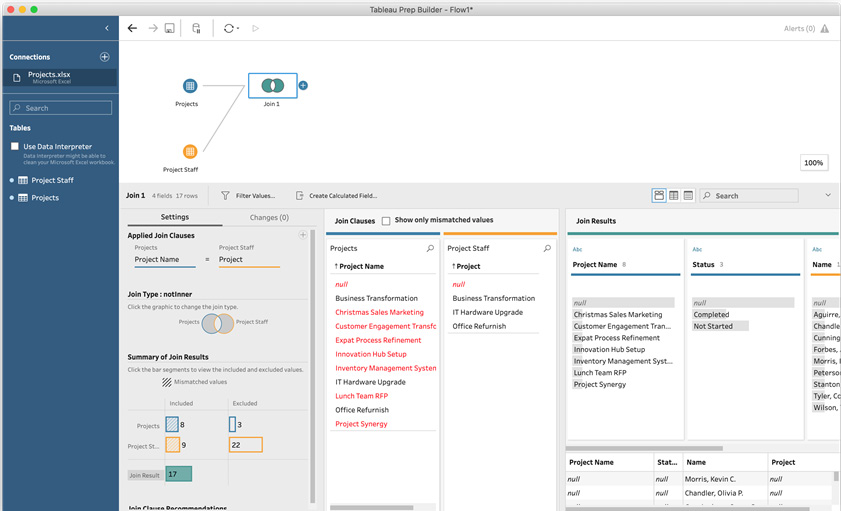

6.  Add a clean step to your flow, after the
    join, to view the data in the preview section.
    Here, you can clearly see that you have included only projects
    without staff and staff without projects:

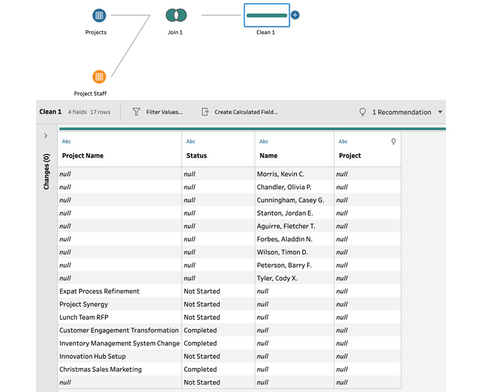

With this step completed, you\'ve performed the **Not Inner Join**
method of discarding data.

## How it works...

A not inner join works by discarding the data which would be put through
as the result of an inner join. In doing so, Tableau Prep allows you to
quickly identify rows that cannot be matched across the data sources
used. This can be helpful in scenarios such as the one used in this
exercise, or even for identifying data quality issues where you expect a
match, but the data is not providing a match on every row.

