# Lab 6: Pivoting Data

In this lab, you\'ll find the following exercises to help you pivot
your data for analytics:

-   Pivoting columns to rows
-   Pivoting columns to rows using wildcards
-   Pivoting rows to columns

# Technical requirements

To follow along with the exercises in this lab, you will need
**Tableau Prep Builder**.

The exercises in this lab use sample data files that you can download
from the course GitHub repository:
[https://github.com/fenago/tableau-data-prep](https://github.com/fenago/tableau-data-prep).

# Pivoting columns to rows

Data is often produced by systems in what the
engineers building the system thought was the most
efficient manner. Rarely do data processing and storage systems store
data with visualization in mind. Similarly, you may have data available
that is appropriate for one type of visualization but not another. In
this exercise, we\'ll look at a sales dataset. This dataset has sales
revenue values per category. The categories are **Electronics**,
**Groceries**, and **Household Appliances**. Each of the categories has
its own column, which prevents us from easily making a line chart with
overall revenue. To resolve this, we\'re going to pivot the data such
that these three individual columns become a single **Category** column,
and values are placed in a single **Revenue** column.

## Getting ready

To follow along with this exercise, download the
**Sample Files 6.1** folder from this course\'s
GitHub repository.

## How to do it...

Start by opening the **Sales Data.csv** file from the **Sample Files
6.1** folder in **Tableau Prep**, then follow the steps to pivot the
data:

1.  Add a **Clean** step and expand the bottom pane, to get a preview of
    the data:

    
    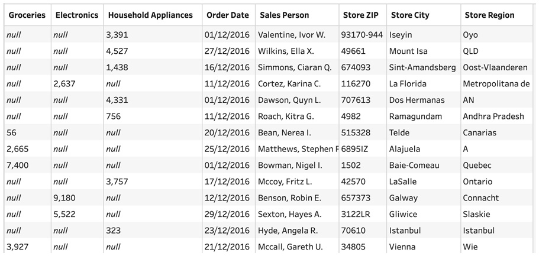

    Notice how the first three columns have many null values. You may
    inspect the data to find that for each row, only one of these
    columns has a value. In this dataset, the columns represent the
    product category, and the value is the amount of revenue from the
    sale.

2.  Click the **+** symbol on the **Clean 1** step
    and select **Pivot**, in order to add a
    **Pivot** step to your flow:

    
    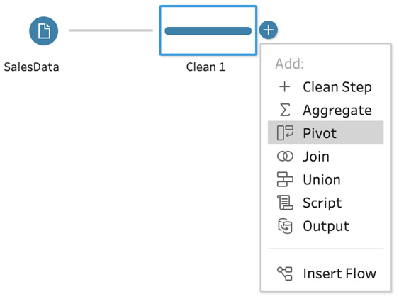

3.  Select the **Pivot** step and expand the bottom pane to clearly view
    all content. Take note of the **Pivoted Fields** section. This is
    where you can drag columns, from the **Fields** list on the left,
    that you\'d like to pivot:

    
    

4.  From the **Fields** list, drag and drop
    **Electronics**, **Groceries**, and **Household Appliances** onto
    the **Pivoted Fields** section. In the
    following screenshot, notice how the **Pivot
    Results** section is instantly updated with two new fields. The
    **Pivot 1 Names** field contains the former column names,
    **Electronics**, **Groceries**, and **Household Appliances**. The
    **Pivot 1 Values** field contains the values of the three former
    columns:

    
    

5.  Add a **Clean** step, then rename the **Pivot 1 Names** field
    **Product Category** and rename the **Pivot 1 Values** field
    **Revenue**. You can double-click the field name in the **Pivot
    Results** section in order to rename a field.

    Toggle between steps **Clean 1** and **Clean
    2** and observe the row count in the top-left
    corner of the bottom pane. Note that the row count was **350** at
    **Clean 1** and has increased to **1K** rows in **Clean 2**, which
    can be seen in the following screenshot:

    
    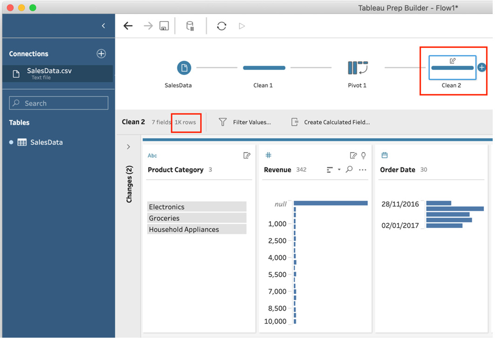

    To investigate this increase in row count,
    search for **Valentine** in the **Sales Person** field, then select
    the name **Valentine** **Ivor W** in order to
    filter the data to just this person.

    The data preview section will now show us three rows, two of which
    have no value for **Revenue**. This is the result of the **Pivot**
    step, which creates a new row for each column we pivot. In our
    example, we are pivoting three columns and hence have gotten three
    rows per source row in return, as seen in the following screenshot:

    
    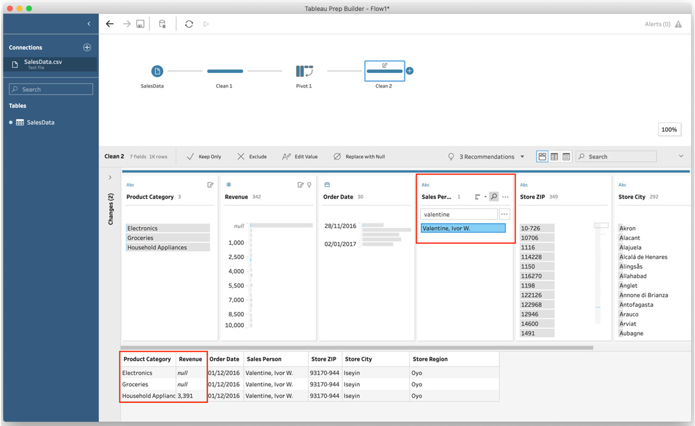

6.  To maintain our data integrity, we need to
    remove rows where **Revenue** is **null**. To
    do this, deselect **Valentine** by clicking the name once. Then
    right-click the **null** values bar in the **Revenue** field and
    select **Exclude**:

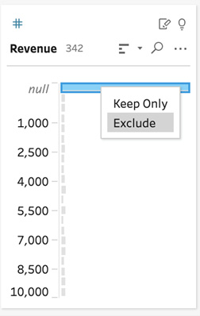

After the exclusion has been applied, notice how the row count is once
again 350, matching our source input row count.

## How it works...

In this exercise, we learned how to pivot data.
Pivoting data helps prepare your data analysis and
is particularly useful when creating reports. When pivoting columns to
rows, Tableau Prep creates a new row for each column you selected to
pivot, plus two additional columns, one for names and one for values.
And so, if you pivot 5 fields in a dataset with 10 fields and 100 rows,
the output will be 500 rows (5 columns pivoted multiplied by the number
of rows). At the same time, your output will have 7 fields (10 source
fields, minus the 5 pivoted fields, plus the 2 additional columns
resulting from the pivot).

Since Tableau Prep is not aware of the data context, this may introduce
a data challenge for you, as we\'ve seen in the example in the *How to
do it...* section, where many rows held a **Revenue** value of **null**.
To correct this, you may need to filter your data to remove unwanted
rows.

# Pivoting columns to rows using wildcards

If your data is subject to changes over time,
particularly the introduction of new columns, your flow may not produce
the output expected or even produce an error. When scheduling a flow for
recurring execution, it is important that you can rely on its execution
being successful. One of the ways in which the **Pivot** function can
achieve this goal is by using **wildcards**. Wildcards can be used to
identify columns that need to be pivoted, based on a header pattern,
rather than an exact match. In this exercise, we\'ll pivot columns to rows
using wildcards.

## Getting ready

To follow along with this exercise, download the **Sample Files 6.2**
folder from this course\'s GitHub repository.

## How to do it...

Start by opening the **SalesData.csv** file from the **Sample Files
6.2** folder in **Tableau Prep**, then follow these steps to pivot
columns to rows using wildcards:

1.  Add a **Clean** step to your flow, then expand the bottom pane to
    observe the data preview:

    
    

    Important note

    Note that the sales data includes revenue information per **product
    category**. Each category field name is prefixed with **Cat\_**. In
    this example, we have three product categories: **Groceries**,
    **Electronics**, and **Household Appliances**. These three
    categories are shown in our data as **Cat_Groceries**,
    **Cat_Electronics**, and **Cat_Household Appliances**.

    Suppose the dataset we connected to only includes a product column
    when an actual sale was made in that product category for the time
    period that the data reflects. That is, if no sales were made for
    the **Cat_Electronics** category, then that category would not
    appear in our data at all. Because of that, we cannot easily pivot,
    since the **Cat_Electronics** value is not known to Tableau Prep.
    The next time we process this data, fewer or more product category
    fields may appear, including **Cat_Electronics**, and a regular
    **Pivot** step would not process such changes. However, using
    wildcards allows us to pivot all fields with a certain pattern. In
    our case, we\'ll look for fields starting with **Cat\_**. Doing so
    allows our data to change over time and new categories can be added.
    As long as those categories start with **Cat\_**, our flow will be
    able to process them automatically, without the need for us to amend
    the flow.

2.  Next expand your flow by adding a **Pivot**
    step. Then, instead of dragging fields into the pivot configuration
    pane, click the **Use wildcard search to pivot** link text:

    
    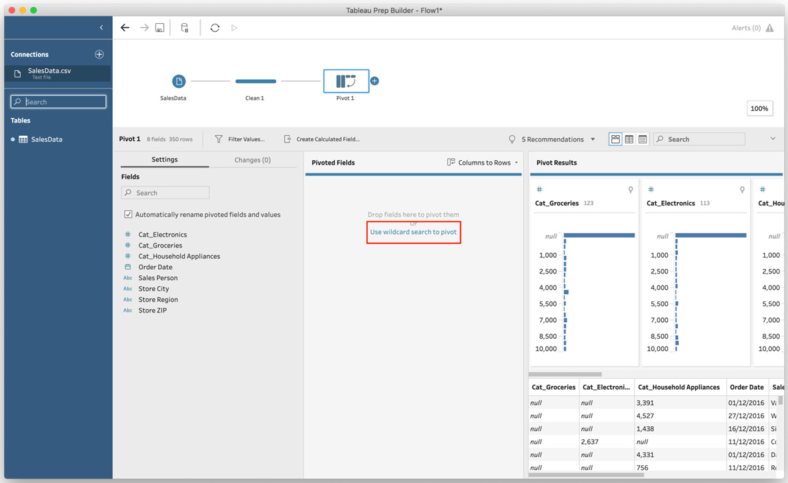

3.  In the wildcard settings, type **Cat1\_** in
    the **Pivot 1 Values** text box and press the *Enter* key:

    
    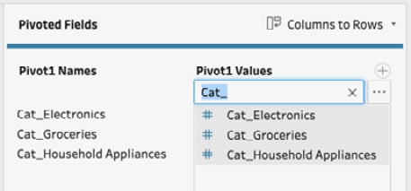

    You\'ve now performed a wildcard search on the field names in our
    dataset. And each field including the text **Cat\_** is identified
    and added to the **Pivot** step.

4.  Click the ellipsis (**...**) button next to
    the wildcard search text and set **Search Options** to **Starts
    with**:

    
    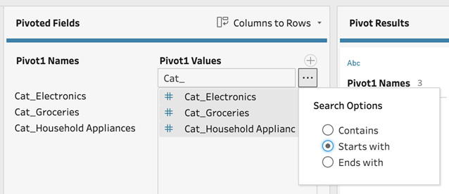

    Setting **Search Options** to **Starts with** will ensure that only
    field names starting with **Cat\_** are included in our pivot. In
    the unlikely event that our product category includes the characters
    **Cat\_** anywhere else, as part of the category name, such fields
    will be ignored from now on.

5.  Add a **Clean** step and rename the newly created **Pivot 1 Names**
    field **Product Category** and rename the **Pivot 1** **Values**
    field **Revenue**.

6.  To verify that our flow is working, open the
    **SalesData.csv** CSV file in Excel. Then, add three new columns
    named **RegisterCat\_**, **InventoryCat_2021**, and **Cat_Books**.
    Save and close the file when done:

    
    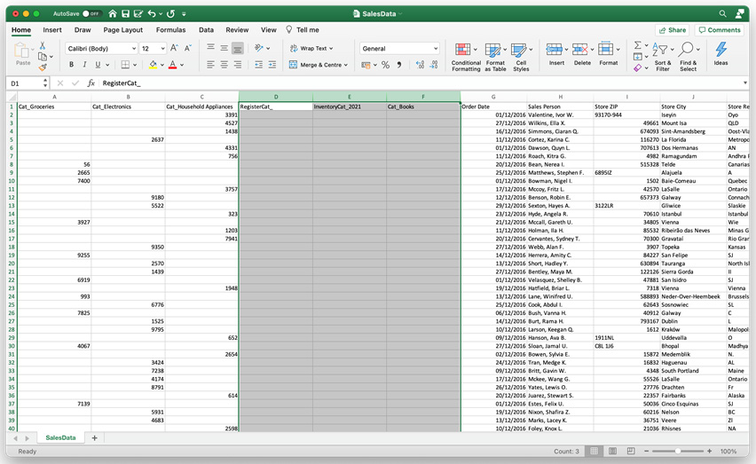

7.  Close Excel and return to Tableau Prep, then click the **Refresh
    Data** button in the toolbar to refresh the sample data for the
    flow.

8.  Select the **Pivot** step and notice that it
    has been updated with only one new field to pivot, that is, the
    **Cat_Books** field. This is the wildcard pivot in action using the
    **Starts with** option we set in *Step 4*:

Let\'s move on to the next section!

## How it works...

In this exercise, we learned how to leverage
wildcards to create a more dynamic flow. Doing so allows your flow to
handle changes in your data as they occur. When pivoting columns to rows
in Tableau Prep, Tableau Prep relies on fixed input from the user to
specify exactly which columns to pivot. With the wildcard option,
Tableau has added flexibility here. Instead of specifying the exact
column name, Tableau Prep will include all columns that either include,
start with, or end with certain text, as specified by you. This allows
you to have a dynamic data feed that introduces or removes fields over
time and allows your flow to handle such changes without complications.

# Pivoting rows to columns

When preparing data that has been generated by
transactional systems, you may encounter data
structures that appear nonsensical from a reporting and analytics
perspective. Take a sales order as an example. A sale may be for one or
multiple items and the total sales amount may be affected by things such
as a loyalty card, discount, referral code, and of course sales tax.
Depending on which system you are working with, such information may be
reported separately, that is, in columns. However, it\'s quite likely to
see multiple rows in your dataset for the same transaction. In this
exercise, we\'ll look at pivoting data from rows to columns, which will
resolve any issues arising from such a data structure. Broadly, these
steps are similar to pivoting columns to rows, with some important
differences, as we\'ll see.

## Getting ready

To follow along with this exercise, download the **Sample Files 6.3**
folder from this course\'s GitHub repository.

## How to do it...

Start by opening the **RevenueData.csv** file from the **Sample Files
6.3** folder in **Tableau Prep**, then follow these steps to pivot rows
to columns:

1.  Add a **Clean** step to your flow and expand the bottom pane so you
    can easily inspect the data:

    
    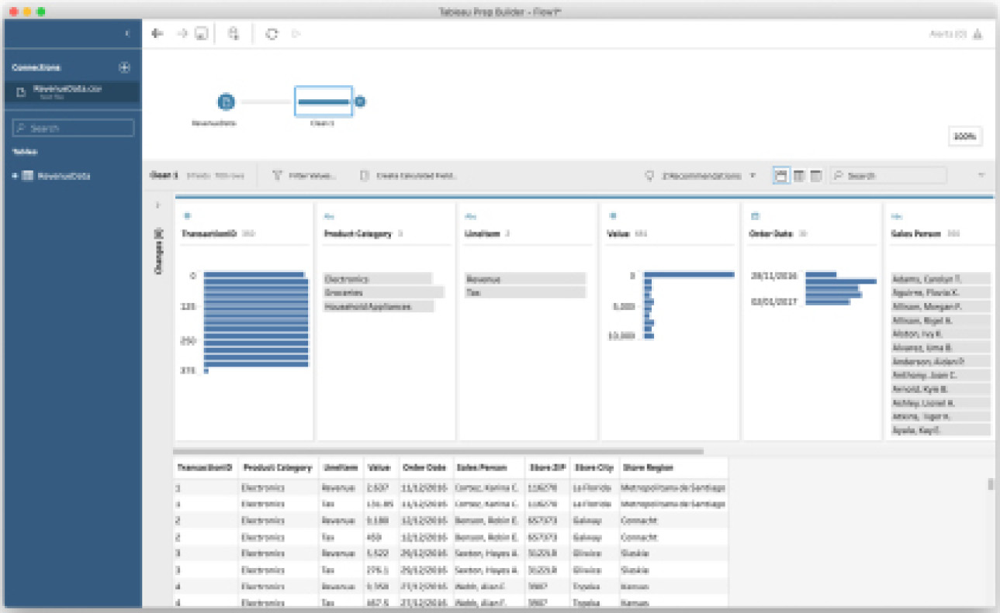

    We can observe two items of interest in the
    cleaning step that will confirm our need to
    apply a pivot transformation, specifically pivoting rows to columns.

    Firstly, in the data preview, we can see that **TransactionID** is
    always repeated: there are two rows with value **1**, two rows with
    value **2**, two rows with value **3**, and so forth:

    
    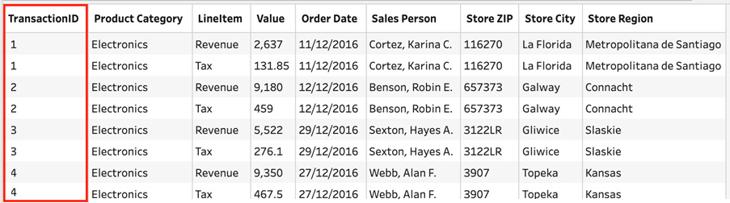

    Upon further investigation, we can see that
    there is only one difference between each pair
    of rows, where a pair is a set of rows with matching
    **TransactionID** values. That difference is in the **LineItem**
    field. From the profile pane, we can easily see that there are two
    distinct values in this field, **Revenue** and **Tax**.

    And so we can conclude that one row is the revenue amount for a
    given transaction, and the other row is the tax amount for that same
    transaction. In order to make reporting easier, we want to have two
    columns instead, one for revenue and another for tax. This is where
    the pivot transformation can help.

2.  Add a **Pivot** step to your flow, then select **Rows to Columns**
    from the dropdown in the **Pivoted Fields** section:

    
    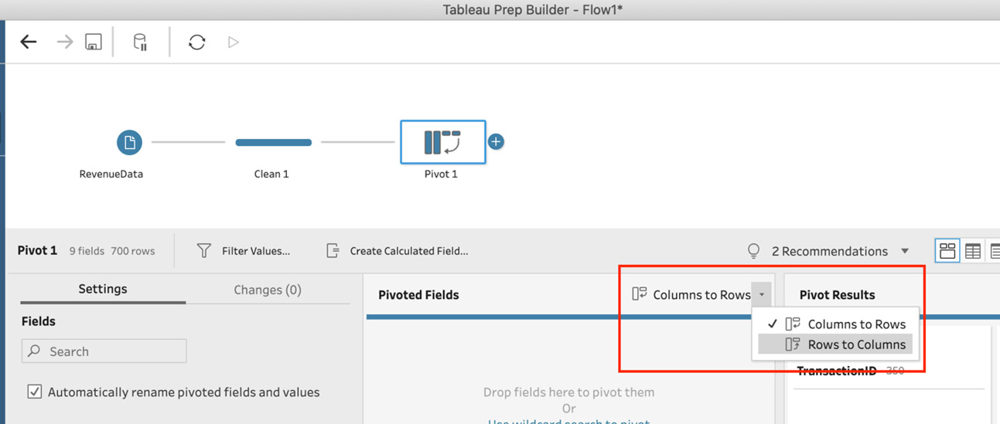

3.  Next, we need to specify which fields in our
    data determine the number of columns to add.
    In our case, we specified that the **LineItem** field holds two
    values, **Revenue** and **Tax**, which are the values we want as
    columns. To input this into the pivot configuration, drag the
    **LineItem** field from the field list, onto the **Pivoted Fields**
    section. **Tableau Prep** will now scan your dataset for unique
    values and display them accordingly.

    The **Pivot** step in your workflow will now raise an error. This
    error indicates the pivot configuration is not complete. When it
    comes to pivoting rows to columns, as opposed to columns to rows, we
    need to tell **Tableau Prep** which field holds our numeric values.

4.  Drag the **Value** field to the bottom of the **Pivoted Fields**
    section, titled **Field to Aggregate for new columns**. This
    completes the configuration:

    
    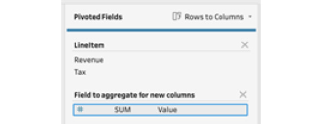

    Tip

    You can change the aggregation at this time from the default **SUM**
    to any other method. For example, suppose you have student exam test
    results; you may choose to aggregate using the average, in order to
    return the average test score per student.

5.  Add another **Clean** step to verify the
    result of your pivot transformation. Notice
    how the two new columns, **Revenue** and **Tax**, have been added to
    the start of your dataset. Also, note how the row count has been
    reduced from 700 to 350:

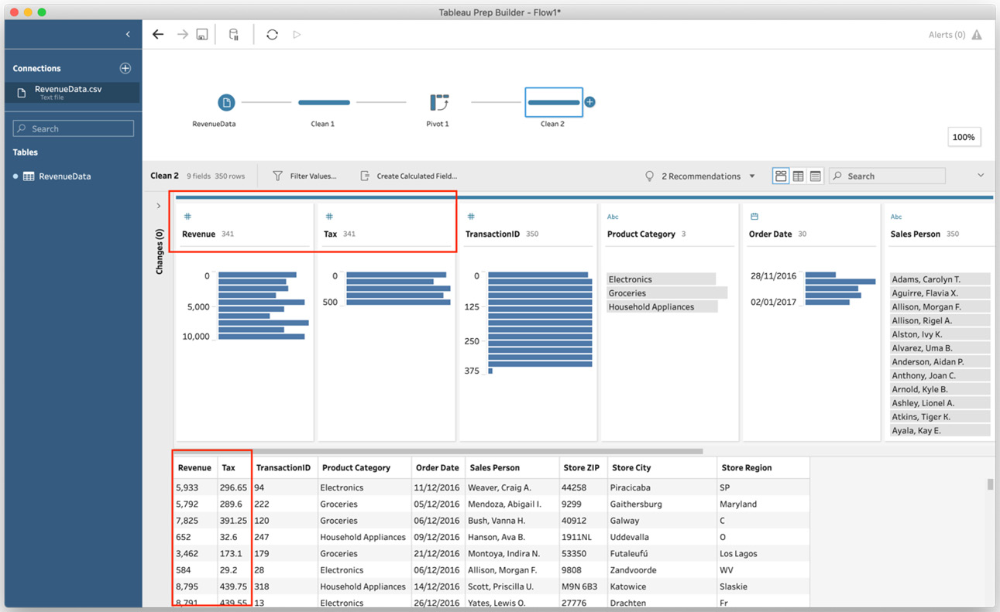

Let\'s move on to the next section!

## How it works...

In this exercise, we learned how to pivot rows to
columns. This type of pivot may be helpful when
your dataset has multiple rows for a single transaction. When pivoting
rows to columns in Tableau Prep, Tableau Prep will create as many new
columns as there are unique values in the pivot field you specify.
Caution is advised here as you may not want to pivot a field with
hundreds of unique values and end up with an equal number of new
columns.

Secondly, Tableau Prep will populate the values for these columns with
another, numeric field that you specify. At this time, Tableau Prep will
automatically apply an aggregation operation, by default set to **SUM**.
This aggregation is needed as you may have multiple rows
with the same unique value.

