# Lab 7: Creating Powerful Calculations


In this lab, you\'ll find the following exercises to help you create
calculated fields to create a more valuable dataset:

-   Creating calculated fields
-   Creating conditional calculations
-   Extracting substrings
-   Changing date formats with calculations
-   Creating relative temporal calculations
-   Creating regular expressions in calculations


# Technical requirements

To follow along with the exercises in this lab, you will require
**Tableau Prep Builder**.

The exercises in this lab use sample data files that you can download
from the course GitHub repository:
[https://github.com/fenago/tableau-data-prep](https://github.com/fenago/tableau-data-prep).


# Creating calculated fields


In this exercise, we\'ll
look at a quick method to help reveal the data actually in use in a **Tableau Desktop** visualization.


## Getting ready

To follow along with this exercise, download the **Sample Files 7.1**
folder from this course\'s GitHub repository. There, you\'ll find the
**December 2016 Sales.xlsx** Excel file. In the version of the sales
data we\'ve been using throughout this course, you\'ll find that we have a
single field with the subtotal, that is, the amount to be paid for the
goods purchased, excluding any applicable taxes or charges. In this
exercise, we\'ll use Tableau Prep to create calculated fields to display
the sales tax amount and the total transaction amount, that is, the
amount the customer will actually have to pay.


## How to do it...

Start by opening the **December 2016 Sales.xlsx** flow from the **Sample
Files 7.1** folder in **Tableau Prep**, then follow these steps:

1.  Examine your dataset and confirm that there is indeed only one
    numeric field, named **Subtotal**, as shown in the following
    screenshot:

    
    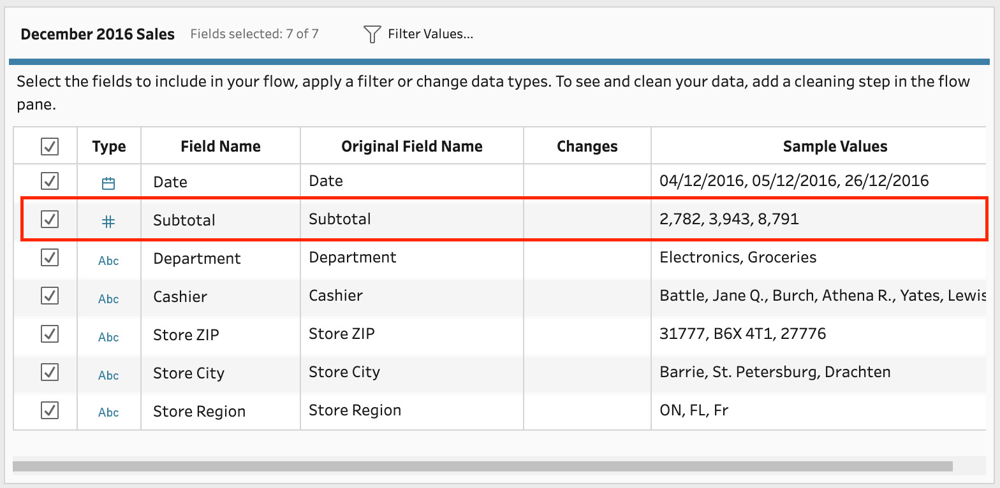


2.  Click the plus icon on your **December 2016
    Sales** step and add a clean step. With the clean step selected, the
    **Create Calculated Field** button will appear in the bottom pane,
    as shown in the following screenshot:

    
    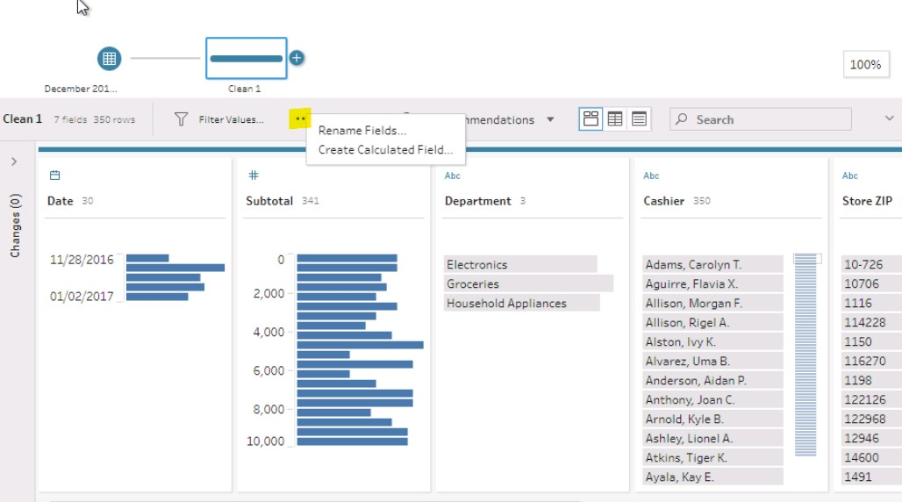


3.  Click the **Create Calculated Field** button to bring
    up the **Add Field** dialog. This is where we
    can create and edit calculated fields. At the top, we\'ll find the
    **Field Name** input box, as seen in the following screenshot, which
    is where we can give our calculated field a name. The text we input
    in the **Field Name** box is the name of the new column that will be
    added to our dataset. Below that, we find an empty input box. This
    input box is where we will type our calculations. Finally, below
    that is the validation status, which currently displays
    **Calculation is valid**. As we type our calculations, Tableau Prep
    will validate the calculation in real time and provide hints on any
    potential calculation issues as they occur:

    
    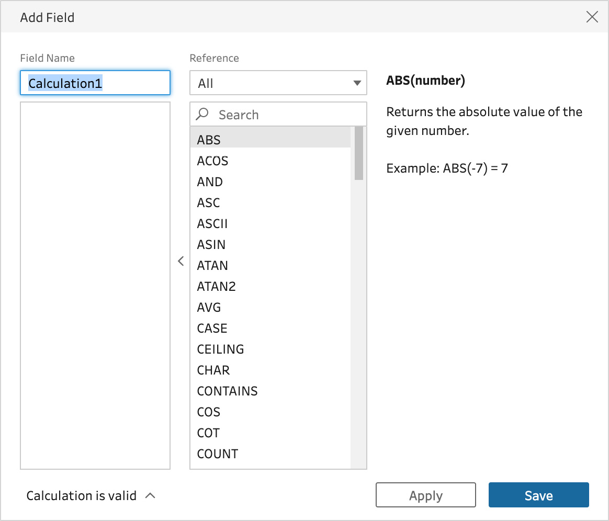


    Important note

    In the **Add Field** dialog, you can type your
    calculation from scratch or use the functions listed in the
    **Reference** list to the right to get started. When selecting an
    advanced function in the **Reference** list, you will see an
    explanation of that function to the right.

    When you double-click an item in the **Reference** list, it will
    automatically add a template calculation to the input box to the
    right so that you can build calculations faster.

    The **Reference** list does not include basic arithmetic operations,
    such as addition or subtraction. Nevertheless, you can use such
    operators in your calculations.

4.  Let\'s create a calculated field that will state the total
    transaction amount the customer has to pay including sales taxes. In
    this example, let\'s assume a flat-rate sales tax that is applicable
    to all goods, set at 6.5%. In order to calculate the total
    transaction amount, we need to multiply the **Subtotal** field we
    identified in *Step 1* by **1.065**. Get started by setting the
    field name to **Transaction Amount**.

5.  Next, in the calculation input box, type in
    **Sub**. Notice how Tableau Prep\'s autocomplete function suggests
    the **Subtotal** field. Click the suggestion to add it to your
    calculation:

    
    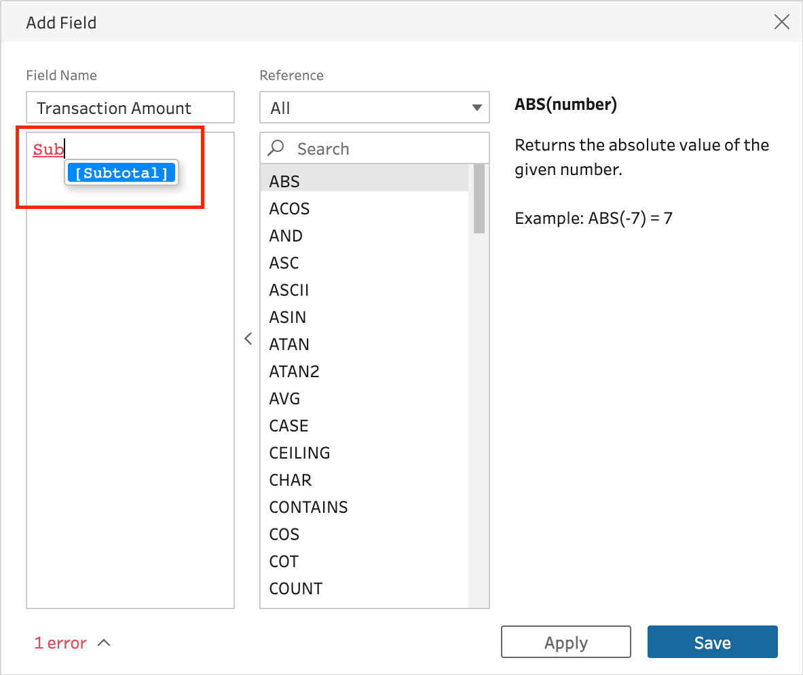


6.  In order to multiply **Subtotal** by 1.065, enter **\* 1.065** in
    the calculated field input box and click **Save** to add your new
    calculated field:

    
    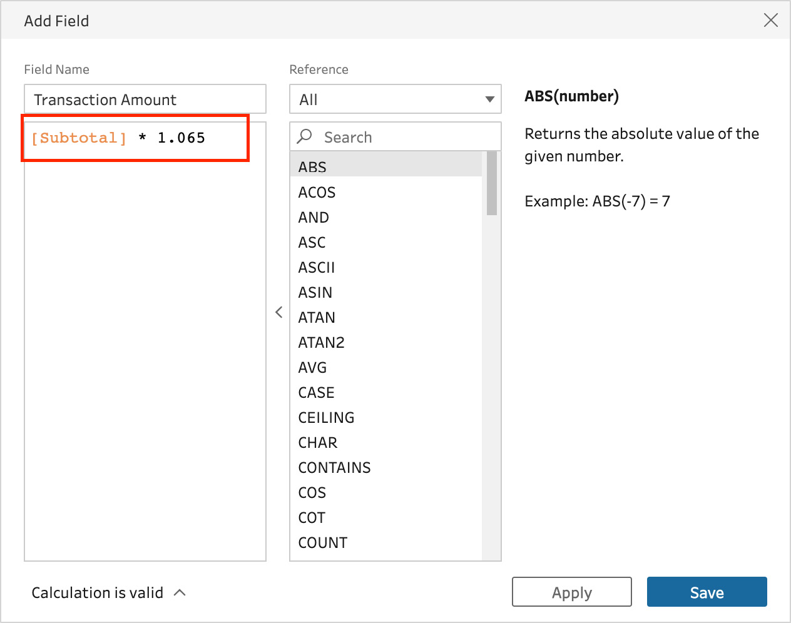


7.  You\'ll instantly see your newly added
    **Transaction Amount** field in the field list and the data preview.
    Newly added calculated fields are added to the beginning. Drag the
    field so that it\'s positioned after the **Subtotal** field, as
    shown in the following screenshot:

    
    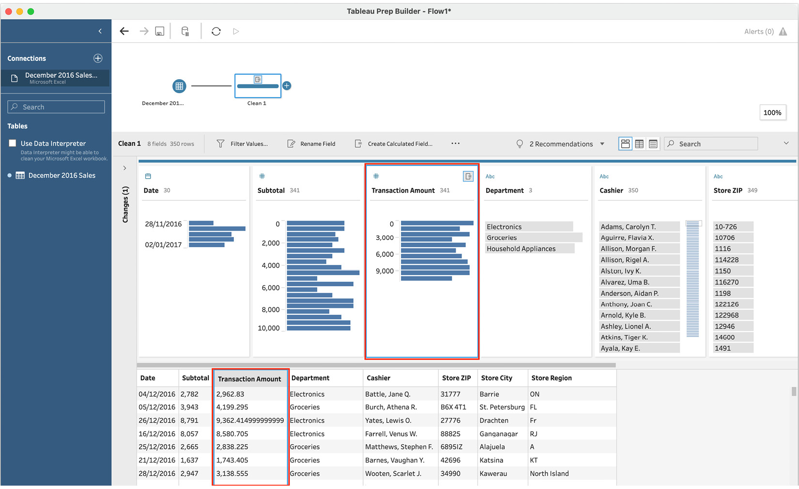


    Important note

    Although Tableau Prep indicated that the
    calculation is valid, it only checks for the arithmetic and logic,
    not whether your calculation outcome is the one you were aiming for.
    Because Tableau Prep has a handy data preview instantly available to
    you, I always like to pick up a calculator and calculate the outcome
    of two or three rows to ensure the outcome is as expected.

8.  Let\'s practice adding another calculated field, this time to return
    the sales tax amount. We don\'t need to add another clean step in
    order to add another calculated field. You can create multiple
    calculated fields in a single clean step or across multiple clean
    steps. With the **Transaction Amount** field still selected, from
    dragging it to its new position in *Step 7*, click the **Create
    Calculated Field** button to bring up the **Add Field** dialog
    again. Notice how the calculation input box already has
    **\[Transaction Amount\]** pre-populated, as we can see in the
    following screenshot. That is the result of
    having the field selected when we clicked on **Create Calculated
    Field**:

    
    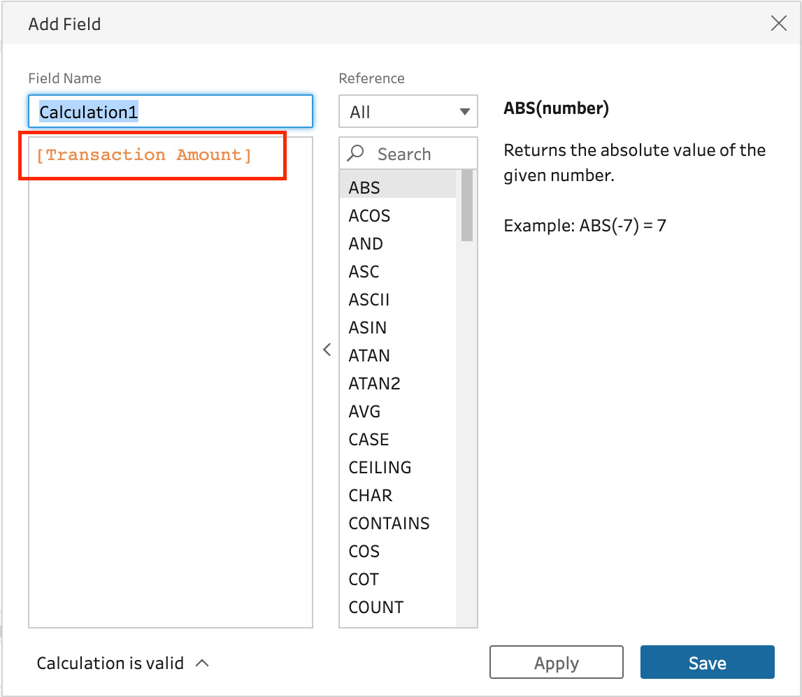


9.  In order to calculate the sales tax amount, we could create a
    calculation using only the **Subtotal** field included in the
    original source data. However, it is possible to use other
    calculated fields in a calculated field, meaning we can simply
    subtract **Subtotal** from our **Transaction Amount** calculated
    field in order to determine the amount of sales tax. To do this,
    update the calculation by adding **- \[Subtotal\]**, as shown in the
    following screenshot. You can either type in the entire calculation
    or leverage the autocomplete suggestions:

    
    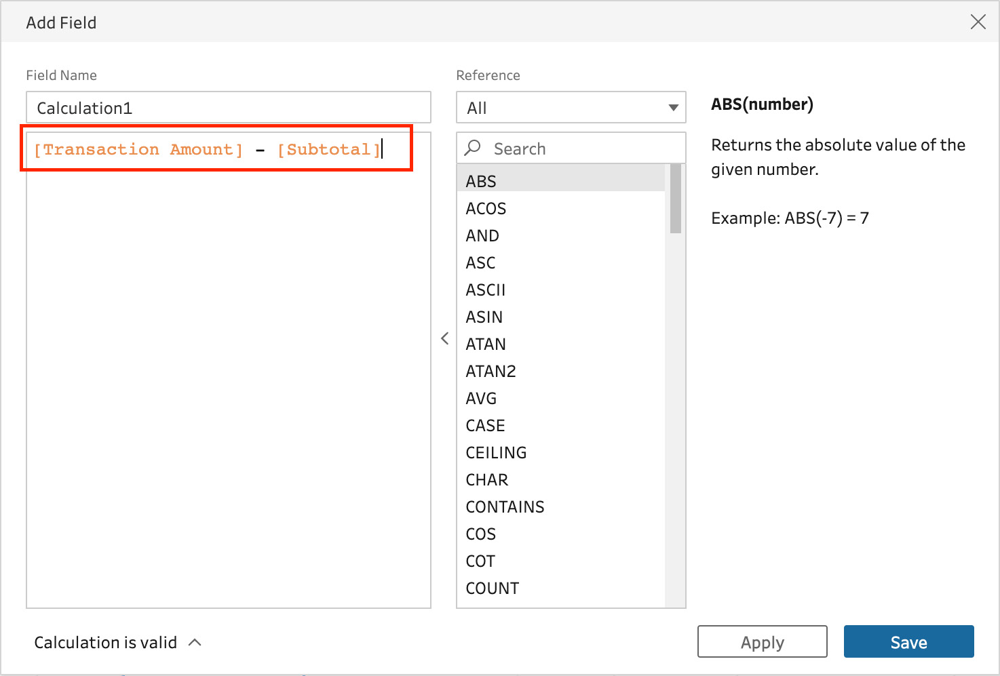


10. Name this field **Sales Tax Amount** and click
    **Save** to add it to your flow.

11. Re-arrange the newly added **Sales Tax Amount** field in your field
    list so that it is positioned after the **Subtotal** field:

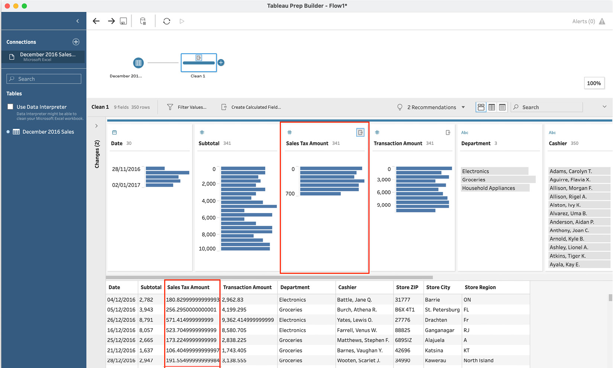


With these steps completed, you\'ve successfully enriched your dataset
by adding the **Sales Tax Amount** and **Transaction Amount** calculated
fields.


## How it works...

In this exercise, we learned how to create
calculated fields using basic arithmetic. We also learned that we could
leverage existing calculated fields in a new calculation. We\'ve seen
that selecting a field prior to starting your calculation inserts that
field into any new calculation. By typing in our calculation, we\'ve
seen Tableau Prep\'s autocomplete feature at work and you are now
familiar with the functions section, which you can leverage anytime you
need help finding or using a function. During this practice, we enriched
our dataset and improved any downstream analysis processes that require
the information we generated in the calculated fields. Preparing your
data in this fashion can avoid many complications and speed up connected
reports because they do not have to perform these calculations anymore.
In general, applying calculated fields in your data preparation phase,
rather than during the subsequent reporting phase,
promotes data consistency for your organization.


# Creating conditional calculations


One of the most powerful calculations you can do
is **conditional calculations**. Conditional calculations return a value
based on the criteria you set in the calculation itself. When the
conditions are met, a certain value is returned, as specified by you in
the calculation. Because conditional statements are relatively
resource-intensive on your computer\'s hardware, it is best to perform
them during data preparation in **Tableau Prep** rather than a
downstream analysis tool. By performing resource-intensive tasks in
Tableau Prep, the data output will already contain the end result,
preventing your analysis tools, such as **Tableau Desktop**, from having
to perform these tasks at a less convenient time. In this exercise, we\'ll
calculate the sales tax amount as well. However, this time, we\'re going
to apply a different tax rate based on the department. To do so, we\'re
going to use a conditional calculation.


## Getting ready

To follow along with this exercise, download the **Sample Files 7.2**
folder from this course\'s GitHub repository. There, you\'ll find the
**December 2016 Sales.xlsx** Excel file we\'ve used previously. The data
contains sales data, including the subtotal amount due, excluding
applicable taxes. In the previous exercise, we used a calculated field to
determine the sales tax amount and total transaction amount by assuming
a flat sales tax percentage set at 6.5%.


## How to do it...

Start by opening the **December 2016 Sales.xlsx** flow from the **Sample Files 7.2** folder in **Tableau Prep**, then follow these steps:

1.  Add the **December 2016 Sales** sheet to your flow and connect a
    clean step, as shown in the following screenshot. Take note that our
    data includes the **Subtotal** amount, but not the sales tax amount
    or total transaction amount. Also note that the **Department** field
    contains three unique values. They are
    **Electronics**, **Groceries**, and **Household Appliances**:

    
    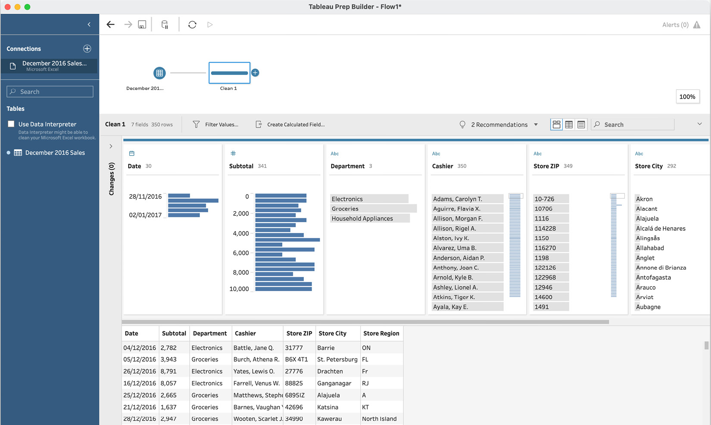


2.  Click on **Create Calculated Field** to bring up the **Add Field**
    dialog. Name the new calculation **Sales Tax Amount**:

    
    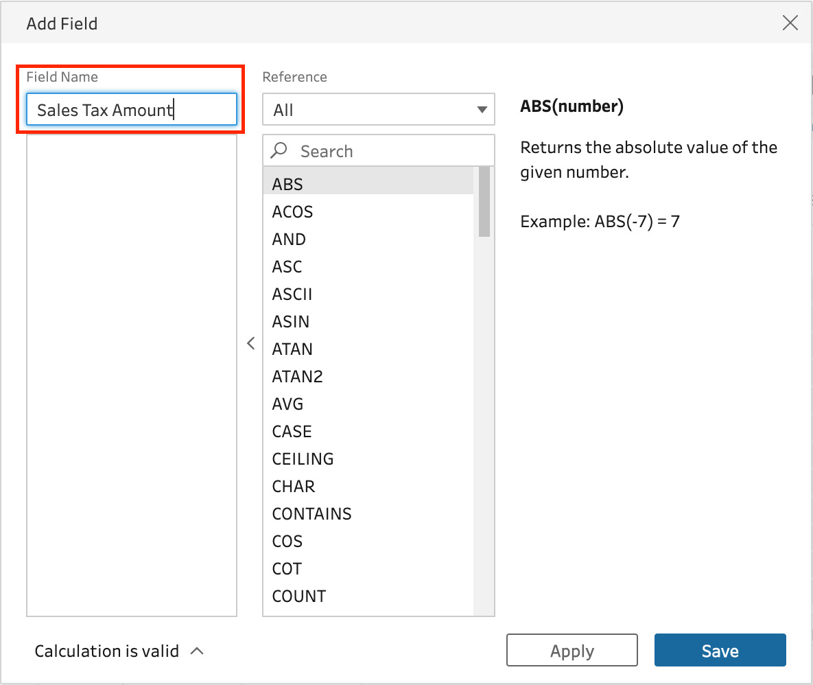


3.  Conditional calculations use logical
    functions. Filter the **Reference** list to **Logical** to see the
    available functions, then select **IF**. When you select a function,
    Tableau Prep will give you a brief outline of the functionality, as
    well as an example. Double-click **IF** so that it is added to your
    calculation input box, as shown in the following screenshot:

    
    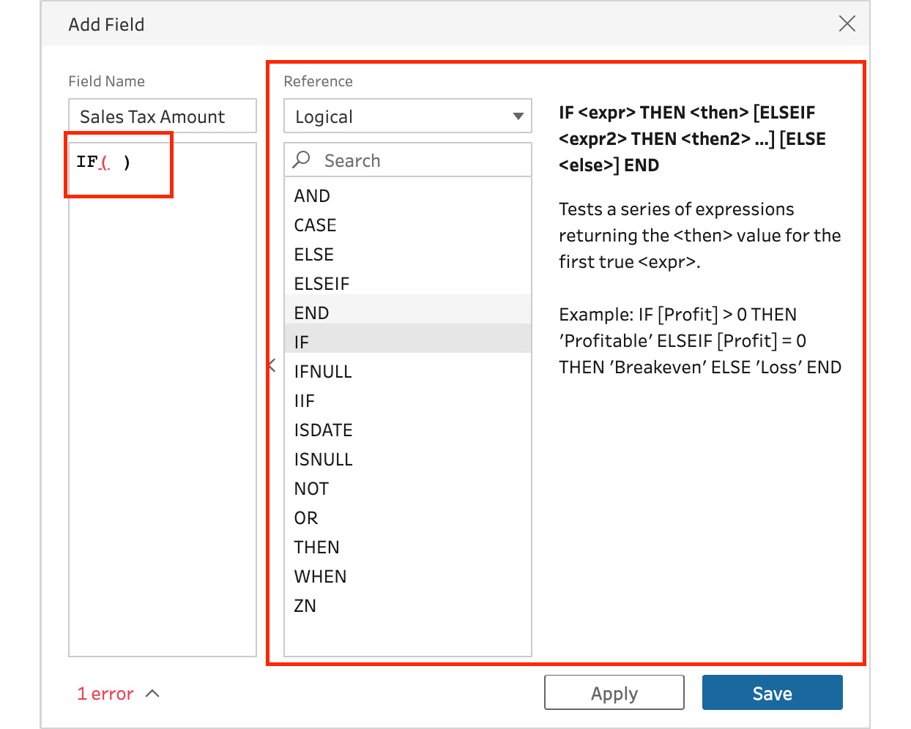


4.  Let\'s write out our calculation and assume a
    tax rate of 21% for **Electronics**, 5% for **Groceries**, and 10%
    for **Household Appliances**. We\'ll start off with just
    **Electronics**. Remove the parentheses in the calculation and
    complete the calculation so that it reads **IF \[Department\] =
    \"Electronics\" THEN \[Subtotal\] \* 0.21 END**. This calculation
    checks each row in your data and if **Department** is equal to
    **Electronics**, it will multiply the **Subtotal** amount by
    **0.21**, or 21% (if you require additional screen space, you can
    collapse the **Reference** list by selecting the arrow in the middle
    of the screen):

    
    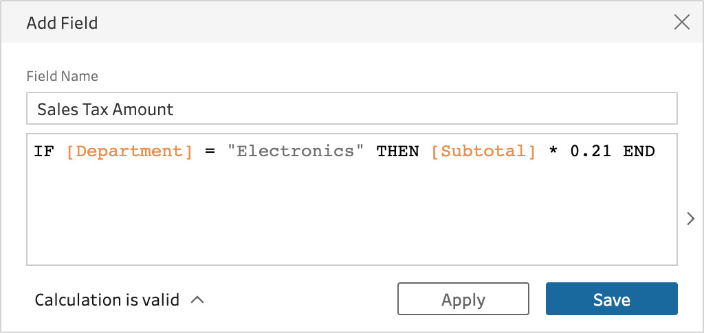


5.  You can see from the **Calculation is valid** text in the
    bottom-right corner of the calculation editor that this calculation
    is ready to be saved. Although it is incomplete for our purposes,
    the **END** keyword in our calculation indicates to Tableau Prep
    that this is the end of our **IF** expression. Save the calculation
    and observe the data preview values for the newly added **Sales Tax
    Amount** field:

    
    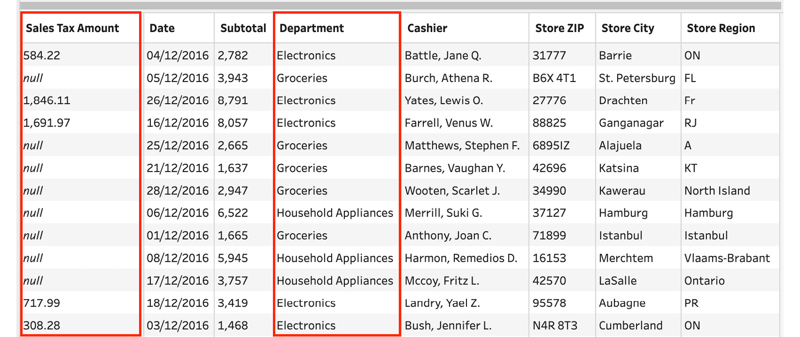


    In our updated dataset, as shown in the
    previous screenshot, we can see that each row with a **Department**
    value of **Electronics** has the **Sales Tax Amount** field
    populated. However, all other rows, that is, those with
    **Groceries** or **Household Appliances**, have a **null** value for
    **Sales Tax Amount**. This exercise illustrates what happens when we
    do not provide what is known as a **catch-all**. A catch-all
    will allow us to set a value for any scenarios
    we have not anticipated, or at least not specified.

6.  Let\'s add a catch-all to our **Sales Tax Amount** calculated field.
    Expand the **Changes** pane and select the edit button for our
    calculated field to return to the calculation editor:

    
    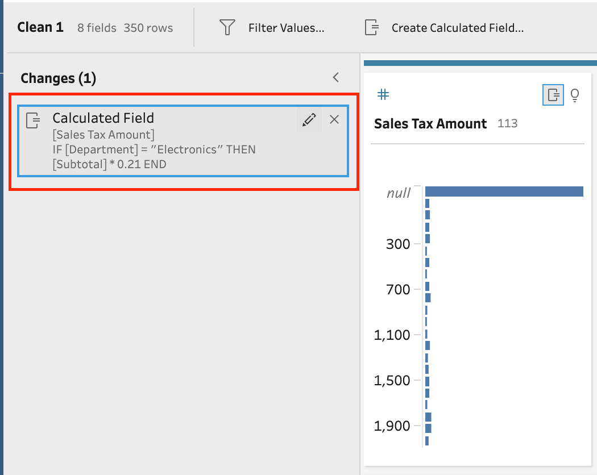


7.  Update the calculation by inserting **ELSE 0**
    before **END**. This will tell Tableau Prep that if none of the
    conditions you specified are met, it should return a zero:

    
    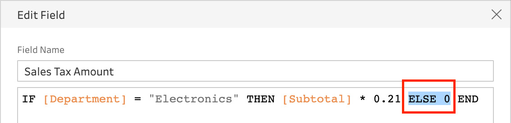


8.  Save the updated calculated field and observe the result in the data
    preview. All rows with **Groceries** or **Household Appliances** now
    have a **Sales Tax Amount** value set at zero:

    
    


9.  Head back to the calculation editor and this
    time, we\'re going to add in logic for the **Groceries** and
    **Household Appliances** departments. To do this, we\'ll use the
    **ELSEIF** statement after the current condition; that is, if
    **Department** is not **Electronics**, then check whether it is
    **Groceries** and apply the relevant tax rate, and if it\'s not
    **Groceries**, check whether it is **Household Appliances** and
    apply the relevant tax rate. And, of course, if it is none of these,
    proceed to the catch-all, zero. Update the calculation by adding the
    following code after **0.21** to evaluate the department and apply
    the right tax rate: **ELSEIF \[Department\] = \"Groceries\" THEN
    \[Subtotal\] \* 0.05 ELSEIF \[Department\] = \"Household
    Appliances\" THEN \[Subtotal\] \* 0.10**. You can move code onto new
    lines to make your calculation more legible. Save your calculation
    when ready:

    
    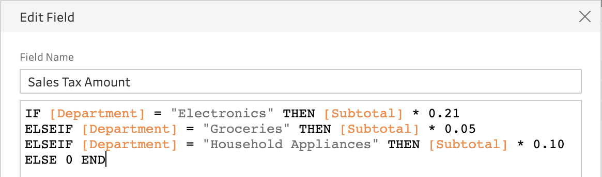


    Important note

    The calculation here can be written in different ways. We included
    some duplicative code here, namely
    **\[Subtotal\] \***. This is causing the calculation to become
    lengthier but easier to read. You may apply a different calculation,
    such as the following, to achieve the same output:
    
    ```
    [Subtotal]*

    IF [Department] = "Electronics" THEN 0.21

    ELSEIF [Department] = "Groceries" THEN 0.05

    ELSEIF [Department] = "Household Appliances" THEN 0.10

    ELSE 0 END
    ```

10. In the data preview, confirm that each **Department** type now has a
    calculated **Sales Tax Amount** value:

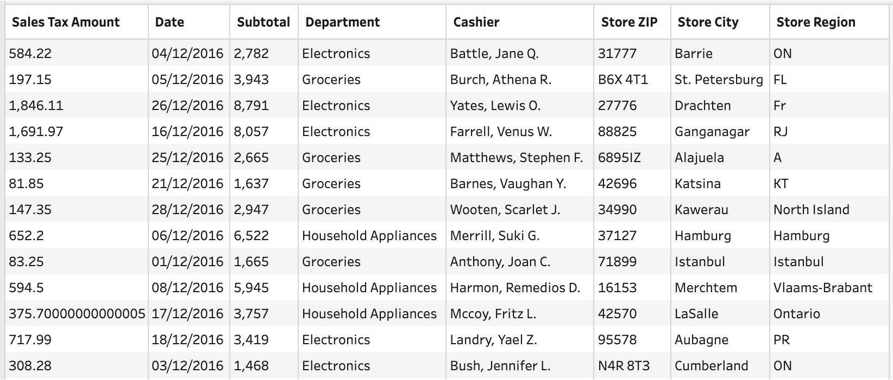


With these steps completed, you\'ve successfully added a conditional
calculation and determined the **sales tax
amount** based on the **department**.


## How it works...

In this exercise, we learned how to apply
conditional calculations using Tableau Prep\'s logical functions. We
learned that we could use conditions to perform a given calculation.
Conditions are one of the most powerful calculation functions you can
employ in order to prepare your data and account for various scenarios,
as we\'ve done with the **Department** field in this exercise. By using
calculated fields, we were able to determine a new value, **Sales Tax
Amount**, based on the value of another field, **Department**.
Conditional calculations are evaluated row by row and may be
resource-intensive, which will be noticeable when working with
relatively large datasets and running your flow. Nonetheless, applying
these powerful calculations during data preparation will benefit
downstream analysis since the output of Tableau Prep will already
include the calculated value.


# Extracting substrings


More often than not, data is delivered to us in a
less-than-ideal state, with multiple values being held in a single
field. We saw how to split data into multiple fields in the *Splitting
columns with multiple values* exercise, in *Lab 3*,
*Cleaning Transformations*. However, splitting fields relies on the data
being organized, and will never leave out any of the data. In this
exercise, we\'ll look at extracting substrings, which will result in new
fields as well. However, unlike splitting fields, we\'ll be able to more
narrowly define what data we want to include in our new field.
Furthermore, extracting substrings is non-destructive, that is, the
original field will remain unaffected. In this exercise, we\'ll load a
dataset into Tableau Prep that has a field with multiple values in it.
We\'ll then proceed to extract each value and create separate fields for
each.


## Getting ready

To follow along with this exercise, download the **Sample Files 7.3**
folder from this course\'s GitHub repository. There, you\'ll find the
**December 2016 Sales.xlsx** Excel file. In the version of the sales
data we\'ve been using throughout this course, you\'ll find that we have a
field called **Customer Name**. The **Customer Name** field holds
multiple values: the name of the customer, organized by last name, first
name, middle name, and initial.


## How to do it...

Start by opening the **December 2016 Sales.xlsx** flow from the **Sample
Files 7.3** folder in **Tableau Prep**, then follow these steps:

1.  Add a clean step to your flow and examine your data in the data
    preview grid. Observe the **Customer Name** field to confirm its
    contents are organized by last name, first name, middle name, and
    initial:

    
    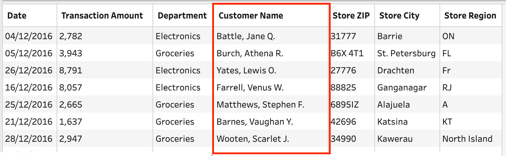


2.  Let\'s first extract the last name substring.
    Click on **Create Calculated Field** and name your new calculation
    **Last Name**.

3.  Since the last name is always followed by a comma, we are going to
    locate the position of the comma first. To do this, enter the
    **FIND(\[Customer Name\],\",\")** calculation. The **FIND** function
    will evaluate a given field, **Customer Name** in this case, and
    locate a given substring, a *comma* character in our use case. When
    the **FIND** function locates the *comma* substring, it will return
    its position number:

    
    


4.  Click **Save** to add your new calculated
    field to the dataset and observe the results. The number indicates
    the position of the comma character in the **Customer Name** field.
    For example, the name **Yates, Lewis O.** has a comma character
    located at position 6. The first five characters make up the name
    **Yates**, and the sixth character is the comma:

    
    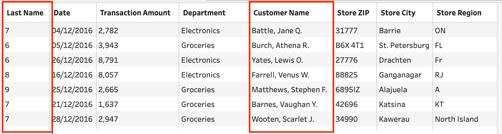


5.  We need to amend our calculation in order to return the last name in
    full. To amend an existing calculation, expand
    the **Changes** pane, then click on the edit icon for our calculated
    field, as highlighted in the following screenshot:

    
    


6.  We want to get all the starting characters of the string, up to the
    comma character position, excluding the comma. To do this, we can
    use the **LEFT** function. **LEFT** will return a specified number
    of characters from a given string. Update your calculation to
    **LEFT(\[Customer Name\],FIND(\[Customer Name\],\",\")-1)**. Here,
    we\'re instructing the **LEFT** function to get a substring from the
    **Customer Name** field, specifically the first number of characters
    as defined by the **FIND** function we wrote in *Step 3*. Notice how
    we added **-1** to the **FIND** function, in order to exclude the
    comma character itself:

    
    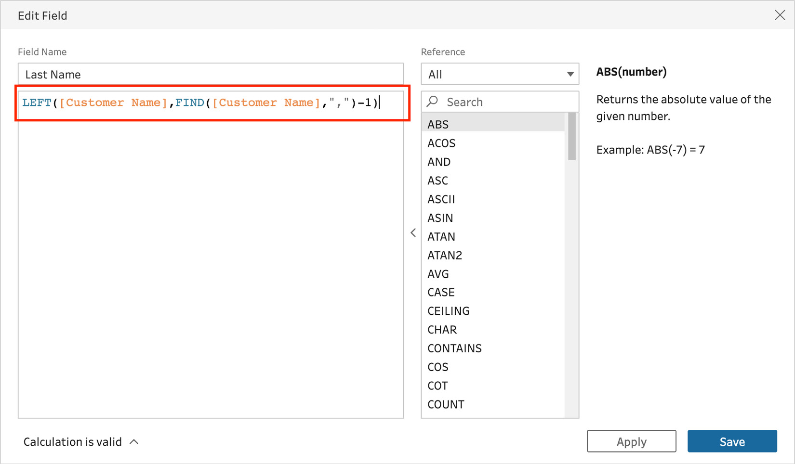


7.  Verify, in the data preview, that we\'re now
    returning the full last name:

    
    


8.  Next, we are going to return the first name. Click on **Create
    Calculated Field** and name your new field **First Name**. Enter the
    **SPLIT(\[Customer Name\],\" \",2)** calculation. In this
    calculation, we\'re using the **SPLIT** function to separate values
    in the **Customer Name** column by a given character. The character
    we\'ve specified between the quotation marks is blank, so we\'re
    splitting by an empty space. In doing so, we get three parts in our
    **Customer Name** field, that is, **last name**, **first name**, and
    **middle initial**. Since we want the second part, we specify **2**
    in the **SPLIT** function. Click **Save** to add your new field.

9.  Next, let\'s create our final field for the
    middle initial. Click **Create Calculated Field** and name it
    **Middle Initial**. Enter the **RIGHT(\[Customer Name\],2)**
    calculation. This calculation uses the **RIGHT** function. **RIGHT**
    will return the number of specified, in this case, **2**, rightmost
    characters in the **Customer Name** field. Click **Save** to add
    your new field.

10. To organize your dataset, drag the **Middle Initial** field between
    the **First Name** and **Last Name** fields.

11. We do not need the **Customer Name** field anymore. We can safely
    remove it and the three derived calculations will continue to
    function. Go ahead and remove the **Customer Name** field from your
    flow:

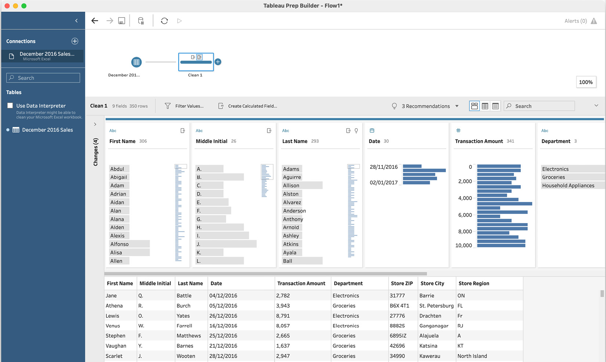


With these steps completed, you\'ve successfully
transformed your dataset by extracting three different substrings from
the original **Customer Name** field.


## How it works...

In this exercise, we learned how to create
calculated fields using various string functions: **LEFT**, **RIGHT**,
**SPLIT**, and **FIND**. Using each of these functions, we extracted a
specific part of a text string, using **LEFT** or **RIGHT** to get the
beginning or ending characters, **SPLIT** to break up a field into
separate values, and **FIND** to locate the position of a substring so
that we may then extract it. These are powerful functions as they allow
you to create dynamic data extraction from a field. For example, the
comma character we located using the **FIND** function could be in a
different position in every row or every time the
dataset is refreshed. Using this function, Tableau Prep will always
evaluate the field to locate the right position first.


# Changing date formats with calculations


When you work with many different disparate
systems, you\'re bound to run into a scenario
where a date is formatted in such a way that it isn\'t recognized by
Tableau Prep as a date. As a result, Tableau Prep will set the data type
for such a field to a string. So, we don\'t lose any data, but we cannot
perform any date functions on such a field. To resolve this, we can
create a calculation to re-organize the date string so that the newly
added field can be recognized as a date. In this exercise, we\'ll process
a data file using Tableau Prep that holds a date field with values not
recognized as a date by Tableau. During the process, we\'ll change the
format of the field using a calculation so that Tableau will then
correctly recognize the field as a date data type.


## Getting ready

To follow along with this exercise, download the **Sample Files 7.4**
folder from this course\'s GitHub repository. There, you\'ll find the
**December 2016 Sales.csv** Excel file.


## How to do it...

Start by connecting to the **December 2016 Sales.csv** file from the
**Sample Files 7.4** folder in **Tableau Prep**, then follow these
steps:

1.  Before adding any additional tools, observe the **Date** field and
    its data type in the input step. Note that **Type** did not
    auto-detect a date and the sample values appear formatted as
    numbers:

    
    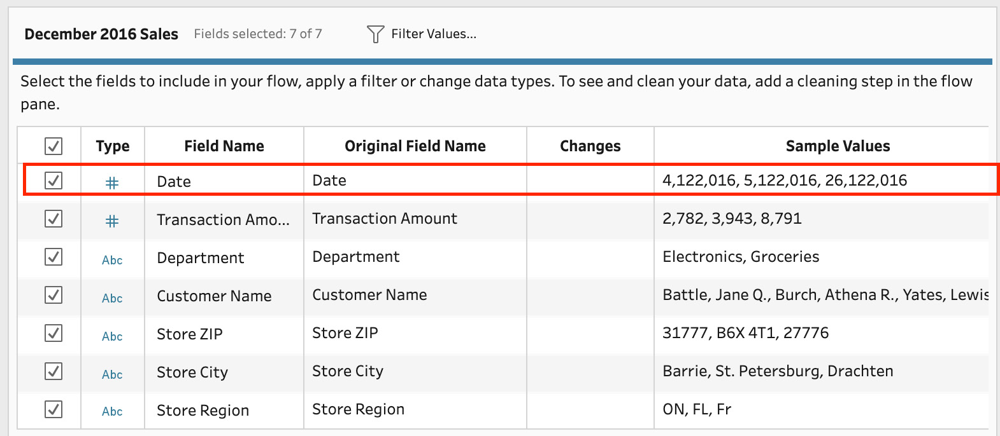


2.  Click the **\#** symbol in
    the **Type** column and set the data type to
    **String**:

    
    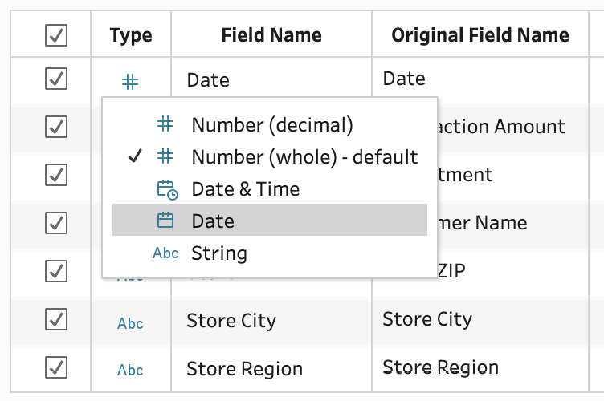


    Important note

    You can change the data type of any field
    during an input step, or in any subsequent
    clean step. However, in this particular scenario, we\'ll want to
    change the data type during the input step. The reason for this is
    that Tableau Prep has detected the field as a number, and if we pass
    data along to the next step with this setting, we\'ll lose the
    leading zero some dates have. For example, December 4, 2016 exists
    in our source file as **04122016**. Setting the format to string
    during the input step retains the leading zero and makes our
    subsequent calculations easier.

3.  Add a clean step and determine the date format by reviewing the data
    in the preview pane. It seems our data is formatted as **DDMMYYYY**,
    that is, two digits to indicate the day, two digits to indicate the
    month, and four to indicate the year, without any separator symbols:

    
    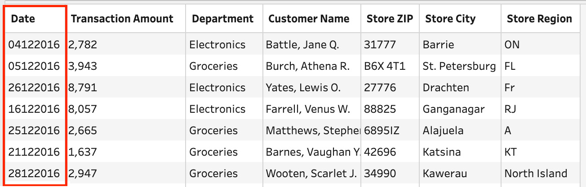


4.  Click on **Create Calculated Field** and name
    your new field **Date**.

    Important note

    We already have a field name of **Date** in our dataset. When you
    name any new calculated field the same as an existing field in your
    dataset, Tableau Prep will automatically hide the original field and
    show the calculated field instead. This is a great feature to speed
    up your flow design as we do not have to manually remove the
    soon-to-be-redundant source **Date** field.

5.  Enter the **MID(\[Date\],3,2) + \"-\" + LEFT(\[Date\],2) + \"-\" +
    RIGHT(\[Date\],4)** calculation. We\'ve seen the **LEFT** and
    **RIGHT** functions in action in previous exercises. The **MID**
    function is one we have not used before. **MID** returns a substring
    from a given field, starting at a certain position. In this case,
    **MID** takes the **Date** field, starts at the third character, and
    returns the subsequent two characters. In doing so, it returns our
    month value. Because our source field has a string data type, we can
    apply string functions, which we\'ve done by adding text in the form
    of **+ \"-\" +**. In string fields, the plus symbol concatenates
    values, rather than adding them:

    
    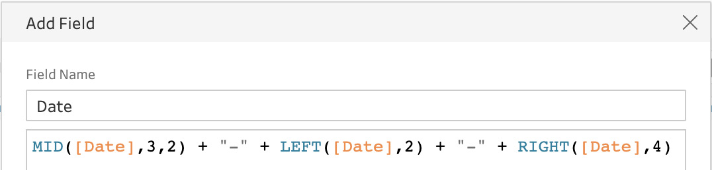


    Important note

    As we saw in *Step 3*, the date format in our
    source is day, month, year. Yet in our
    calculation, we organized it as month, day, year. The reason for
    this US-style date formatting is that is the format that Tableau
    Prep will recognize, as we\'ll see in *Step 6*.

6.  Click **Save** to view your calculation result. Notice how the newly
    added **Date** calculation has replaced the source **Date** field.
    It now looks like a date. However, the type is still **String**.
    Click the type icon for the **Date** field and change it to
    **Date**:

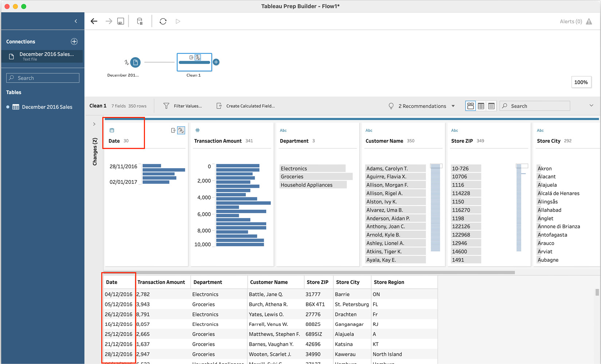


With these steps completed, you have
successfully transformed your data into a proper
date format.


## How it works...

In this exercise, we learned how to leverage calculations to change a
string field to a date. We did so by breaking down the values in our
dataset, specifically identifying and extracting the day, month, and
year values. We then re-arranged these values and formatted them with
additional symbols to create the appearance of a properly formatted
date. We then changed the data type to **Date** and in doing so, added
benefits to any further calculations you may wish to perform that
involve date functions, either in Tableau Prep or
an analytics application such as Tableau Desktop.
