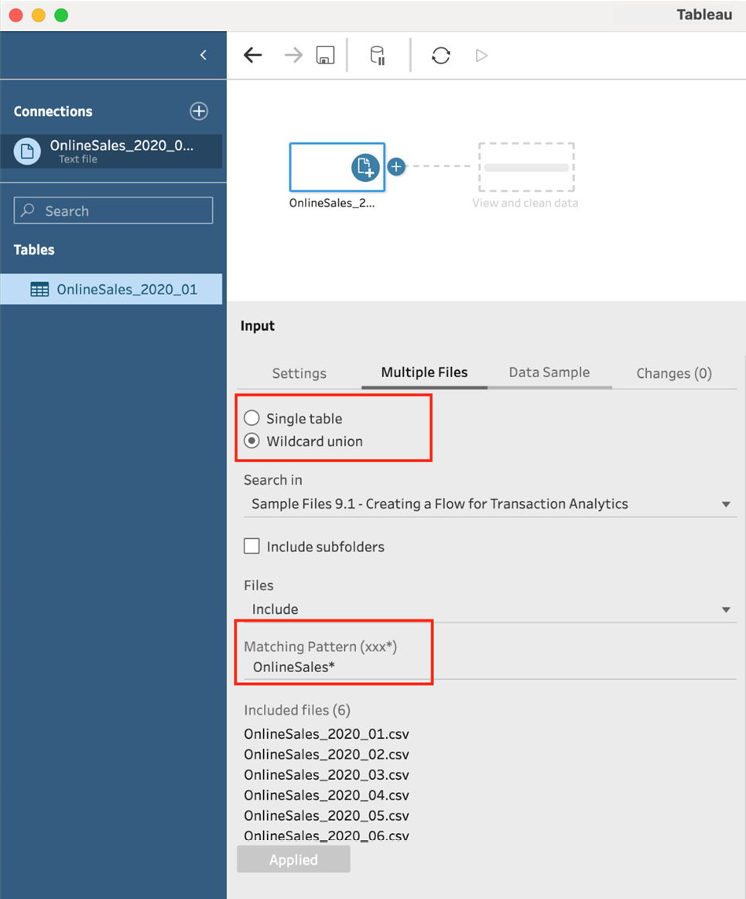
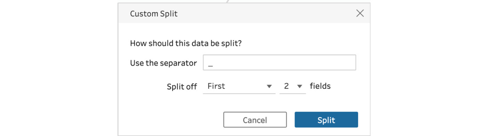
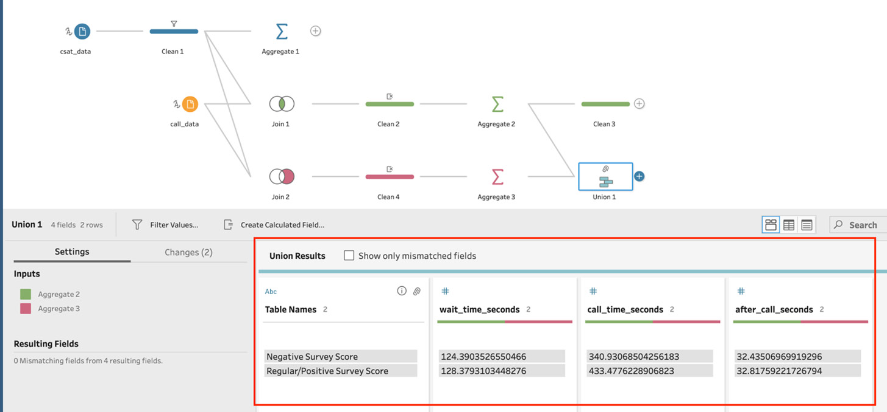

# Lab 8: Creating Prep Flows in Various Business Scenarios

In this lab, we will cover the following exercises:

-   Creating a flow for transaction analytics
-   Creating a call center flow for instant analysis

# Technical requirements

To follow along with the exercises in this lab, you will require
Tableau Prep Builder.

The exercises in this lab use sample data files that you can download
from the course GitHub repository at
[https://github.com/fenago/tableau-data-prep](https://github.com/fenago/tableau-data-prep).

# Creating a flow for transaction analytics

In this exercise, we\'ll
create a data pipeline, or flow, for analytics. In this scenario, we\'ll
assume that we are an analyst for a fictive department store with
multiple physical stores, as well as an online store front. We will be
presented with multiple data sources that need to be combined, cleaned,
and transformed so that we can output a clean and reliable dataset of
all transactions that occurred in the first six months of 2020. This is
a common scenario in most industries and is the perfect use case for
Tableau Prep.

## Getting ready

To follow along with this exercise, download the **Sample Files 8.1**
folder from this course\'s GitHub repository. In here you\'ll find various
data files. Several of these files originate from disparate systems and
we\'ll need to employ Tableau Prep to provide a single, holistic output
of all transactions.

The contents of the files
are as follows:

-   Files starting with **OnlineSales** contain sales information for
    transactions made through the company website. There is one file per
    calendar month, and so we must combine six files to get the full
    dataset we need for the first six months of 2020.
-   **STORE_SALES_EXPORT.xlsx** contains sales data from physical
    stores. The stores sell the same products as the online storefront.
    However, the data format is different as the stores use a different
    point-of-sale system. This data export contains all store sales for
    the six-month period we need, from January to June 2020.
-   **Products.csv** contains descriptive product information, such as
    the product name and category. We will need to join this to the
    sales data so that the new dataset is easier to understand, as the
    sales data only includes product IDs.
-   **ShippingData.hyper** is a Tableau Hyper extract prepared by our
    analyst colleague who works in the shipping department. The data
    contains product shipping information for those products that were
    sold online. The company does not provide a delivery service for
    products bought in their physical stores.
-   **CustomerList.csv** contains our customer information for those
    customers who have created an account with the company. Let\'s
    assume that creating a customer account for online transactions is
    mandatory. However, in-store transactions only have a customer ID if
    the customer uses their optional loyalty card.
-   **returns_h1_2020.csv** contains product return information.

In this exercise, we\'re going to combine all of these datasets using a
number of techniques we\'ve learned in this course. The output of our flow
will be a comprehensive dataset that can be easily understood and used
for downstream analysis purposes.

## How to do it...

Start by opening up Tableau Prep and connect to
the **OnlineSales_2020_01.csv** file from the **Sample Files 8.1**
folder in Tableau Prep. Then, perform the
following steps:

1.  This dataset contains data for a single month. Specifically, the
    month of January, as indicated by the last two numbers in the
    filename. The format of all files starting with **OnlineSales** are
    the same, and so we can combine these files using the **UNION**
    functionality with the input step. To do this,
    select the **Multiple Files** tab in the **Input** settings and
    select **Wildcard union**. Then, set the matching pattern to
    **OnlineSales\***. This will instruct Tableau Prep to union all
    files starting with **OnlineSales**. Make sure to click **Applied**
    to save your settings:

    
    

2.  As a result of our union action, Tableau Prep
    has automatically added the **File Paths**
    field, to indicate where each row of data originated. As we won\'t
    require this information for any type of analysis, we can remove it
    here simply by unchecking the box in the field list:

    
    

3.  Observe the field list and note how Tableau Prep has wrongly
    assigned a numeric data type to the **custId** field. This field
    represents the customer ID and although it consists of numbers, it
    will not be used as such in any calculation. Correct the data type
    by clicking the data type icon **\#** and select **String** instead:

    
    

4.  Next, let\'s add the sales data for our
    physical stores. Use the Connect to Excel
    functionality and select the **STORE_SALES_EXPORT.xlsx** file
    provided in the sample files folder. Unlike the online sales data we
    have worked with so far, this dataset contains data for the full 6
    months, so we don\'t have to perform a union here.

5.  With the new input selected, correct the data type for the
    **TransactionID** and **CustomerID** fields by changing the type to
    **String**. This is the same solution we applied in *Step 3*, and
    something that occurs frequently in real-world scenarios when your
    data contains numeric IDs.

6.  Before we continue, let\'s name the steps in our flow. As we\'ll
    build out a relatively large flow, naming your steps is useful for
    ensuring that your flow remains easy to understand. Rename the
    **OnlineSales_2020_01** input step by double-clicking its name and
    changing the name to **Online Sales**. Then, rename the second
    dataset to **In-Store Sales**:

    
    

7.  Click the **+** icon besides the **In-Store
    Sales** input and then select **Clean Step**.
    Observe the **TransactionDate** field values, as highlighted in the
    following screenshot. Each value here seems to be a number and not a
    date. This is because the input data has been formatted as a **UNIX
    TIMESTAMP**. This type of data issue is not
    uncommon, and we need to create a simple calculated field to convert
    this value to a date, as Tableau Prep cannot automatically convert
    this source field to a date:

    
    

8.  With **Clean Step** still selected, click on
    **Create Calculated Field...**. Name the new
    field **Purchase Date** and set the expression to
    **DATEADD(\'second\',\[TransactionDate\],#1970-01-01#)**, which is
    the expression to convert a Unix timestamp to a regular datetime
    format. Click **Save** when done to apply your new calculation:

    
    

    Observe the outcome and ensure that the
    format is indeed date and time, as shown in
    the following screenshot:

    
    

9.  We won\'t need the specific time for the
    purchase date, so let\'s change the data type
    from **Date & Time** to **Date** by clicking the data type icon in
    the field list and then selecting **Date**, as shown in the
    following screenshot:

    
    

10. We also no longer require the original
    **TransactionDate** field. To remove this field using the clean
    step, click the context menu next to the field
    name and then select **Remove**, as shown in the following
    screenshot:

    
    

11. Next, we\'re going to combine the online sales
    data with our in-store sales data. To do this,
    we need to perform a union. Drag and hover **Clean Step** on top of
    the **Online Sales** input. Then, from the options that appear,
    hover over **Union** and release, as shown in the following
    screenshot:

    
    

    This will automatically create a **Union**
    step and your screen should look like the
    following screenshot:

    
    

12. In the bottom left of the window, we can see
    that there are quite a few **Mismatched
    Fields** options. This is to be expected when you combine data from
    different sources, as we have just done. Fortunately, both our
    sources include fields with a similar meaning and they just have
    different field names, which prevents Tableau Prep from
    automatically aligning them. To resolve this, click the field pairs
    that represent the same information (hold the *Command* or *CTRL*
    key to select the second field), and then right-click and select
    **Merge Fields**, as shown in the following screenshot for the
    **Purchase Date** and **PurchaseDate** fields. Note that the newly
    merged field will take the name of the field you right-clicked:

    
    

    Perform this **Merge Fields** action for the
    field pairs listed here:

    -   **Purchase Date** and **PurchaseDate**

    -   **PurchaseId** and **TransactionID**

    -   **discountpercentage** and **Discount%**

    -   **quantity** and **Quantity**

    -   **productId** and **Product_ID**

    -   **custId** and **CustomerID**

        When you\'ve completed all the merges,
        your **Settings** tab should look like the
        following screenshot:

1.  With the **Union** step still selected, notice that a new field has
    appeared in the **Union Results** field list, named **Table Names**.
    This field indicates where each row originated, that is, from our
    online sales dataset or the in-store dataset. This field may come in
    handy for downstream analysis, so let\'s rename the value
    **STORE_SALES_EXPORT.xlsx/EXPORT** to **In-Store Sales** and the
    field name itself to **Sales Type**, as shown
    in the following screenshot:

    
    

2.  Next, create another data connection, this time to the
    **Products.csv** file, provided in the sample files with this
    lesson.

3.  This **Products.csv** file we just added contains descriptive
    product information. For example, instead of using a product ID such
    as *1931E212-FF85-3A36-620A-8C56D1C6B605*, we can get a name such as
    *Modern Utility Laptop Messenger Bag*. To add this information to
    our existing dataset as additional columns, we need to perform a
    join. To do this, drag the input on top of the **Union** step. When
    the **Union** and **Join** options appear, drop the input on top of
    the **Join** option to instantly add a join step.

4.  Configure the join by specifying a common
    field between the two datasets, in this case,
    **productId** and **ID**, as shown in the following screenshot. The
    default join type, inner, can be left as-is:

    
    

5.  As is typical with a join, we now have a redundant field for product
    ID. Remove the **ID** field from the field
    list by selecting **Remove** from the field
    context menu. This way, we only have the **productId** field as the
    identifier:

    
    

6.  Add another data source, this time a Tableau extract named
    **ShippingData.hyper**. This data is provided by our shipping
    department and contains shipping information for sales completed
    online. Rename the step **Shipping**.

7.  Add a clean step to the **Shipping** input and observe the field
    named **ID**. The shipping ID here is made up of two identifiers;
    first, the shipping department\'s ID, followed by an underscore
    symbol and then the purchase ID. We need to split this field so
    that these values are stored separately. To
    do this, select **Custom Split...** from the
    context menu for the **ID** field:

    
    

    -   Configure the split to use the underscore (**\_**) symbol as a
        separator and split the first **2** fields, as shown in the
        following screenshot:

-   When you\'re ready, click **Split**. This will
    then split the ID field into two new fields,
    named **ID - Split 1** and **ID - Split 2**:

1.  Rename the **ID - Split 1** field to **Shipping ID** and the **ID -
    Split 2** field to **Purchase ID**.

2.  We will no longer need the original **ID** field, so use the context
    menu to remove it from the dataset.

3.  Drop the **Shipping** input on top of the existing join in order to
    create another **Join** step. Configure the join clause to use the
    **TransactionID** and **Purchase ID** fields to perform the join.
    Because only sales are shipped, the shipping data does not contain
    information for store sales. As such, we need to set this join to a
    left join type. A left join will result in including all data from
    the left dataset, which is our main flow, and any matching data from
    the right dataset, which is our shipping data. Set **Join Type** to
    **left** by selecting the left circle in the Venn diagram. Your flow
    and join settings should look like those in the following
    screenshot:

    
    

4.  Delete the now redundant **Purchase ID** field. We still have the
    **TransactionID** field to identify a given
    row of data.

5.  Add your fifth data connection to this flow.
    This time, select the **CustomerList.csv** text file. This input
    contains information about our customers, such as their full name.
    Rename the input step to **Customers**.

6.  The **Customers** data includes an **ID** field, which has been
    incorrectly set to a numeric format by Tableau Prep. Click the data
    type icon for the **ID** field and change the type to **String**.

7.  Join the **Customers** data to the existing flow by dropping it on
    the **Join 2** step. Configure the join clause to join on the
    **custId** and **id** fields. Because in-store checkouts do not
    always involve a customer loyalty card, the customer ID is not
    always known. Given the missing customer IDs, set the join type to
    **left** using the Venn diagram so that all rows are included from
    our main flow, including those for which we do not have customer
    details.

8.  Delete the redundant customer ID field, named **id**, which
    originated from the **Customers** data.

9.  Add our final data connection, the text file named
    **returns_h1_2020.csv**, and rename the step to **Returns**.

10. Correct the data type for the **return_id**
    field by setting it to **String**.

11. Rename the **status** field to **Return Status** so that we don\'t
    mix it up later with the existing status fields from the
    **Shipping** and **Customer** data.

12. Join the **Returns** step with the main flow by dropping it on top
    of **Join 3** to create a new join. Configure the join clause to use
    the **TransactionID** and **purchase_id** fields. Once more, use the
    Venn diagram to set the join type to **left**. Not all customers are
    returns, so we want to return all transactions and any matched rows
    from the **Returns** dataset.

13. Remove the redundant **purchase_id** field from the dataset.

14. Click the **+** icon on the last join and add a **Clean** step.
    Using the **Clean** step, rename the fields as follows:
    -   **custId** to **Customer ID**
    -   **productId** to **Product ID**
    -   **quantity** to **Quantity**
    -   **discountpercentage** to **Discount %**
    -   **TransactionID** to **Transaction ID**
    -   **RECIPIENT_NAME** to **Recipient Name**
    -   **RECIPIENT_STREET** to **Recipient Street**
    -   **RECIPIENT_CITY** to **Recipient City**
    -   **RECIPIENT_POSTAL** to **Recipient Postal**
    -   **RECIPIENT_REGION** to **Recipient Region**
    -   **SHIPMODE** to **Shipping Mode**
    -   **TRACEID** to **Shipping Courier Tracking ID**
    -   **STATUS** to **Shipping Status**
    -   **name** to **Customer Name**
    -   **surname** to **Customer Surname**
    -   **status** to **Customer Membership Status**
    -   **return_id** to **Return ID**

15. As a final step, we need to add an output step
    to our flow. Click the **+** icon on the
    **Clean** step and select **Output**. Configure the output to write
    to a location of your choosing and set the filename to **2020-H1
    Sales Data.csv** and the **Output** type to **CSV**. Your final flow
    should look like the following screenshot:

With these steps completed, you\'ve
finished this exercise and successfully created a
comprehensive sales flow. If you wish, you can run the flow and analyze
your data further in an application such as
**Tableau Desktop**.

## How it works...

In this exercise, we learned to combine multiple different tools and
functions in Tableau Prep to create a comprehensive flow that provides a
clean data output that can be used for downstream analysis. We leveraged
different methods of input, cleaning, pivoting, union, join, calculated
fields, and aggregation to create the ideal dataset and even perform
quick analysis in Tableau Prep. This combination
of tools is very common in flows and offers
significant added value to companies who want to combine data from
disparate systems into a single, holistic view.

# Creating a call center flow for instant analysis

In this exercise, we\'ll explore another typical
real-world example. In the previous exercise,
*Creating a flow for transaction analytics*, our focus was to provide a
new data *output* that could be used for further analytical purposes. In
contrast, in this exercise, we\'ll leverage Tableau Prep to investigate
data in order to answer a business question. That is, our objective is
to find the answer using Tableau Prep itself. You\'re likely to find
similar use cases in any industry, where your leadership relies on you
not only preparing data but investigating that data and elaborating on
things such as business performance using key metrics or performing a
deep dive analysis for a specific scenario.

## Getting ready

To follow along with this exercise, download the **Sample Files 8.2**
folder from this course\'s GitHub repository. The files here contain
information from a call center for a company selling laptops and desktop
PCs. There are data files included for the month of January 2021 that
include call information, case data from a CRM system, and an extract
from a **Customer Satisfaction** (**CSAT**) survey. The CSAT survey is
an optional survey sent to customers following a
call and asks them to rate their satisfaction with the interaction on a
scale of 1 to 10, where 1 is very dissatisfied and 10 is very satisfied.
Let\'s assume that recently, the **Customer Satisfaction Score**, also
known as the **CSAT Score**, has decreased and
your leadership has tasked you with investigating why that may be. Using
Tableau Prep, we\'re going to investigate the data available in order to
identify some clues as to what may be affecting the drop in CSAT.

## How to do it...

Let\'s start looking at the customer satisfaction data. Open a new
Tableau Prep instance and connect to the **csat_data.csv** file from the
**Sample Files 8.2** folder. Then, perform the following steps:

1.  Start off by correcting the data types. Change
    **survey_id** to **String** and amend **call_id** to **String** as
    well:

    
    

2.  Next, click the **+** icon and add a **Clean**
    step to your flow. Observe the data profile
    and you will notice that the distribution of the survey score is
    skewed toward the lower end, as shown in the following screenshot.
    This is expected as we\'re investigating the reason behind the
    business\'s low survey score:

    
    

3.  Let\'s now get the average score by adding an
    **Aggregate** step. In the step configuration, drag and drop the
    **score** field to the **Aggregated Fields** section, and click
    **SUM**, followed by **Average**, to get the
    average score across all surveys. Here, we can
    see that our average score is 4.05, as shown in the following
    screenshot:

    
    

4.  Now that we know the average score, let\'s narrow our dataset to
    surveys where the customer scored between 1
    and 4. To do this, select the **Clean** step, select the score
    values **1**, **2**, **3**, and **4** (use the *Command* or *CTRL*
    key to multi-select), and then right-click and
    select **Keep Only**. This will filter our survey data for scores
    1-4 only:

    
    

5.  Let\'s see what we can find out from the call
    data for these surveys. Add another data connection, this time to
    the file **call_data.csv**. This dataset contains information about
    the date the call was made, how long the
    customer had to wait before being connected to a customer service
    agent (the **wait_time_seconds** field), the duration of the
    conversation with the agent (**call_time_seconds**), and the time
    the agent spent updating the case management system after the call
    ended (**after_call_seconds**). Before you continue, correct the
    **call_id** field data type by setting it to **String**, as shown in
    the following screenshot:

    
    

6.  Let\'s join this data with our survey data. To
    do this, drag the **call_data** step on top of
    the **Clean** step and select **Join** to instantly add the **Join**
    step. Notice how Tableau Prep seamlessly branches our flow (the
    original branch ending with **Aggregate**), as shown in the
    following screenshot. Since our two datasets contain the same field
    name, **call_id**, Tableau Prep automatically configures **Join
    Clauses** to use that field, which is appropriate. We can leave the
    **Join Type** default set to **Inner**, which ensures that only
    calls matching our filtered survey data come through:

    
    

7.  To keep your dataset lean, add a new **Clean**
    step after **Join** and remove the duplicate
    field, **call_id-1**.

8.  Let\'s pull up the average call times next. Add a new **Aggregate**
    step after **Join** and drag the **wait_time_seconds**,
    **call_time_seconds**, and **after_call_seconds** fields to the
    **Aggregated Fields** section and change the aggregate for all
    fields from **SUM** to **Average**. In order to easily view the
    results, add a **Clean** step after **Aggregate**, as shown in the
    following screenshot:

    
    

    We will need to compare this information
    to calls with a higher survey score, that is,
    calls with a score of between 5 and 10. We\'ll proceed to do so in
    the next step.

9.  Go ahead and, once again, join the **call_data** field with the
    first **Clean** step, resulting in a third branch in our flow. This
    time, we are only interested in calls where the user had either no
    survey score at all (which is possible, because the survey is
    optional), or a score higher than 4. To do this, configure **Join
    Type** to **rightOnly** using the Venn diagram illustration. This
    will result in returning all data from the right side, which is the
    call data that does not match any data in the filtered clean step
    (which is filtered for results with a score of 1-4 only):

    
    

10. To keep our data tidy, add a **Clean** step
    and remove the duplicate **call_id** field, keeping **call_id-1**.

    Important note

    In this exercise, we\'re using the Clean step function to remove
    fields from the dataset that have become redundant following a Join
    step. It should be noted that the same action, removing a field, can
    be performed in the Join step itself, even if that field is part of
    the Join clause. It\'s a personal preference related to how you wish
    to visually organize your flow.

11. Now that our new, third branch only contains
    positive survey data (assuming positive is no score, or a score of
    between 5-10), let\'s perform the same aggregate analysis we did
    previously, that is, add a new **Aggregate** step after **Join** and
    drag the **wait_time_seconds**, **call_time_seconds**, and
    **after_call_seconds** fields to the **Aggregated Fields** section,
    and then change the aggregate for all fields from **SUM** to
    **Average**.

12. To easily compare this result with our previous aggregate result for
    negative survey call data, drag the step marked **Aggregate 3** on
    top of **Aggregate 2** and select **Union** to add a **Union** step.
    In the **Union** step, double-click the
    **csat_data.csv,call_data.csv** value in the table names field and
    rename it **Regular/Positive Survey Score**. Then, rename the
    **call_data.csv-1,csat_data.csv-1** value to **Negative Survey
    Score**, as shown in the following screenshot:

    
    

    In the **Union Results** view, we can now easily compare the call
    data. While the **wait_time_seconds** and **after_call_seconds**
    values are relatively similar, we can see a
    significant difference in
    **call_time_seconds**. In fact, it\'s roughly **27%** (433/349)
    higher than calls that resulted in a positive feedback score.

13. It might be interesting to see what percentage of callers
    experienced this higher call time and left a negative score. We can
    easily go back to any step in our flow and make changes to their
    configurations, something that is very typical in an ad hoc analysis
    such as this. Return to both the **Aggregate 2** and **Aggregate 3**
    steps and add the **Number of Rows** field to the **Aggregated
    Fields** section. The **Number of Rows** field is automatically
    generated in the aggregate step and lets us know the row count for
    the step. When done, return to the **Union** step, as shown in the
    following screenshot:

    
    

    Notice that **1,363** customers out of a total of 3,830
    (**1,363**+**2,467**) customers experienced a
    higher call time, at least on average, and
    left a negative survey score. That equates to 36% of all callers.

    Important note

    Don\'t forget your plain old calculator. Oftentimes, simple quick
    calculations during an ad hoc analysis, such as determining the
    percentage difference in this step, are done faster on a simple
    calculator. If you do not need to recalculate this value again or do
    not intend to run your flow against new data, this simple tip can
    often save you time.

14. The datasets supplied also include a case data file. This data
    contains an extract from the call center case management system and
    records the purpose of the call, as well as the related product. Add
    a third data connection to your flow for the Excel file,
    **case_data.xlsx**. In the connection settings, correct the data
    type for the **call_id** field to **String**.

15. Join the newly added case data with the **Clean 2** step by dragging
    and dropping the **Case Data** step on top of the **Clean 2** step.
    The **Clean 2** step contains all the data we have used so far for
    customers who left a rating of between 1 and 4. By joining it with
    the case data, we can start identifying the reasons these customers
    called in. Leave the automatically
    detected **Join Clause** set to **case_id**
    and **Join Type** as **inner**, as shown in the following
    screenshot:

    
    

16. Add an **Aggregate** step after the newly added **Join 3** and then
    add **contact_reason** to the **Grouped Fields** section, and
    **Number of Rows** to the **Aggregated Fields** section, as shown in
    the following screenshot:

    
    

17. Next, add a **Clean** step and observe the
    number of rows by **contact_reason**. It\'s
    quite obvious that three numbers stand out from the rest: **403**,
    **404**, and **410** are significantly higher than the other row
    counts. Select the three numbers, right-click, and select **Keep
    Only** to filter the data to just these three values. In doing so,
    we quickly see the three main reasons why people called in:
    **Firmware Issue**, **Unable to Boot Up**, and **Update Issue**, as
    shown in the following screenshot:

    
    

18. To ascertain the percentage of calls routed to these three reasons,
    click the **Join 3** step to see the number of rows in this branch
    listed under **Join Result** in the configuration. The number of
    rows here, **1,363**, is the number of surveys with a score of 4 or
    lower. With the information collected in *Step 17*, we can calculate
    the percentage of calls within
    this subset that are related to one of the
    three key categories, that is, (403+404+410)/1363 = *89%*.

19. **case data** also includes the **product** per case. Let\'s see
    which products are affected by the three case reasons we\'ve
    identified in *Step 17*. To do this, join **Join 3** with **Clean
    5**. Leave the default configurations set, with **Join Clause** on
    **contact_reason** and **Join Type inner**.

20. Finally, add a **Clean** step after the newly added join and remove
    all fields with the exception of **Number of Rows**, **product**,
    and **contact_reason**. Now we can clearly see the affected products
    in the product file, as shown in the following screenshot:

With these steps completed, you\'ve successfully
performed an ad hoc analysis in Tableau Prep
itself. We could summarize our findings in a report to the requestor as
follows:

-   The average customer satisfaction score for January 2021 is **4.05**
    (out of 10).

-   More than a third, **36%**, of customers rated their level of
    satisfaction as 4 or lower.

-   On average, customers who left negative feedback typically
    experienced call times **27% longer** compared to call times for
    customers who left positive feedback.

-   Out of **1,363** calls related to negative feedback (4 or lower),
    **1,217 (89%)** were related to issues with regard to **Firmware,
    Updates or Booting up**. The products that these calls and issues
    relate to are the following:

    2019 13\" Super Book

    2019 15\" Desktop PC

    2020 13\" Airbook Laptop

    2020 13\" Notebook Z

    2020 14\" Notebook X

    2020 16\" Megabook Pro

    2020 16\" Ultrabook

## How it works...

In this exercise, we learned to use Tableau Prep as
a data investigation tool. We were presented with
data and a business question, and we merged different data sources and
tools in order to find the answer. This use case presents the incredible
value Tableau Prep has to offer as a data analysis tool in its own
right. Oftentimes, it can be faster to perform analysis like we did in
this exercise, in Tableau Prep itself, rather than performing the
additional steps of writing outputs and then continuing the work in a
visualization tool.

